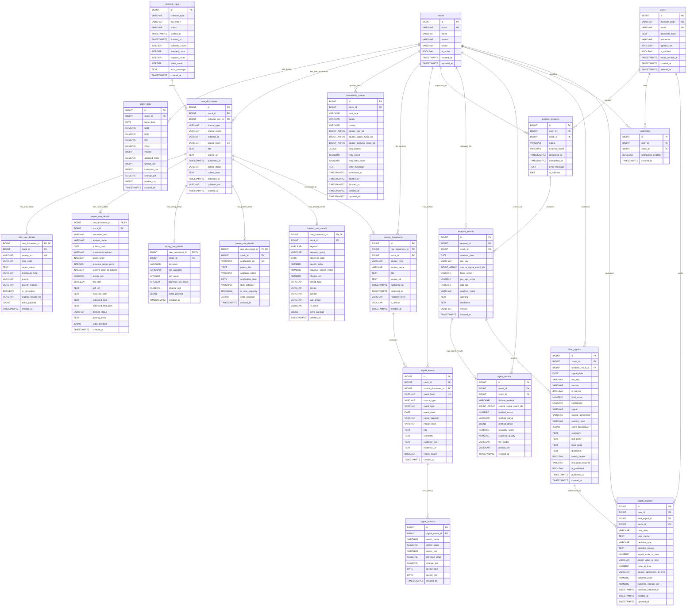

# Signal Alpha Core ERD

```mermaid
erDiagram
    stocks {
        BIGINT id PK
        VARCHAR ticker UK
        VARCHAR name
        VARCHAR market
        VARCHAR sector
        BOOLEAN is_active
        TIMESTAMPTZ created_at
        TIMESTAMPTZ updated_at
    }

    ohlcv_data {
        BIGINT id PK
        BIGINT stock_id FK
        DATE trade_date
        NUMERIC open
        NUMERIC high
        NUMERIC low
        NUMERIC close
        BIGINT volume
        NUMERIC adjusted_close
        BIGINT foreign_net
        BIGINT institution_net
        NUMERIC change_pct
        BIGINT market_cap
        TIMESTAMPTZ created_at
    }

    users {
        BIGINT id PK
        VARCHAR member_code UK
        VARCHAR email UK
        TEXT password_hash
        VARCHAR nickname
        BOOLEAN agreed_risk
        BOOLEAN is_verified
        TIMESTAMPTZ email_verified_at
        TIMESTAMPTZ created_at
        TIMESTAMPTZ deleted_at
    }

    collector_runs {
        BIGINT id PK
        VARCHAR collector_type
        VARCHAR run_mode
        VARCHAR status
        TIMESTAMPTZ started_at
        TIMESTAMPTZ finished_at
        INTEGER collected_count
        INTEGER inserted_count
        INTEGER skipped_count
        INTEGER failed_count
        TEXT error_message
        TIMESTAMPTZ created_at
    }

    raw_documents {
        BIGINT id PK
        BIGINT stock_id FK
        BIGINT collector_run_id FK
        VARCHAR source_type
        VARCHAR source_name
        VARCHAR external_id
        VARCHAR source_hash UK
        TEXT title
        TEXT source_url
        TIMESTAMPTZ published_at
        VARCHAR collect_status
        TEXT collect_error
        TIMESTAMPTZ collected_at
        VARCHAR collector_ver
        TIMESTAMPTZ created_at
    }

    dart_raw_details {
        BIGINT raw_document_id PK, FK
        BIGINT stock_id FK
        VARCHAR receipt_no UK
        VARCHAR corp_code
        TEXT report_name
        VARCHAR disclosure_type
        VARCHAR priority
        VARCHAR priority_reason
        BOOLEAN is_correction
        VARCHAR original_receipt_no
        JSONB extra_payload
        TIMESTAMPTZ created_at
    }

    report_raw_details {
        BIGINT raw_document_id PK, FK
        BIGINT stock_id FK
        VARCHAR securities_firm
        VARCHAR analyst_name
        DATE publish_date
        VARCHAR investment_opinion
        INTEGER target_price
        INTEGER previous_target_price
        INTEGER current_price_at_publish
        NUMERIC upside_pct
        BOOLEAN has_pdf
        TEXT pdf_url
        TEXT local_file_path
        TEXT extracted_text
        TEXT extracted_text_path
        VARCHAR parsing_status
        TEXT parsing_error
        JSONB extra_payload
        TIMESTAMPTZ created_at
    }

    hiring_raw_details {
        BIGINT raw_document_id PK, FK
        BIGINT stock_id FK
        VARCHAR keyword
        VARCHAR job_category
        INTEGER job_count
        INTEGER previous_job_count
        NUMERIC change_pct
        JSONB extra_payload
        TIMESTAMPTZ created_at
    }

    patent_raw_details {
        BIGINT raw_document_id PK, FK
        BIGINT stock_id FK
        VARCHAR application_no UK
        TEXT patent_title
        VARCHAR applicant_name
        DATE application_date
        VARCHAR tech_category
        BOOLEAN is_new_category
        JSONB extra_payload
        TIMESTAMPTZ created_at
    }

    datalab_raw_details {
        BIGINT raw_document_id PK, FK
        BIGINT stock_id FK
        VARCHAR keyword
        VARCHAR keyword_group
        DATE observed_date
        NUMERIC search_index
        NUMERIC previous_search_index
        NUMERIC change_pct
        VARCHAR period_type
        VARCHAR device
        VARCHAR gender
        VARCHAR age_group
        BOOLEAN is_spike
        JSONB extra_payload
        TIMESTAMPTZ created_at
    }

    processing_queue {
        BIGINT id PK
        BIGINT stock_id FK
        VARCHAR task_type
        VARCHAR status
        VARCHAR priority
        BIGINT_ARRAY source_raw_ids
        BIGINT_ARRAY source_signal_event_ids
        BIGINT_ARRAY source_analysis_result_ids
        JSONB task_context
        SMALLINT retry_count
        SMALLINT max_retry_count
        TEXT error_message
        TIMESTAMPTZ scheduled_at
        TIMESTAMPTZ started_at
        TIMESTAMPTZ finished_at
        TIMESTAMPTZ created_at
        TIMESTAMPTZ updated_at
    }

    source_documents {
        BIGINT id PK
        BIGINT raw_document_id FK
        BIGINT stock_id FK
        VARCHAR source_type
        VARCHAR source_name
        TEXT title
        TEXT source_url
        TIMESTAMPTZ published_at
        TIMESTAMPTZ collected_at
        VARCHAR reliability_level
        BOOLEAN is_official
        TIMESTAMPTZ created_at
    }

    signal_events {
        BIGINT id PK
        BIGINT stock_id FK
        BIGINT source_document_id FK
        VARCHAR event_hash UK
        VARCHAR source_type
        VARCHAR event_type
        DATE event_date
        VARCHAR signal_direction
        VARCHAR impact_level
        TEXT title
        TEXT summary
        TEXT evidence_text
        TEXT evidence_url
        BOOLEAN needs_review
        TIMESTAMPTZ created_at
    }

    signal_metrics {
        BIGINT id PK
        BIGINT signal_event_id FK
        VARCHAR metric_name
        NUMERIC metric_value
        VARCHAR metric_unit
        NUMERIC previous_value
        NUMERIC change_pct
        DATE period_start
        DATE period_end
        TIMESTAMPTZ created_at
    }

    analysis_requests {
        BIGINT id PK
        BIGINT user_id FK
        BIGINT stock_id FK
        VARCHAR status
        VARCHAR analysis_mode
        TIMESTAMPTZ requested_at
        TIMESTAMPTZ completed_at
        TEXT error_message
        INET ip_address
    }

    analysis_results {
        BIGINT id PK
        BIGINT request_id FK
        BIGINT stock_id FK
        DATE analysis_date
        VARCHAR run_key
        BIGINT_ARRAY source_signal_event_ids
        NUMERIC base_score
        NUMERIC pre_xgb_score
        NUMERIC xgb_adj
        VARCHAR analysis_mode
        TEXT warning
        TEXT disclaimer
        VARCHAR version
        TIMESTAMPTZ created_at
    }

    agent_results {
        BIGINT id PK
        BIGINT result_id FK
        BIGINT stock_id FK
        VARCHAR debate_method
        BIGINT_ARRAY source_signal_event_ids
        NUMERIC method_score
        VARCHAR method_signal
        JSONB method_detail
        NUMERIC reliability_score
        NUMERIC evidence_quality
        VARCHAR llm_model
        VARCHAR prompt_ver
        TIMESTAMPTZ created_at
    }

    final_signals {
        BIGINT id PK
        BIGINT stock_id FK
        BIGINT analysis_result_id FK
        DATE signal_date
        VARCHAR run_key
        VARCHAR version
        BOOLEAN is_current
        NUMERIC final_score
        NUMERIC confidence
        VARCHAR signal
        VARCHAR source_agreement
        VARCHAR warning_level
        JSONB score_breakdown
        TEXT summary
        TEXT bull_point
        TEXT bear_point
        TEXT disclaimer
        BOOLEAN needs_review
        VARCHAR min_plan_required
        BOOLEAN is_published
        TIMESTAMPTZ published_at
        TIMESTAMPTZ created_at
    }

    watchlists {
        BIGINT id PK
        BIGINT user_id FK
        BIGINT stock_id FK
        BOOLEAN notification_enabled
        TIMESTAMPTZ created_at
    }

    signal_journals {
        BIGINT id PK
        BIGINT user_id FK
        BIGINT final_signal_id FK
        BIGINT stock_id FK
        VARCHAR user_view
        TEXT user_memo
        VARCHAR decision_type
        TEXT decision_reason
        NUMERIC signal_score_at_time
        VARCHAR signal_value_at_time
        NUMERIC price_at_time
        VARCHAR source_agreement_at_time
        NUMERIC outcome_price
        NUMERIC outcome_change_pct
        TIMESTAMPTZ outcome_checked_at
        TIMESTAMPTZ created_at
        TIMESTAMPTZ updated_at
    }

    stocks ||--o{ ohlcv_data : has_prices
    stocks ||--o{ raw_documents : has_raw_documents
    stocks ||--o{ processing_queue : queues_tasks
    stocks ||--o{ source_documents : has_sources
    stocks ||--o{ signal_events : has_events
    stocks ||--o{ analysis_requests : requested_for
    stocks ||--o{ analysis_results : analyzed_for
    stocks ||--o{ agent_results : scored_for
    stocks ||--o{ final_signals : publishes
    stocks ||--o{ watchlists : watched
    stocks ||--o{ signal_journals : journaled

    users ||--o{ analysis_requests : creates
    users ||--o{ watchlists : owns
    users ||--o{ signal_journals : writes

    collector_runs ||--o{ raw_documents : collects
    raw_documents ||--o| dart_raw_details : has_dart_detail
    raw_documents ||--o| report_raw_details : has_report_detail
    raw_documents ||--o| hiring_raw_details : has_hiring_detail
    raw_documents ||--o| patent_raw_details : has_patent_detail
    raw_documents ||--o| datalab_raw_details : has_datalab_detail
    raw_documents ||--o| source_documents : normalizes_to

    source_documents ||--o{ signal_events : produces
    signal_events ||--o{ signal_metrics : has_metrics

    analysis_requests ||--o{ analysis_results : produces
    analysis_results ||--o{ agent_results : has_agent_results
    analysis_results ||--o{ final_signals : creates
    final_signals ||--o{ signal_journals : referenced_by
```
