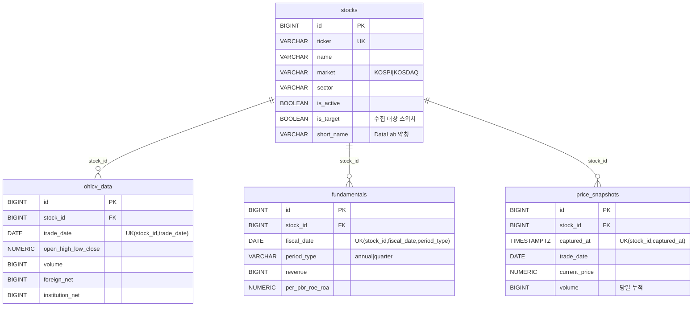
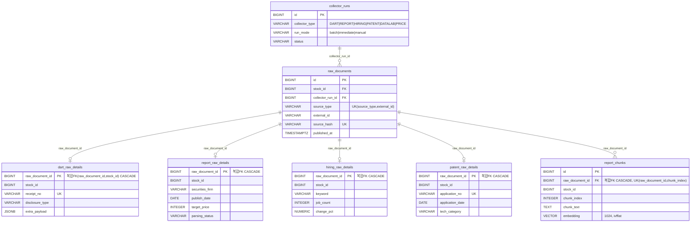
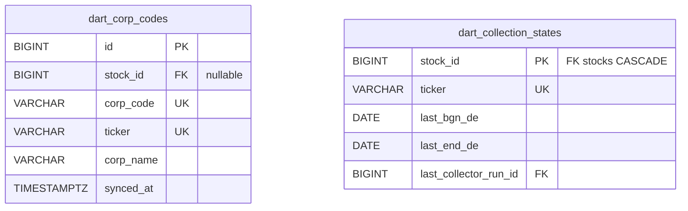
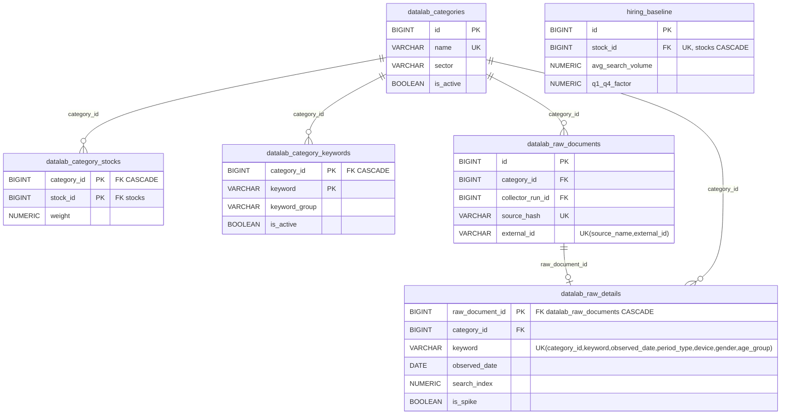
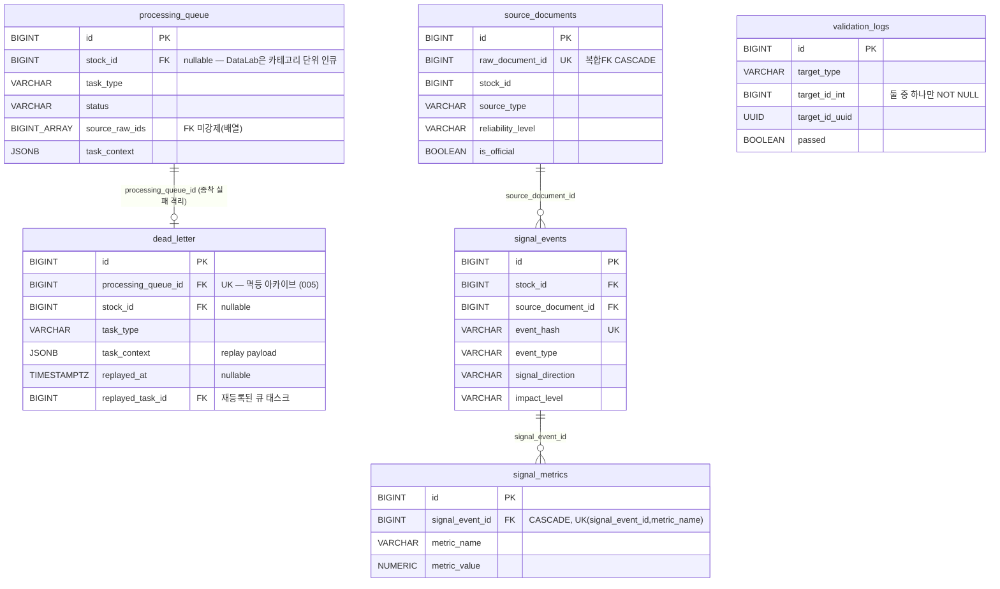
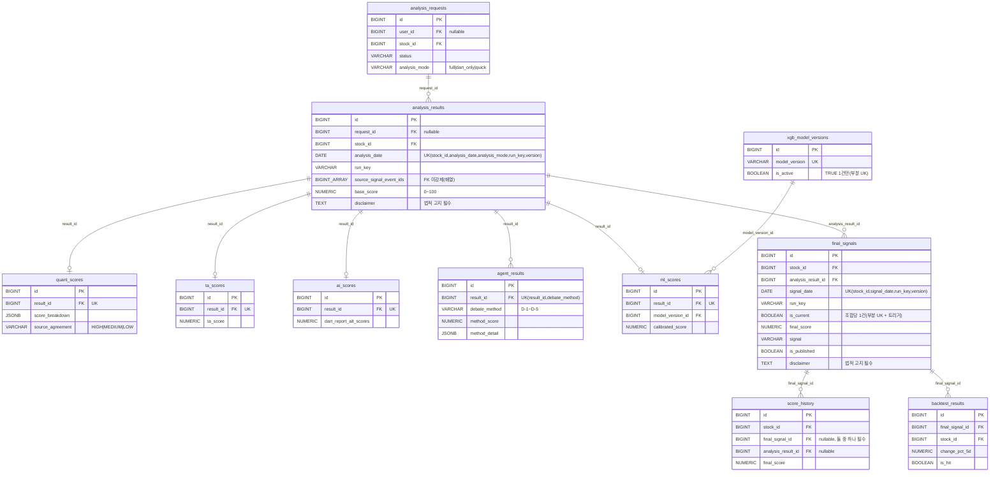
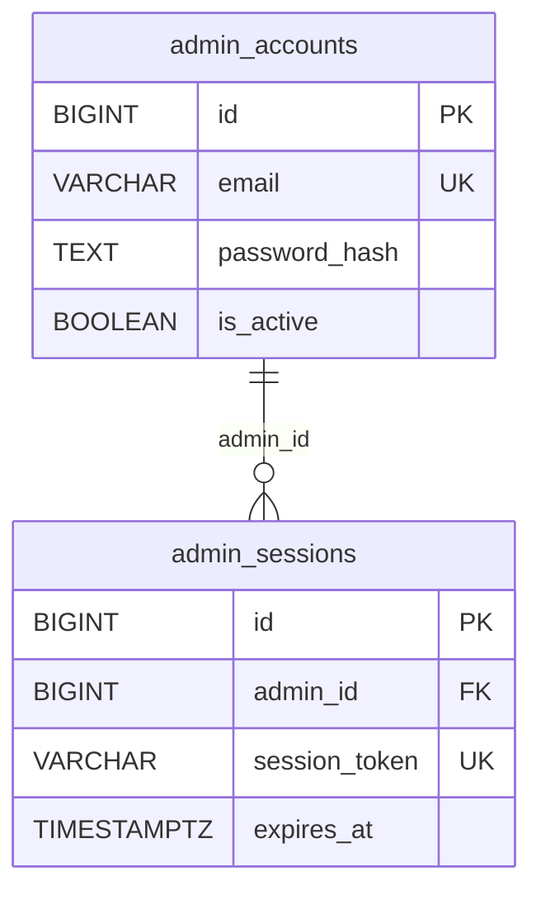
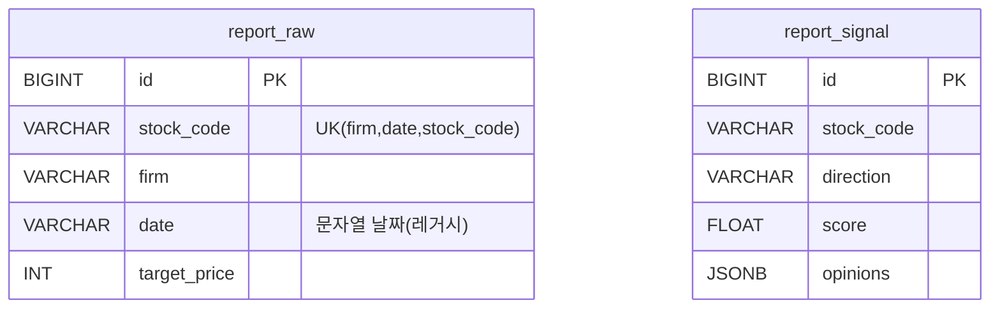
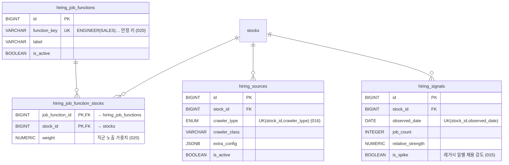

# Signal Alpha ERD

베이스라인 마이그레이션(`database/migrations/` 001~013) 기준 전체 테이블 관계도.

> 컬럼 전체 정의의 기준은 항상 `database/migrations/` SQL입니다.
> 이 문서는 테이블 간 관계와 핵심 컬럼(PK/FK/UNIQUE/대표 필드)만 표기합니다.
> **새 테이블을 추가하는 마이그레이션 PR은 이 문서의 해당 Zone 블록도 함께 갱신해야 합니다** (`database/README.md` §4).

## Zone A — Market (002_market.sql)

## Zone C — Collection 핵심 (003_collection_core.sql)

`stocks ||--o{ raw_documents` (stock_id). detail 테이블의 복합 FK `(raw_document_id, stock_id) → raw_documents(id, stock_id)`는 detail 행의 종목이 원본 문서와 일치함을 DB 차원에서 보장한다.

## Zone C — DART 보조 (004_collection_dart.sql)

## Zone C — DataLab (005_collection_datalab.sql) · Hiring (006_collection_hiring.sql)

DataLab은 **카테고리 단위 수집**: 종목 기반 `raw_documents`를 쓰지 않고 자체 원본/상세 테이블을 사용한다.

## Zone D — Processing (007_processing.sql)

## Zone B+F — User / Billing (008_users_billing_base.sql, 010_users_billing_extend.sql)

```mermaid
erDiagram
    users {
        BIGINT id PK
        VARCHAR member_code UK
        VARCHAR email UK
        BOOLEAN agreed_risk
        TIMESTAMPTZ deleted_at
    }

    subscription_plans {
        BIGINT id PK
        VARCHAR plan_type UK "free|pro|premium"
        INTEGER max_watchlist
    }

    signal_subscriptions {
        BIGINT id PK
        BIGINT user_id FK "active 1건만(부분 UK)"
        BIGINT plan_id FK
        VARCHAR status
    }

    watchlists {
        BIGINT id PK
        BIGINT user_id FK "UK(user_id,stock_id)"
        BIGINT stock_id FK
    }

    signal_journals {
        BIGINT id PK
        BIGINT user_id FK
        BIGINT final_signal_id FK "nullable"
        BIGINT stock_id FK
        VARCHAR user_view
    }

    user_signal_reads {
        BIGINT id PK
        BIGINT user_id FK "UK(user_id,final_signal_id)"
        BIGINT final_signal_id FK
    }

    user_sessions {
        BIGINT id PK
        BIGINT user_id FK "users CASCADE"
        TEXT refresh_token_hash UK
        TIMESTAMPTZ expires_at
        TIMESTAMPTZ revoked_at
    }

    social_accounts {
        BIGINT id PK
        BIGINT user_id FK "users CASCADE"
        VARCHAR provider "UK(provider,provider_user_id)"
        VARCHAR provider_user_id
    }

    portone_verifications {
        BIGINT id PK
        BIGINT user_id FK
        VARCHAR imp_uid UK
        VARCHAR verification_type
    }

    terms_agreements {
        BIGINT id PK
        BIGINT user_id FK "UK(user_id,terms_type,version)"
        VARCHAR terms_type
        VARCHAR version
    }

    users ||--o{ signal_subscriptions : "user_id"
    subscription_plans ||--o{ signal_subscriptions : "plan_id"
    users ||--o{ watchlists : "user_id"
    users ||--o{ signal_journals : "user_id"
    users ||--o{ user_signal_reads : "user_id"
    users ||--o{ user_sessions : "user_id"
    users ||--o{ social_accounts : "user_id"
    users ||--o{ portone_verifications : "user_id"
    users ||--o{ terms_agreements : "user_id"
```

`stocks ||--o{ watchlists`, `final_signals ||--o{ signal_journals / user_signal_reads` (Zone E 참조).

## Zone E — Analysis (009_analysis.sql)

## Zone G — Admin (011_admin.sql)

## Legacy — report MVP (013_legacy_report_mvp.sql) ⚠️ 폐기 예정

신규 코드 참조 금지. 공용 경로(`raw_documents` → `report_raw_details` → `report_chunks`)로 이전 후 DROP 예정.

## Zone C·E — Hiring / Alternative 확장 (014~020)

베이스라인(001~013) 이후 추가된 Hiring 분석 계층과 Alternative 통합 신호 확장.

기존 테이블에 추가된 컬럼(신규 테이블 아님):

- `final_signals` ← `consensus_score`, `positive_evidence`, `caution_evidence` (017). `alignment_rate`는 기존 `source_agreement`와 동일하여 컬럼 미저장(읽기 계층 alias).
- `datalab_category_keywords` ← `polarity` (demand/risk/neutral) (018).
- `patent_raw_details` ← `llm_features` JSONB, `llm_status` (019).
- `hiring_raw_details` ← `observed_date` (014).

## 시스템 테이블

- `schema_migrations(filename PK, checksum, applied_at)` — `database/migrate.py`가 자동 생성·관리하는 적용 원장. 마이그레이션 파일로 만들지 않는다.
