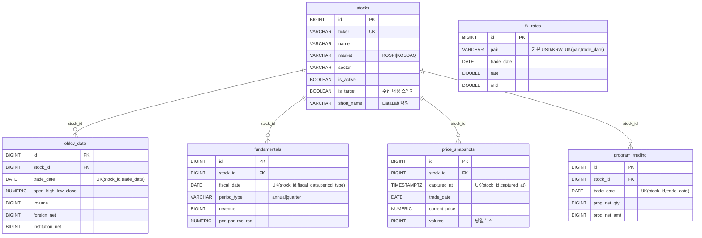
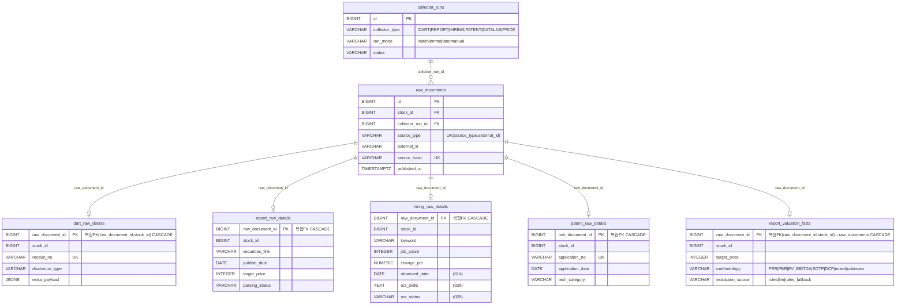
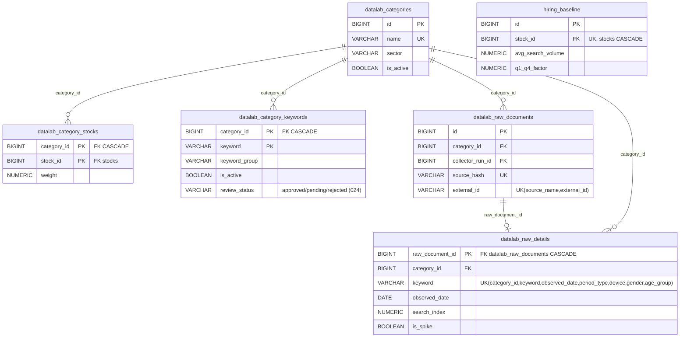
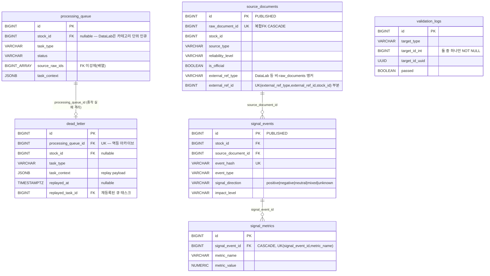
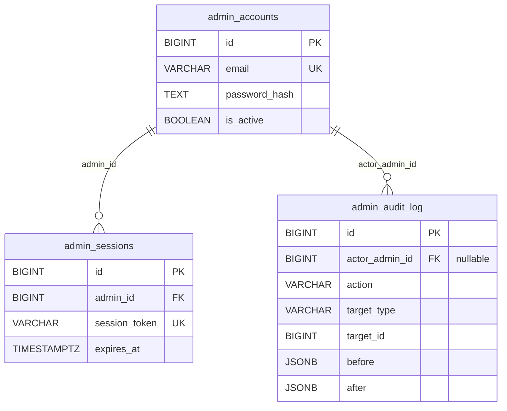
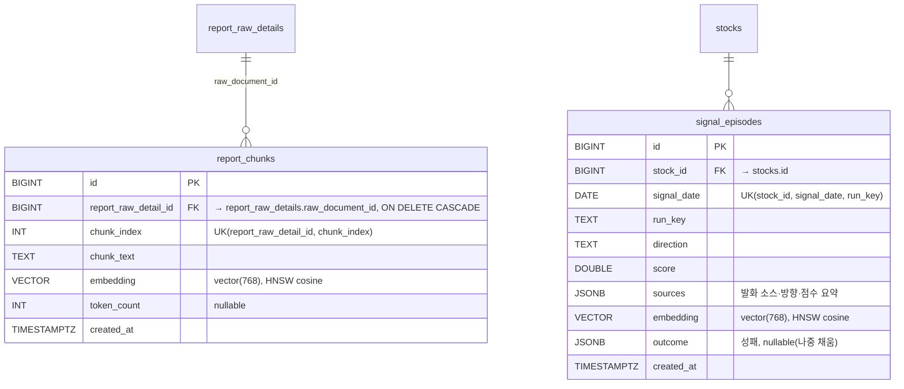

# Signal Alpha ERD

베이스라인 마이그레이션(`database/migrations/` `0001_infra_roles` ~ `0004_backend_baseline` + 이후 타임스탬프 증분) 기준 전체 테이블 관계도.

> 컬럼 전체 정의의 기준은 항상 `database/migrations/` SQL입니다.
> 이 문서는 테이블 간 관계와 핵심 컬럼(PK/FK/UNIQUE/대표 필드)만 표기합니다.
> **새 테이블을 추가하는 마이그레이션 PR은 이 문서의 해당 Zone 블록도 함께 갱신해야 합니다** (`database/README.md` §4, `docs/migration_rules.md` §4).

## DB 인스턴스 분리 (2-DB 물리 분리)

스키마는 **수집 DB(COLLECTION)** 와 **백엔드 DB(BACKEND)** 두 인스턴스로 물리 분리되어 있고, 두 DB가 공통으로 보는 **PUBLISHED** 테이블만 양쪽에 동시 적재됩니다. 마이그레이션 타깃(`docs/migration_seed_targets.md`)이 베이스라인 파일과 1:1로 대응합니다.

| 그룹 | 베이스라인 파일 | 적재 위치 | 테이블 |
| --- | --- | --- | --- |
| **PUBLISHED** | `0002_published_baseline.sql` (target `all`) | 양쪽 DB 복제 | `stocks`, `signal_events`, `source_documents`, `analysis_results`, `agent_results`, `final_signals` (+ 트리거 함수 `set_final_signal_current`/`update_updated_at`, `hiring_crawler_type` ENUM) |
| **COLLECTION** | `0003_collection_baseline.sql` (target `collection`) | 수집 DB | 수집·정규화·처리·스코어·ML·백테스트 계열 전부 (Zone A/C/D + Zone E 점수 테이블) |
| **BACKEND** | `0004_backend_baseline.sql` (target `backend`) | 백엔드 DB | 사용자/세션/구독/결제/관리자/저널/발행 계열 (Zone B/F/G) |

- **cross-DB FK는 존재할 수 없습니다.** 물리 분리된 두 인스턴스 사이엔 Postgres FK가 불가능하므로, 재베이스라인 생성기(`rebaseline.py`)가 **각 DB에 참조 대상이 없는 FK 제약을 제거**합니다(컬럼은 남고 제약만 제거). 예: COLLECTION DB의 `agent_results.result_id → analysis_results`는 둘 다 수집 DB에 있어 유지되지만, PUBLISHED 측에 복제된 `agent_results`에서는 제약이 제거됩니다.
- 따라서 아래 mermaid의 `||--o{` 선은 **논리 관계**이며, 일부는 특정 DB에서 물리적 FK가 아닐 수 있습니다.
- 각 Zone 헤더의 `[COLLECTION]`/`[BACKEND]`/혼재 배지가 적재 위치를 나타냅니다.

## Zone A — Market [COLLECTION] (`0003_collection_baseline.sql`)

`program_trading`은 프로그램 매매 수급(일별), `fx_rates`는 환율(종목 무관 거시 보조)을 적재한다.

`stocks` 자체는 **PUBLISHED**(`0002`)로 양쪽 DB에 복제된다(시세/수급 테이블이 수집 DB에서 FK로 참조).

## Zone C — Collection 핵심 [COLLECTION] (`0003_collection_baseline.sql`)

`stocks ||--o{ raw_documents` (stock_id). detail 테이블의 복합 FK `(raw_document_id, stock_id) → raw_documents(id, stock_id)`는 detail 행의 종목이 원본 문서와 일치함을 DB 차원에서 보장한다. `report_valuation_facts`는 리포트 밸류에이션(목표가 산정 근거)을 같은 복합 FK 경로로 저장한다.

## Zone C — DART 보조 [COLLECTION] (`0003_collection_baseline.sql`)

```mermaid
erDiagram
    dart_corp_codes {
        BIGINT id PK
        BIGINT stock_id FK "nullable"
        VARCHAR corp_code UK
        VARCHAR ticker UK
        VARCHAR corp_name
        TIMESTAMPTZ synced_at
    }

    dart_collection_states {
        BIGINT stock_id PK "FK stocks CASCADE"
        VARCHAR ticker UK
        DATE last_bgn_de
        DATE last_end_de
        BIGINT last_collector_run_id FK
    }

    dart_financial_facts {
        BIGINT id PK
        BIGINT stock_id FK "nullable"
        VARCHAR corp_code "UK(corp_code,bsns_year,reprt_code,fs_div,sj_div,COALESCE(account_id,account_nm))"
        VARCHAR rcept_no
        VARCHAR account_nm
        NUMERIC amount_krw
    }

    dart_employee_stats {
        BIGINT id PK
        BIGINT stock_id FK "nullable"
        VARCHAR corp_code "UK(corp_code,bsns_year,reprt_code,segment,sex,line_seq)"
        INTEGER headcount
        NUMERIC avg_salary_krw
        NUMERIC avg_tenure_years
    }

    dart_ownership_events {
        BIGINT id PK
        BIGINT stock_id FK "nullable"
        VARCHAR corp_code "UK uq_ownership_event(corp_code,rcept_no,holder_name,holder_type,line_seq)"
        DATE report_date
        VARCHAR holder_name
        NUMERIC shares_delta
        NUMERIC ratio_delta
    }

    stocks ||--o{ dart_corp_codes : "stock_id"
    stocks ||--o| dart_collection_states : "stock_id"
    stocks ||--o{ dart_financial_facts : "stock_id"
    stocks ||--o{ dart_employee_stats : "stock_id"
    stocks ||--o{ dart_ownership_events : "stock_id"
```

`dart_financial_facts`(재무 항목 raw), `dart_employee_stats`(직원·급여 통계), `dart_ownership_events`(지분 변동 공시)는 DART 정형 데이터를 `corp_code` 기준으로 적재한다(`stock_id`는 nullable — corp_code 우선 매칭).

## Zone C — DataLab (`0003_collection_baseline.sql`) · Hiring [COLLECTION]

DataLab은 **카테고리 단위 수집**: 종목 기반 `raw_documents`를 쓰지 않고 자체 원본/상세 테이블을 사용한다.

## Zone D — Processing (`0002_published_baseline.sql` + `0003_collection_baseline.sql`)

`source_documents`·`signal_events`는 **PUBLISHED**(`0002`, 양쪽 DB), 나머지(`processing_queue`/`dead_letter`/`signal_metrics`/`validation_logs`)는 **COLLECTION**(`0003`).

`source_documents`의 앵커 이원화(`raw_document_id` 복합FK vs `external_ref_*` 범용 앵커)와 `chk_source_doc_anchor`(정확히 하나만 채움)는 `database/README.md` §6 참조.

## Zone B+F — User / Billing [BACKEND] (`0004_backend_baseline.sql`)

```mermaid
erDiagram
    users {
        BIGINT id PK
        VARCHAR member_code UK
        VARCHAR email UK
        VARCHAR phone "uq_users_phone_active 부분 UK (025)"
        VARCHAR status "active|suspended|deleted (027)"
        BOOLEAN agreed_risk
        TIMESTAMPTZ deleted_at
    }

    subscription_plans {
        BIGINT id PK
        VARCHAR plan_type UK "free|pro|premium"
        INTEGER max_watchlist
    }

    signal_subscriptions {
        BIGINT id PK
        BIGINT user_id FK "active 1건만(부분 UK), users CASCADE"
        BIGINT plan_id FK
        VARCHAR status
        TIMESTAMPTZ next_billing_at "(027)"
        BOOLEAN auto_renew "(027)"
    }

    payments {
        BIGINT id PK
        BIGINT user_id FK "users CASCADE"
        BIGINT subscription_id FK "nullable"
        VARCHAR imp_uid
        INTEGER amount
        VARCHAR status "paid|cancelled|partial_cancelled|failed"
        INTEGER refund_amount
    }

    watchlists {
        BIGINT id PK
        BIGINT user_id FK "UK(user_id,stock_id), users CASCADE"
        BIGINT stock_id FK
    }

    signal_journals {
        BIGINT id PK
        BIGINT user_id FK "users CASCADE"
        BIGINT final_signal_id FK "nullable"
        BIGINT stock_id FK
        VARCHAR user_view "watch/research_more/not_relevant"
        TEXT user_memo
        NUMERIC signal_score_at_time "작성 시점 스냅샷"
        VARCHAR signal_value_at_time
        VARCHAR source_agreement_at_time
        JSONB tags
    }

    signal_journal_outcomes {
        BIGINT id PK
        BIGINT journal_id FK "UK(journal_id,horizon), signal_journals CASCADE"
        VARCHAR horizon "7td|30td (거래일)"
        DATE base_trade_date
        NUMERIC base_price
        DATE outcome_trade_date
        NUMERIC outcome_price
        NUMERIC change_pct
        TIMESTAMPTZ checked_at
    }

    user_signal_reads {
        BIGINT id PK
        BIGINT user_id FK "UK(user_id,final_signal_id), users CASCADE"
        BIGINT final_signal_id FK
    }

    report_issuances {
        BIGINT id PK
        BIGINT user_id FK "users CASCADE"
        BIGINT stock_id FK
        BIGINT final_signal_id FK "UK(user_id,final_signal_id)"
        VARCHAR run_key
        VARCHAR issued_via "free|subscription"
    }

    user_sessions {
        BIGINT id PK
        BIGINT user_id FK "users CASCADE"
        TEXT refresh_token_hash UK
        TIMESTAMPTZ expires_at
        TIMESTAMPTZ revoked_at
    }

    social_accounts {
        BIGINT id PK
        BIGINT user_id FK "users CASCADE"
        VARCHAR provider "UK(provider,provider_user_id)"
        VARCHAR provider_user_id
    }

    portone_verifications {
        BIGINT id PK
        BIGINT user_id FK "users CASCADE"
        VARCHAR imp_uid UK
        VARCHAR verification_type
    }

    terms_agreements {
        BIGINT id PK
        BIGINT user_id FK "UK(user_id,terms_type,version), users CASCADE"
        VARCHAR terms_type
        VARCHAR version
    }

    collection_schedules {
        BIGINT id PK
        VARCHAR name UK
        BOOLEAN enabled
        TIME run_at_local "기본 04:30"
        TEXT timezone "Asia/Seoul"
        JSONB targets "기본 [price,dart]"
        INTEGER dart_limit
        JSONB price_modes
        INTEGER frequency_minutes "반복 주기(분)"
        TIME active_from_local "활성 시작"
        TIME active_until_local "활성 종료"
        TIMESTAMPTZ manual_trigger_requested_at
    }

    users ||--o{ signal_subscriptions : "user_id"
    subscription_plans ||--o{ signal_subscriptions : "plan_id"
    users ||--o{ payments : "user_id"
    signal_subscriptions ||--o{ payments : "subscription_id"
    users ||--o{ watchlists : "user_id"
    users ||--o{ signal_journals : "user_id"
    signal_journals ||--o{ signal_journal_outcomes : "journal_id"
    users ||--o{ user_signal_reads : "user_id"
    users ||--o{ report_issuances : "user_id"
    users ||--o{ user_sessions : "user_id"
    users ||--o{ social_accounts : "user_id"
    users ||--o{ portone_verifications : "user_id"
    users ||--o{ terms_agreements : "user_id"
```

`stocks ||--o{ watchlists / report_issuances`, `final_signals ||--o{ signal_journals / user_signal_reads / report_issuances` (Zone E 참조 — 단 PUBLISHED/BACKEND 간 cross-DB라 물리 FK 아님).

`payments`(결제/환불 이력), `report_issuances`(회원별 리포트 발행 이력), `collection_schedules`(소스별 수집 주기·활성 시간대·수동 트리거 제어, `20260629_0900` + `20260701_1600`), `signal_journal_outcomes`(저널 작성 후 7/30 거래일 주가 변동 확정 — 워커 outcome 러너가 BACKEND_DATABASE_URL 로 기록, `20260702_1400`)가 백엔드 DB에 추가됐다. 사용자-소유 테이블의 `user_id` FK는 **하드 삭제** 지원을 위해 `ON DELETE CASCADE`다(`20260626_0244`).

## Zone E — Analysis [PUBLISHED + COLLECTION 혼재]

대표/방식별 분석 결과는 **PUBLISHED**(`0002`: `analysis_results`, `agent_results`, `final_signals`), 점수·ML·백테스트 계열은 **COLLECTION**(`0003`)이다.

```mermaid
erDiagram
    analysis_requests {
        BIGINT id PK "COL"
        BIGINT user_id "nullable, no FK (cross-DB)"
        BIGINT stock_id FK
        VARCHAR status
        VARCHAR analysis_mode "full|dart_only|quick"
    }

    analysis_results {
        BIGINT id PK "PUB"
        BIGINT request_id FK "nullable"
        BIGINT stock_id FK
        DATE analysis_date "UK(stock_id,analysis_date,analysis_mode,run_key,version)"
        VARCHAR run_key
        BIGINT_ARRAY source_signal_event_ids "FK 미강제(배열)"
        NUMERIC base_score "0~100"
        TEXT disclaimer "법적 고지 필수"
    }

    quant_scores {
        BIGINT id PK "COL"
        BIGINT result_id FK "UK"
        JSONB score_breakdown
        VARCHAR source_agreement "HIGH|MEDIUM|LOW"
    }

    ta_scores {
        BIGINT id PK "COL"
        BIGINT result_id FK "UK"
        NUMERIC ta_score
    }

    ai_scores {
        BIGINT id PK "COL"
        BIGINT result_id FK "UK"
        NUMERIC dart_report_alt_scores
    }

    agent_results {
        BIGINT id PK "PUB"
        BIGINT result_id FK "UK(result_id,debate_method)"
        VARCHAR debate_method "D-1~D-5"
        VARCHAR method_signal "positive|negative|neutral|mixed|unknown (20260629)"
        NUMERIC method_score
        JSONB method_detail
    }

    xgb_model_versions {
        BIGINT id PK "COL"
        VARCHAR model_version UK
        BOOLEAN is_active "TRUE 1건만(부분 UK)"
    }

    ml_scores {
        BIGINT id PK "COL"
        BIGINT result_id FK "UK"
        BIGINT model_version_id FK
        NUMERIC calibrated_score
    }

    ml_inferences {
        BIGINT id PK "COL"
        BIGINT stock_id FK
        VARCHAR run_key "UK uq_ml_inference(stock_id,run_key,asof_date,model_name,horizon)"
        DATE asof_date
        VARCHAR model_name
        SMALLINT horizon
        DOUBLE pred_value
        BOOLEAN gate_passed
    }

    meta_signals {
        BIGINT id PK "COL"
        BIGINT stock_id FK
        VARCHAR run_key "UK uq_meta_signal(stock_id,run_key,asof_date,horizon)"
        DATE asof_date
        SMALLINT horizon
        DOUBLE final_score
        VARCHAR direction "positive|negative|neutral|unknown"
        VARCHAR method "stacking|equal_fallback|empty|linear_stacking"
        JSONB weight_breakdown
    }

    final_signals {
        BIGINT id PK "PUB"
        BIGINT stock_id FK
        BIGINT analysis_result_id FK
        DATE signal_date "UK(stock_id,signal_date,run_key,version)"
        VARCHAR run_key
        BOOLEAN is_current "조합당 1건(부분 UK + 트리거)"
        NUMERIC final_score
        VARCHAR signal
        JSONB source_predictions "7-소스 예측률 (20260628)"
        DOUBLE ml_final_score
        VARCHAR ml_direction "positive|negative|neutral|unknown"
        BOOLEAN is_published
        TEXT disclaimer "법적 고지 필수"
    }

    recommendations {
        BIGINT id PK "COL"
        BIGINT stock_id FK
        DATE asof_date "UK uq_recommendation(stock_id,asof_date,run_key)"
        VARCHAR run_key
        SMALLINT rank
        NUMERIC recommendation_score
        VARCHAR basis "final|meta"
        JSONB components
    }

    score_history {
        BIGINT id PK "COL"
        BIGINT stock_id FK
        BIGINT final_signal_id FK "nullable, 둘 중 하나 필수"
        BIGINT analysis_result_id FK "nullable"
        NUMERIC final_score
    }

    backtest_results {
        BIGINT id PK "COL"
        BIGINT final_signal_id FK
        BIGINT stock_id FK
        NUMERIC change_pct_5d
        BOOLEAN is_hit
    }

    event_study_panel {
        BIGINT id PK "COL"
        BIGINT signal_event_id FK "→signal_events CASCADE, UK(signal_event_id,asof_date)"
        BIGINT stock_id FK
        DATE asof_date
        DOUBLE fwd_return_1d
        DOUBLE fwd_return_5d
        DOUBLE fwd_return_20d
        DOUBLE abnormal_return_20d
    }

    analysis_requests ||--o{ analysis_results : "request_id"
    analysis_results ||--o| quant_scores : "result_id"
    analysis_results ||--o| ta_scores : "result_id"
    analysis_results ||--o| ai_scores : "result_id"
    analysis_results ||--o{ agent_results : "result_id"
    analysis_results ||--o| ml_scores : "result_id"
    xgb_model_versions ||--o{ ml_scores : "model_version_id"
    analysis_results ||--o{ final_signals : "analysis_result_id"
    final_signals ||--o{ score_history : "final_signal_id"
    final_signals ||--o{ backtest_results : "final_signal_id"
    signal_events ||--o{ event_study_panel : "signal_event_id"
    stocks ||--o{ ml_inferences : "stock_id"
    stocks ||--o{ meta_signals : "stock_id"
    stocks ||--o{ recommendations : "stock_id"
```

`ml_inferences`(개별 모델 추론)·`meta_signals`(메타러너 결합 시그널)·`recommendations`(랭킹 추천)·`event_study_panel`(L6 event-study forward-return 라벨 패널)은 ML/백테스트 라인의 산출물이다. `final_signals`는 7-소스 예측률(`source_predictions`)과 ML 라인 결과(`ml_*`)를 함께 보관한다.

## Zone G — Admin [BACKEND] (`0004_backend_baseline.sql`)

`admin_audit_log`는 관리자 변경 감사 로그(변경 전/후 스냅샷)다.

## Zone C — Hiring 분석/대체 확장 [COLLECTION] (`0003_collection_baseline.sql`)

Hiring 분석 계층과 대체 데이터 통합 신호. (베이스라인 통합 이전 구 014~020 마이그레이션 출처는 컬럼 옆 괄호로 표기.)

```mermaid
erDiagram
    hiring_signals {
        BIGINT id PK
        BIGINT stock_id FK
        DATE observed_date "UK(stock_id,observed_date)"
        INTEGER job_count
        NUMERIC relative_strength
        BOOLEAN is_spike "레거시 일별 채용 강도 (015)"
    }

    hiring_sources {
        BIGINT id PK
        BIGINT stock_id FK
        ENUM crawler_type "UK(stock_id,crawler_type) (016)"
        VARCHAR crawler_class
        JSONB extra_config
        BOOLEAN is_active
    }

    hiring_job_functions {
        BIGINT id PK
        VARCHAR function_key UK "ENGINEER|SALES|… 안정 키 (020)"
        VARCHAR label
        BOOLEAN is_active
    }

    hiring_job_function_stocks {
        BIGINT job_function_id PK,FK "→ hiring_job_functions"
        BIGINT stock_id PK,FK "→ stocks"
        NUMERIC weight "직군 노출 가중치 (020)"
    }

    hiring_search_trend {
        BIGINT id PK
        BIGINT stock_id FK
        VARCHAR keyword_group "UK(stock_id,period_date)"
        DATE period_date
        NUMERIC search_index
        VARCHAR period_type "weekly"
    }

    hiring_portal_company_ids {
        BIGINT id PK
        BIGINT stock_id FK
        VARCHAR portal "UK(stock_id,portal)"
        VARCHAR company_id
    }

    hiring_quarantine {
        BIGINT id PK
        BIGINT collector_run_id FK "nullable"
        VARCHAR source_label "replay-reparse 파서 매핑"
        VARCHAR violation_reason "거부/오류 사유"
        JSONB record_payload "parse된 dict (replay-data)"
        TEXT raw_payload "원본 HTML/JSON, nullable (replay-reparse)"
        TIMESTAMPTZ replayed_at "nullable"
        BIGINT replayed_run_id FK "재적재 run"
    }

    stocks ||--o{ hiring_signals : ""
    stocks ||--o{ hiring_sources : ""
    stocks ||--o{ hiring_job_function_stocks : ""
    stocks ||--o{ hiring_search_trend : ""
    stocks ||--o{ hiring_portal_company_ids : ""
    hiring_job_functions ||--o{ hiring_job_function_stocks : ""
    collector_runs ||--o{ hiring_quarantine : "collector_run_id (크롤 실패 격리)"
```

`hiring_search_trend`(채용 키워드 검색 트렌드)·`hiring_portal_company_ids`(포털별 기업 ID 매핑)는 Hiring 수집 보조 테이블이다.

기존 테이블에 추가된 컬럼(신규 테이블 아님):

- `final_signals` ← `consensus_score`, `positive_evidence`, `caution_evidence` (017); `ml_final_score`/`ml_direction`/`ml_confidence` (ML 라인, `chk_final_signal_ml_direction`); `source_predictions` (7-소스 예측률, `20260628`). `alignment_rate`는 기존 `source_agreement`와 동일하여 컬럼 미저장(읽기 계층 alias).
- `datalab_category_keywords` ← `polarity` (demand/risk/neutral) (018); `review_status`(approved/pending/rejected)·`validation_active_days`·`validation_window_days`·`validation_coverage`·`validated_at` (024, 검색량 검증 관문 결과·키워드 라이프사이클).
- `patent_raw_details` ← `llm_features` JSONB, `llm_status` (019).
- `hiring_raw_details` ← `observed_date` (014); `ocr_skills`·`ocr_status` (028).
- `agent_results.method_signal` ← `'unknown'` 허용 (C안 abstain, `20260629_1217`).
- `users` ← `phone` (025), `status`(active|suspended|deleted) (027). 사용자-소유(BACKEND) 테이블의 `user_id` FK는 `ON DELETE CASCADE`(하드 삭제, `20260626_0244`). `analysis_requests.user_id`(COLLECTION)는 `users`(BACKEND)와 cross-DB 라 **FK 없이 nullable 컬럼**으로 두고, 회원 삭제 시 분리는 앱레벨 publisher 가 담당한다(`20260626_0244`에서 FK 제거).
- `signal_subscriptions` ← `next_billing_at`, `auto_renew` (027).

## Zone H — Agent 임베딩/메모리 [COLLECTION] (`20260701_1218_agent_embeddings_pgvector.sql`)

7-에이전트화 Stage 0(임베딩 인프라). pgvector 확장 위에 RAG 청크·에피소드 메모리를 768차원으로 저장한다.

`report_chunks`는 리포트 RAG 검색용 청크 임베딩, `signal_episodes`는 시그널 발화 에피소드 메모리(과거 유사상황 회상)다. 둘 다 pgvector `vector(768)` + HNSW cosine ANN 인덱스. 적용 DB에 `vector` 확장 선행 필요(Neon/Supabase 등 지원).

## Legacy — report MVP [COLLECTION] ✅ 제거됨

레거시 `report_raw` / `report_signal`(구 report RAG MVP, `setup_db.py` 산출)은
`20260630_1200_drop_legacy_report_raw_signal.sql`(target: collection)로 **DROP 됐다**.
리포트는 공용 경로(`raw_documents` → `report_raw_details`)만 사용한다. 베이스라인
`0003_collection_baseline.sql` 에는 생성 구문이 남아 있으나(이력) 위 마이그가 곧바로 제거한다.

## 시스템 테이블

- `schema_migrations(filename PK, checksum, applied_at)` — `database/migrate.py`가 자동 생성·관리하는 적용 원장. 마이그레이션 파일로 만들지 않는다.

전체 테이블 수: **70개** (+ `schema_migrations` 원장). PUBLISHED 6 / COLLECTION 48 / BACKEND 16
(BACKEND 는 `collection_schedules` 포함 — `db_partition.py` 기준).
