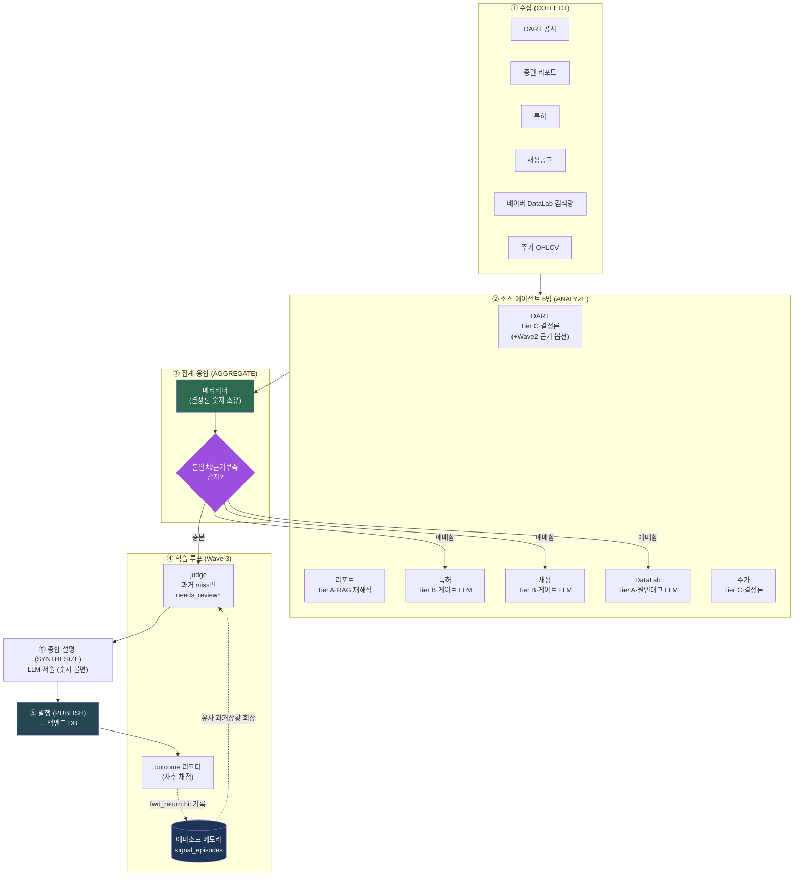
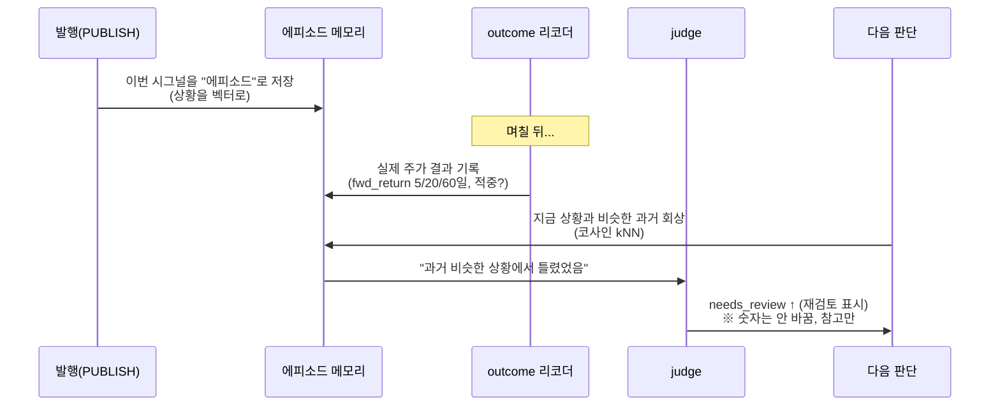

# 에이전트화 구조 완전 해설 (초보자용)

> 작성 2026-07-03 · 대상: 도메인/개발 입문자 · 근거 코드: `services/agent-worker/app/`
> 이 문서는 "어제 구현한 에이전트화가 정확히 무엇이고, 각 조각이 무슨 일을 하는지"를 그림과 비유로 풀어 설명합니다.

---

## 0. 딱 한 문장 요약

**여러 종류의 데이터(공시·리포트·특허·채용·검색량·주가)를 각각 담당하는 "전문가 6명 + 종합 담당 1명"이 서로 근거를 주고받으며 하나의 투자 시그널을 만들고, 자기가 과거에 틀린 걸 기억해 다음 판단에 참고하는 시스템.**

---

## 1. 먼저 용어부터 (비유로)

| 용어 | 쉬운 뜻 | 비유 |
|---|---|---|
| **에이전트(agent)** | 하나의 데이터를 맡아 "분석 결과 + 근거"를 내놓는 담당자 | 신문사의 부서별 기자 |
| **소스(source)** | 데이터 종류 하나 (DART, 특허, 채용 등) | 기자가 취재하는 분야 |
| **오케스트레이터/집계(aggregator)** | 6명의 결과를 모아 최종 결론을 내는 담당 | 편집장 |
| **큐(queue)** | "다음에 할 일" 목록이 쌓이는 대기줄 | 주방의 주문서 스택 |
| **결정론(deterministic)** | 같은 입력이면 항상 같은 답 (규칙·수식) | 계산기 |
| **LLM** | 문장을 이해/생성하는 AI (Gemini 등) | 글 잘 쓰는 조수 |
| **메타러너(meta-learner)** | 여러 신호를 합쳐 최종 점수를 내는 학습된 수식 | 성적 가중평균 공식 |
| **에피소드 메모리** | "과거에 이런 상황에서 이랬다"를 저장한 기억 | 기자의 취재 수첩 |
| **되묻기(requery)** | 결과가 애매할 때 특정 담당자에게 "다시 봐줘" 요청 | 편집장이 기자에게 재확인 |

---

## 2. 무엇이 바뀌었나 — Before / After

### Before: 단방향 "컨베이어 벨트" (ETL)

```
데이터 수집 → 정규화 → 규칙점수 → 집계 → 발행
```
- 한 방향으로만 흐름. 뒤에서 앞으로 되돌아가는 길이 없음.
- 점수 경로에 AI가 전혀 없음 (전부 고정 규칙).
- 담당자끼리 대화 없음.
- → 팀 피드백: **"이건 그냥 자동화 파이프라인이지 '에이전트'가 아니다."**

### After: 양방향 "전문가 팀" (에이전트)

```
6명의 전문가가 각자 분석 + 근거 작성
        ↓ (모음)
편집장이 종합 → 애매하면 특정 전문가에게 "다시 봐줘"(되묻기)
        ↓
발행 → 나중에 결과가 맞았는지 채점 → 기억에 저장 → 다음 판단에 참고(학습 루프)
```
- **양방향**: 편집장이 전문가에게 되물을 수 있음.
- **AI 근거**: 각 전문가가 LLM으로 "왜 그런지" 설명을 붙임.
- **자기학습**: 과거에 틀린 걸 기억해 비슷한 상황에서 "한 번 더 검토" 표시.

> ~~⚠️ **가장 중요한 불변식**: AI가 붙는 건 **근거·설명·되묻기·"재검토 필요" 표시**뿐. **최종 숫자(점수/방향)는 끝까지 결정론(규칙+메타러너)이 소유**합니다. LLM은 절대 점수를 바꾸지 않습니다.~~
>
> 🔴 **2026-07-13 이 불변식은 의도적으로 폐기되었습니다** (사용자 승인·팀 고지 필요).
> 실측에서 수식이 틀리고 LLM 이 맞는 사례가 반복 확인되어(DART 부호 카운트가 대량 순매도를
> 순매수로 오판 / REPORT 가 파싱오류를 강한 신호로 변환 / DATALAB 검색급증→방향 오역),
> **소스 점수·통합 점수를 LLM 코호트 채점이 산출**하는 구조로 전환했습니다
> (`LLM_SCORING_ENABLED` / `LLM_AGGREGATE_ENABLED` — 기본 off, 검증 후 ON).
> 환각/오염 방어는 불변식 대신 코드 가드로 옮겨졌습니다: 스키마 API 강제(responseSchema)·
> confidence 상한 0.85·no_signal→0 강제·투자권유 차단·DataLab attention 출력 스키마 제외·
> 서술 단계 숫자 불변 가드 유지. 결정론 수식은 백테스트 계측기(`app/backtest/reference_scorer`)
> 와 폴백(`LLM_SCORING_FALLBACK=rules`)으로 보존됩니다.

---

## 2-B. 멀티에이전트인가? (가장 자주 나오는 질문)

**한 줄 답: 멀티에이전트 *구조*는 맞다. 하지만 아직 *자율* 멀티에이전트는 아니다. 단일 에이전트도 아니다.**
정확한 위치는 **"멀티에이전트 모양을 한 워크플로우(agentic workflow)"** 이고, 이건 실수가 아니라 **로드맵상 의도된 지점(Stage 2)** 입니다.

### 먼저 세 가지 구분 (Anthropic "Building effective agents" 기준)

| 단계 | 정의 | 비유 |
|---|---|---|
| **워크플로우(workflow)** | 사람이 짠 **고정된 코드 경로**가 LLM·도구를 순서대로 부름 | 정해진 양식에 빈칸 채우기 |
| **에이전트(agent)** | **LLM이 스스로** 다음 할 일·쓸 도구를 정하고 끝났는지도 판단 (Reason→Act→Observe 루프) | 기자가 알아서 추가 취재 |
| **멀티에이전트(multi-agent)** | 그런 **자율 에이전트가 여럿** 서로 소통·토론하며 협력 | 기자들이 서로 반박하며 결론 |

> 핵심 갈림길은 딱 하나: **"다음 단계를 코드가 정하나(workflow), LLM이 정하나(agent)?"**

### 우리 시스템을 이 잣대로 재보면 (코드 근거)

- **각 소스 에이전트** = 결정론 규칙이 점수를 내고, LLM은 **게이트 뒤 단발 `classify()` 한 번**. 루프 없음, 도구 선택 없음.
  - DataLab 그래프(`datalab/graph.py`): `validate → analyze_rules →[스파이크 게이트]→ classify_cause → validate → END` — **분기는 있지만 전진만(feed-forward, 사이클 없음)**. 게이트는 `should_classify()`라는 **결정론 함수**지 LLM 판단이 아님.
- **오케스트레이터 되묻기** = `detect → requery → judge`도 **결정론 감지기**가 "누구에게 되물을지" 정함.
- **황금률**: 숫자는 끝까지 결정론(메타러너)이 소유.
- **게다가 기본값은 LLM이 아예 꺼짐**(`*_LLM_ENABLED` 전부 default off) → 기본 프로덕션 경로는 **순수 결정론 파이프라인**.

→ 판정 기준("다음 단계를 누가 정하나")으로 보면 **전부 코드가 정한다. 그래서 개별 노드는 '에이전트'가 아니라 '워크플로우'** 입니다.

### 그럼에도 "멀티에이전트 구조"인 이유 (진짜입니다)

단순 ETL과는 분명히 다릅니다. 이미 갖춘 것:
- **전문화된 다수 컴포넌트**가 **동일 계약**(`SourceAgentInput/Output`)을 공유 — "전문가 사회" 위상.
- **양방향 피드백 엣지**(조건부 되묻기) — 단방향 탈출.
- **공유 에피소드 메모리 + 학습 루프**.

즉 **자율성을 얹을 뼈대는 다 만들었고, 빠진 건 "자율성" 한 겹**입니다.

> **비유:** 부서별 전문가 6명 + 편집장을 갖춘 신문사(=멀티 구조 ✅). 그런데 지금 전문가들은 *정해진 양식에 빈칸을 채우는* 중이고, "더 취재해야겠다"를 스스로 못 정합니다. 편집장도 규칙표대로만 되묻습니다. → **사람은 여럿인데, 절차는 대본대로.**

### 자율 멀티에이전트가 되려면 (= Stage 3, 황금률 유지)

원칙: **자율성은 '근거·되묻기·종합' 층에만. 숫자는 계속 결정론이 소유.**

| 층 | 지금 (workflow) | 자율 에이전트가 되려면 |
|---|---|---|
| **소스 노드** | 게이트 뒤 단발 `classify()` | **한도 있는 ReAct 루프** + 도구벨트(메모리 회상·인접 키워드·주가창·충돌 소스 근거). LLM이 "더 볼지/끝낼지" 스스로 결정 |
| **오케스트레이터** | 결정론 `detect→requery` | **LLM 되묻기 판단**: "cause와 공시가 상충 → 재조정 요청" |
| **에이전트 간** | 없음(각자 독립) | **교차 토론(debate)**: 상충 두 소스에 서로 근거 주고 *rationale만* 수정 → judge (TradingAgents bull/bear 방식) |
| **불변식** | 숫자=결정론 | **그대로 유지** (메타러너가 최종 숫자 소유) |
| **게이트** | — | **Stage 3 관문**: 백테스트 lift 증명 + 비결정성 예산. 결정론 경로를 못 이기면 배포 안 함 |

### 지금 위치 — 의도된 Stage 2

이게 바로 기획 로드맵의 **Stage 3**입니다 (`~/.claude/plans/stateful-brewing-hinton.md`, `docs/spec/cross-layer-orchestration-and-risks.md`). 우리가 지금 있는 곳은 **Stage 2(구조 + 양방향 + 메모리)**. **"우연히 단일에 머문" 게 아니라 "자율은 가치 증명 전까지 일부러 잠가둔" 상태**입니다.

> **권고**: 연구 결론상 방향성 알파 증거가 약하고([[altdata-direction-signal-wall]]) 자율성은 비용·비결정성을 늘리므로, 가치 있는 **멀티에이전트 위상(전문화·융합·메모리)** 은 유지하되 **완전 자율(Stage 3)은 "lift 증명" 게이트 뒤에 계속** 둡니다.

---

## 3. 전체 구조도



### 텍스트 버전 (Mermaid 안 보일 때)

```
수집 6종 ──▶ 소스 에이전트 6명 (각자 점수+근거)
                     │
                     ▼
              메타러너(최종 숫자 소유)
                     │
             ┌───────┴────────┐
       [애매하면 되묻기]   [충분하면 통과]
             │                │
      특정 소스 재해석         │
             └───────┬────────┘
                     ▼
      judge (에피소드 메모리 참고 → 과거 틀렸으면 "재검토" 표시)
                     ▼
      종합·설명 (LLM, 숫자 불변) ──▶ 발행 ──▶ (사후) 결과 채점 ──▶ 메모리에 저장
                                                          ↑___________학습 루프___________│
```

---

## 4. 소스 티어링 — "모두 AI일 필요는 없다"

핵심 설계 철학: **데이터마다 AI가 필요한 정도가 다르다.** 그래서 3등급으로 나눴습니다.

| Tier | 뜻 | 소스 | AI 사용 |
|---|---|---|---|
| **A (풀)** | 다단계로 스스로 판단 | 리포트, DataLab | RAG/그래프 + LLM 근거 |
| **B (씬)** | 게이트 통과 시 **단발** LLM 1회 | 특허, 채용 | 조건부 1회 호출 |
| **C (결정론)** | LLM 없이 계약만 | 주가, DART | 없음(DART만 Wave2 옵션) |

> 왜 이렇게? **비용 다이얼**입니다. 고급 LLM은 비싸니까, 정말 해석이 필요한 데이터(리포트·검색량)에만 몰아주고, 주가처럼 숫자가 명확한 건 규칙으로만 처리합니다.

---

## 5. 에이전트 하나하나 뜯어보기

각 에이전트는 **같은 계약(contract)**을 지킵니다. 입력 `SourceAgentInput`을 받아 출력 `SourceAgentOutput`을 냅니다. 출력의 핵심 필드:

```
score       : -1.0 ~ +1.0  (음수=하락, 0=중립, 양수=상승)   ← 규칙이 소유
direction   : up/down/unknown                              ← 규칙이 소유
summary     : 사람이 읽는 요약
method_detail: 근거·피처 (LLM 근거는 여기에 additive로 붙음)
needs_review: 재검토 필요 여부 (True/False)
analysis_source: rules / llm / rules_fallback  ← 어떤 경로로 나왔는지
```

> 📁 코드: `services/agent-worker/app/agents/base.py`

---

### 5-1. 🏢 DART 에이전트 (공시) — Tier C

- **파일**: `app/agents/dart/agent.py`
- **하는 일**: 공시 이벤트에서 **정형 수치/서술 피처**를 뽑습니다.
- **특이점**: DART는 **고정 점수(verdict)를 내지 않습니다.** `direction="unknown"`, `data_status="no_signal"`로 반환 → 집계 점수 계산에서 **자연스럽게 제외**됩니다. 판정은 나중에 메타러너(Wave3 융합)가 합니다.
- **Wave 2 옵션**: `evidence_extractor`를 주입하면 **고임팩트 공시**에 한해 LLM이 **근거**(요약/핵심사실/리스크플래그)를 뽑아 `method_detail["llm_evidence"]`에 **additive로** 붙입니다. **점수는 절대 안 바뀝니다** (verdict 아님, 근거만).
- **비유**: 사실만 정리해 편집장에게 넘기는 자료조사원. 자기 의견(점수)은 안 냄.

---

### 5-2. 📄 리포트 에이전트 (증권사 리포트) — Tier A

- **팀 영역** (우리 스코프 밖이지만 구조 이해용)
- **하는 일**: 이미 저장된 리포트 원문(`report_raw_details.extracted_text`)을 **RAG**로 재해석합니다.
- **RAG란?** = 원문을 잘게 쪼개(chunks) 벡터로 만들어 두고, 지금 상황과 "의미가 비슷한" 조각을 찾아와 근거로 쓰는 기법. (재수집 0 — 이미 있는 원문을 재처리만)
- **비유**: 과거 리포트 더미에서 지금 상황과 비슷한 대목을 찾아 인용하는 애널리스트.

---

### 5-3. 💡 특허 에이전트 — Tier B

- **파일**: `app/agents/patent/agent.py`
- **하는 일**: 규칙 분석기가 점수/방향을 냅니다. 그다음 **게이트**(신호가 충분히 강할 때만)를 통과하면 LLM을 **1회** 호출해 특허의 **중요도(materiality)를 태그**로 붙입니다.
- **추가 단계 ENRICH_PATENT**: 특허 제목+초록을 Gemini에 넣어 "이 특허가 얼마나 중요한지" 가중치(`llm_features`)를 미리 캐시 → 분석기가 이걸 읽어 특허별 비중을 조절.
- **불변식**: 중요도는 **태그일 뿐**, `rule.score`/`rule.direction`은 그대로 통과. LLM 실패 시 결정론 프리라벨로 폴백.
- **연구 결론 참고**: 특허 단독 방향성 알파는 기각됨. 그래서 여기서 LLM은 "점수"가 아니라 "설명"만.

---

### 5-4. 👔 채용 에이전트 — Tier B

- **파일**: `app/agents/hiring/agent.py` (이 문서 작성 시 직접 정독한 대표 사례)
- **흐름** (`analyze` 메서드):
  1. `run_rules` — 규칙 분석기가 점수/방향 산출 (Phase 0라 현재는 unknown/0.0)
  2. `_build_focus` — 공고에서 **주요 직무 top3 + 요구기술 top5**를 결정론적으로 추출
  3. `should_dig` (**게이트**) — 직무/기술 내용이 있고 실패 안 했을 때만 LLM 호출
  4. `classify_focus` — Gemini가 "이 회사가 무엇을 위해 채용 중인가" **근거 카드** 작성
- **불변식**: `direction`/`score`는 `# unchanged` 주석과 함께 **그대로** 통과. focus는 `evidence_items`에 additive로 붙어 발행까지 살아남음.
- **폴백**: LLM 실패 시 `analysis_source="rules_fallback"`, `llm_error` 기록하고 결정론 요약 사용.
- **비유**: 채용공고 100건을 훑어 "이 회사 요즘 AI 인력 뽑네"라고 **설명**하는 HR 애널리스트. 주가 방향은 안 찍음.

---

### 5-5. 🔍 DataLab 에이전트 (네이버 검색량) — Tier A

- **파일**: `app/agents/datalab/agent.py` + `graph.py` (langgraph StateGraph)
- **하는 일**: 규칙 분석기가 점수 + **어텐션(attention) 급등** 축을 냅니다. **스파이크 게이트**(검색량이 급등했을 때만)를 통과하면 LLM이 **원인(cause)을 태그**합니다: `catalyst`(재료)/`fomo`(추격)/`price_led`(주가가 검색을 끌었나).
- **왜 graph?** 스파이크 게이트가 "숨은 if"가 아니라 **진짜 그래프 분기**로 보이게 하려고. 단계(`run_rules`/`should_classify`/`classify_cause`)를 노드로 배선.
- **불변식**: cause는 **태그 전용**. 점수/방향/어텐션 축 전부 불변. 비스파이크 신호는 LLM 건너뜀.
- **연구 결론 참고**: DataLab = 매그니튜드 흔적 + 차기매출 나우캐스터 + 시장수준 FEARS 리스크지표. **종목별 방향 알파는 없음** → 그래서 여기도 LLM은 "원인 설명"만.

---

### 5-6. 📈 주가 에이전트 — Tier C

- **파일**: `app/agents/price/agent.py` (단 26줄!)
- **하는 일**: `RuleSourceAgent(PriceAnalyzer())` — 기존 규칙 분석기를 계약으로 **감싸기만** 함. LLM 전혀 없음.
- **왜 이렇게 단순?** 주가는 숫자가 이미 명확해서 AI가 붙을 이유가 없음. `RuleSourceAgent`라는 **범용 투명 어댑터**로 한 줄이면 계약 peer가 됨.
- **비유**: 계산기. 넣으면 답 나옴. 설명 필요 없음.

---

### 5-7. 🎯 집계·오케스트레이터 (편집장) — 7번째 에이전트

- **파일**: `app/orchestrator/aggregation/tasks.py`, `app/ml/meta_learner.py`
- **하는 일 3가지**:
  1. **팬인(fan-in)**: 6명의 결과를 (종목, 날짜) 기준으로 모음
  2. **융합**: **메타러너**가 가중평균/학습된 수식으로 **최종 숫자**를 만듦 ← 여기가 숫자의 진짜 주인
  3. **되묻기(Wave3)**: 소스 간 불일치나 근거 부족(전체의 10~20%)이 감지되면 특정 소스에게 "다시 해석해줘"(재수집 아님, **재해석**). 상한 2회.
- **중요**: 이건 **top-down 지휘관이 아닙니다.** 평소엔 밑단 sink로 조용히 모으다가, **애매할 때만** 되묻는 "조건부 엣지". (팀이 우려한 비용 폭증 구조를 피하려는 설계)

---

## 6. 학습 루프 (Wave 3) — "자기가 틀린 걸 기억한다"

이게 이번 에이전트화의 **하이라이트**입니다.



- **에피소드 메모리** (`signal_episodes` 테이블): 발행할 때마다 "그 순간의 상황"을 벡터로 저장.
- **outcome 리코더**: 며칠~몇 주 뒤 실제 주가가 어땠는지(5/20/60일 forward return, 적중 여부) **사후 채점**해서 그 에피소드에 붙임.
- **recall**: 새 판단 때 "지금과 의미가 비슷한 과거 상황"을 코사인 유사도로 k개 찾아옴.
- **judge**: 그 과거들에서 우리가 틀렸었다면 → `needs_review`를 올려 "이번엔 한 번 더 검토" 신호. **단, 숫자는 절대 안 바꿈. 참고·캘리브레이션만.**

> **왜 숫자를 안 바꾸나?** LLM/유사도 기반 회상이 점수를 직접 흔들면 재현 불가능하고 검증도 어려워짐. 그래서 "판단은 결정론, 기억은 조언자" 원칙을 끝까지 지킴.

---

## 7. 실제 파이프라인 스테이지 (큐 관점)

시스템은 큐(대기줄)에 작업을 넣고 워커가 하나씩 꺼내 처리합니다. 순서:

```
COLLECT_*          수집 (DART/리포트/특허/채용/DataLab/주가)
   ↓
NORMALIZE_*        원시 데이터 → 정형 테이블(source_documents 등)
   ↓
ENRICH_*           (특허/채용만) LLM 보강: 특허 중요도·채용 OCR 스킬
   ↓
ANALYZE_*          소스별 분석 → 각자 final_signals 1행 (6개 피어)
   ↓
AGGREGATE_SIGNAL   팬인 + 메타러너 융합 (+ Wave3 되묻기/judge)
   ↓
SYNTHESIZE         끝단 LLM 종합·설명 (숫자 불변, 금지어 필터만)
   ↓
PUBLISH_SIGNALS    백엔드 DB로 발행 (물리 2-DB 분리)
```

**ML 곁가지** (메타러너 학습 경로):
```
SRC_INFER          소스별 base 모델 추론 (DataLab/Hiring 피처 → forward-return 예측)
   ↓
RETURN_COMBINE     예측들을 결합 → meta_signals (return 채널)
```
> 📁 코드: `app/orchestrator/queue/task_types.py`

---

## 8. "에이전트답게" 만든 3가지 핵심

1. **양방향** — 편집장이 전문가에게 되묻는 조건부 엣지 (단방향 ETL 탈출).
2. **AI 근거** — 각 소스가 게이트 뒤에서 LLM으로 "왜"를 설명 (점수는 안 건드림).
3. **자기학습** — 발행→채점→기억→회상→재검토 루프가 닫힘.

그리고 이 셋을 하는 내내 지킨 **황금률**:
> **숫자(점수/방향)는 결정론이 소유. LLM은 근거·되묻기·needs_review만.**

---

## 9. 코드 지도 (어디를 보면 되나)

| 보고 싶은 것 | 파일 |
|---|---|
| 모든 에이전트의 공통 계약 | `app/agents/base.py` |
| 규칙→계약 어댑터 | `app/agents/rule_source_agent.py` |
| 소스 등록(레지스트리) + LLM on/off 스위치 | `app/analyzers/registry.py` |
| 채용 에이전트 (대표 Tier B) | `app/agents/hiring/agent.py` |
| 특허 에이전트 | `app/agents/patent/agent.py` |
| DataLab 에이전트 + 그래프 | `app/agents/datalab/agent.py`, `graph.py` |
| DART 에이전트 | `app/agents/dart/agent.py` |
| 주가 에이전트 (최소 Tier C) | `app/agents/price/agent.py` |
| 대체데이터 큐 핸들러 | `app/orchestrator/alternative/tasks.py` |
| 집계·메타러너 | `app/orchestrator/aggregation/tasks.py`, `app/ml/meta_learner.py` |
| 스테이지 정의 | `app/orchestrator/queue/task_types.py` |

> **LLM 켜는 법**: 환경변수로 소스별 opt-in. 기본은 전부 **off** (규칙 경로와 byte-identical).
> `HIRING_LLM_ENABLED` / `PATENT_LLM_ENABLED` / `DATALAB_LLM_ENABLED` = `1`

---

## 10. 자주 헷갈리는 점 (FAQ)

**Q. LLM이 투자 점수를 매기나요?**
A. **네 — 2026-07-13 부로 그렇게 바뀌었습니다** (§2-A 불변식 폐기 참조). `LLM_SCORING_ENABLED`
를 켜면 6소스 점수와 통합 점수를 LLM 코호트 채점이 산출합니다(기본 off). 결정론 수식은
백테스트 계측기·폴백으로 보존되고, 환각 방어는 코드 가드(스키마 강제·confidence 상한·
투자권유 차단 등)가 담당합니다.

**Q. 에이전트가 스스로 웹을 뒤지거나 데이터를 다시 수집하나요?**
A. 아니요. 되묻기는 "이미 있는 데이터를 **재해석**"입니다. 재수집이 아닙니다.

**Q. 6명이 항상 서로 대화하나요?**
A. 아니요. 평소엔 각자 조용히 일하고, **애매할 때(10~20%)만** 편집장이 특정 소스에 되묻습니다.

**Q. "자기학습"이 점수를 바꾸나요?**
A. 아니요. 과거 결과를 회상해 "재검토 필요" 플래그만 올립니다. 숫자는 불변.

**Q. 왜 주가는 AI가 없나요?**
A. 숫자가 이미 명확해서 해석할 게 없습니다. 비싼 LLM을 아껴 리포트·검색량에 씁니다.
