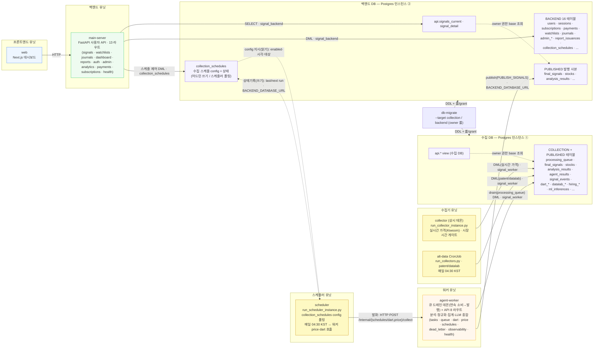
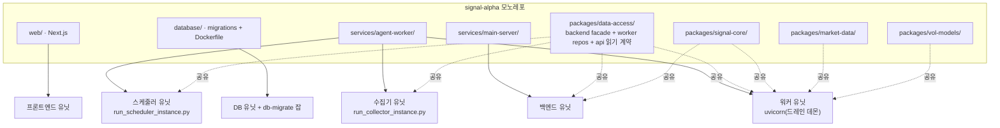
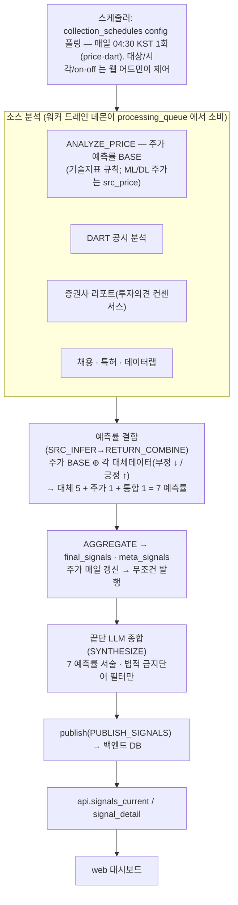

# Signal α — 시스템 설계도 (현 구조)

> 현재 GitHub 구조(`origin/main`) 기준 배포 토폴로지와 DB 소유권 경계를 그린 설계도입니다.
> 텍스트 개요는 [architecture.md](./architecture.md), DB 스키마 기준은 `database/migrations/` 입니다.
> 배포는 **frontend / backend / worker / collector / scheduler 5 컴퓨트 유닛 + DB 2 인스턴스**(수집 DB /
> 백엔드 DB)로 분리합니다(#11 워커 영역 완성: 수집기·스케줄러를 워커에서 분리). 수집기는 원천 수집만,
> 스케줄러는 **백엔드 DB `collection_schedules` config 를 폴링**해 매일 `run_at_local`(기본 04:30 KST)에
> 워커 수집 엔드포인트(price·dart)를 호출, **워커는 큐 드레인 데몬으로 큐를 끝단(발행)까지 연속 소비**합니다.
> 스케줄 on/off·시각·대상·수동 실행은 **웹 어드민이 `main-server` 를 통해 `collection_schedules` 에 기록**하고
> 스케줄러가 폴링해 따릅니다(어드민 제어 평면 — `main-server → worker` 직접 호출 없음).
> backend와 worker는 런타임에 직접 호출하지 않고, 워커가 산출물을 백엔드 DB 로 **앱레벨 발행(publish)**
> 하면 backend 는 백엔드 DB 의 `api.*` 읽기 계약으로 읽습니다(#531 2-인스턴스 분리. cross-DB FK 불가 →
> publisher 가 정합성 담당).
> 마이그/시드 타깃 규칙: [database/docs/migration_seed_targets.md](../database/docs/migration_seed_targets.md).

## 1. 배포 토폴로지 & DB 소유권 경계

> **유닛 경계(수집/스케줄/드레인 분리)**: 수집기는 외부 API에서 원천만 적재하고, 스케줄러는
> 백엔드 DB `collection_schedules` config 를 폴링해 매일 정시에 워커 수집 엔드포인트를 호출(=`processing_queue`
> 인큐)만 하며, **워커의 드레인 데몬이 큐를 끝단(발행)까지 연속 소비**한다. 수집기·드레인은 수집 DB 에
> `signal_worker` 롤로 접근하고, 스케줄러는 추가로 발행용 백엔드 연결(`BACKEND_DATABASE_URL`)로
> `collection_schedules` 만 읽고/상태를 쓴다. 엔트리포인트: `run_collector_instance.py` /
> `run_scheduler_instance.py` / 워커 lifespan 드레인 데몬(`QUEUE_DRAIN_DAEMON_ENABLED`, 단발 검증은
> `run_worker_drain.py`). 단일 통합 인스턴스로도 기동 가능(`PRICE_COLLECTOR_ENABLED`+드레인 동시 on).

> **어드민 제어 평면**: 스케줄 on/off·시각·대상·수동 실행은 웹 어드민 → `main-server`(`/api/admin/schedules*`,
> `signal_backend` DML) → `collection_schedules` 쓰기로 이뤄지고, 워커측 스케줄러가 같은 행을 폴링해 따른다.
> `main-server` 는 워커를 직접 호출하지 않고 **공유 config 행으로만** 신호한다(경계 유지).

> **수집기 연결점**: collector 는 **인바운드 트리거가 없는 상시 데몬**이 정상이다 — 시장시간(평일
> 09:00–15:30 KST) 게이트로 스스로 폴링하며 advisory lock 으로 단일 수집을 보장한다. 가격은 두 경로로
> 수집 DB 에 적재된다: (1) **collector** = 장중 실시간 OHLCV/스냅샷, (2) **scheduler 04:30** → 워커
> `/internal/price/collect` = 전일 확정 flows 정산+종가. patent/datalab 은 **alt-data CronJob**(매일 04:30)이
> 적재한다. 5-유닛 분리 배포에선 worker `PRICE_COLLECTOR_ENABLED=false`(가격 데몬은 collector 전담).

> **배포 토폴로지**: 이 5 유닛 + 2 DB 는 **GKE + Argo CD(GitOps)** 매니페스트로 배포한다 —
> `deploy/k8s/`(kustomize: web·main-server·agent-worker·collector·scheduler Deployment + alt-data CronJob +
> Postgres ×2 StatefulSet + 마이그 Job ×2) / `deploy/argocd/`(Application). 가이드: [deploy/README.md](../deploy/README.md),
> [k8s-argocd-deployment.md](./k8s-argocd-deployment.md).

> 다이어그램에 **없는 화살표가 곧 경계**입니다: `main-server`는 `agent-worker`를 런타임에 직접
> 호출하지 않고(워커 산출물은 `api.*` view로만 읽음), worker base 테이블(`final_signals` 등)에
> 직접 권한이 없습니다. 따라서 `main-server → agent-worker` 및 `main-server → public(worker 테이블)`
> 간선은 의도적으로 존재하지 않습니다(스케줄 제어도 워커 직접 호출이 아니라 `collection_schedules` 경유).

**권한 롤 (DB 소유권 경계)**

| 롤 | 권한 | 사용 서비스 (DB) |
|---|---|---|
| `signal_worker` | `public` 전체 DML (수집·분석·시그널 적재) | worker · collector · scheduler 유닛 (수집 DB) |
| `signal_backend` | `api.*` SELECT + 소유 15 테이블 DML. PUBLISHED base 직접 권한 없음 | main-server (백엔드 DB) |
| owner | DDL · 롤/grant · view 소유 (`--target collection`/`backend` 각각) | db-migrate (양 DB) |

> 롤은 양 인스턴스에 동일하게 생성되며(0001_infra_roles, target all), grant 는 DB 별로 부여됩니다
> (0006 수집 / 0007 백엔드). 마이그/시드 타깃 분류는
> [database/docs/migration_seed_targets.md](../database/docs/migration_seed_targets.md),
> 부트스트랩·리셋 절차는 [db-2-instance-bootstrap 런북](./runbooks/db-2-instance-bootstrap.md) 참고.

> **컷오버 주의**: 롤은 비밀번호 없이 생성됩니다. 운영 배포 시 out-of-band로 비밀번호를 부여하고
> `WORKER_/BACKEND_DATABASE_URL` 을 해당 롤로 교체해야 권한 격리가 발효됩니다(`.env.example` 참고).

## 2. 레포 → 배포 유닛 매핑

- **`services/agent-worker` 한 코드베이스가 세 유닛(worker · collector · scheduler)으로 기동**된다 —
  각각 다른 엔트리포인트(워커=uvicorn+드레인 데몬, 수집기=`run_collector_instance.py`,
  스케줄러=`run_scheduler_instance.py`). 단일 통합 인스턴스 기동도 가능(개발/소규모 배포).
- `packages/data-access`는 양쪽 유닛이 공유하되, **CI 가드**가 main-server(백엔드)의
  `signal_alpha_data_access.worker` / `.repositories` 직접 import를 차단합니다. 백엔드는
  `signal_alpha_data_access.backend` 읽기 계약 facade만 사용합니다.
- `signal-core`는 서비스 간 공통 데이터 계약·안전 규칙, `market-data`/`vol-models`는 워커 분석에 사용됩니다.

## 3. 멀티에이전트 분석 흐름 (요약)

> **목표 설계(라우팅)**: 주가 예측률을 **BASE** 로 두고 각 대체데이터(DART·리포트·채용·특허·데이터랩) 분석을
> 그 위에 **가/감산**(부정 ↓, 긍정 ↑)해 **7 예측률**(대체 5 + 주가 1 + 통합 1)을 만든다. 주가는 평일 매일
> 갱신되므로 종목마다 **무조건 발행**한다. 끝단 LLM 은 7 예측률을 사용자에게 **서술**하고(예측률만으론 설명
> 부족), 유일한 가드는 **법적 금지단어 필터**(투자·매수·매도·적극매수·적극매도)다.
> **사용자 노출**: 통합(`SRC`)은 발행 헤드라인(`score`/`direction`). per-source 6개(주가 1 + **공공데이터 5개** =
> 주가 ⊕ 각 공공데이터)는 각 **0-100** 으로 리포트 `prediction_rates` 에 따로 노출(`source_predictions.score_100`). `RISK_VETO` 치명키워드
> 보류·`run_recommend` 추천 랭킹·근거 이벤트 발행 게이트는 **폐기**한다(설계 확정 후 코드 재작성).
> REPORT 는 투자의견(`signal_direction`) 컨센서스로 결정론 방향을 낸다.
> 소스별 수집기/분석기는 `agent-worker/app/collectors/*` · `analyzers/*` 아래 소스 단위
> (`dart · report · price · datalab · hiring · patent`)로 구성됩니다. 출력 계약 검증기는
> `app/orchestrator/aggregation/source_contract.py`. 단계별 큐·테이블 흐름은
> [data-pipeline.md](./data-pipeline.md), 집계 계약은 `spec/final-signal-aggregator-spec.md` 참고.
