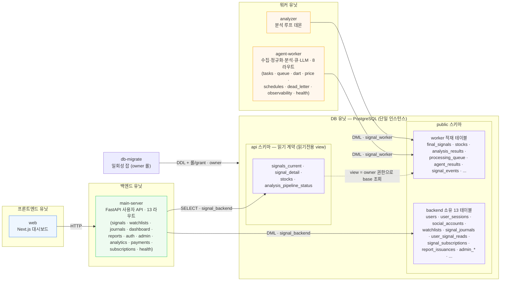
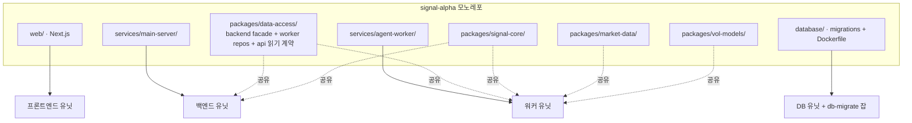
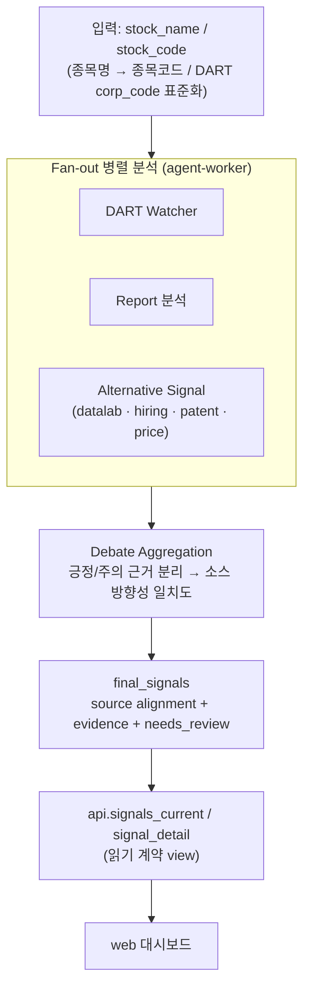

# Signal α — 시스템 설계도 (현 구조)

> 현재 GitHub 구조(`origin/main`) 기준 배포 토폴로지와 DB 소유권 경계를 그린 설계도입니다.
> 텍스트 개요는 [architecture.md](./architecture.md), DB 스키마 기준은 `database/migrations/` 입니다.
> 배포는 **db / worker / backend / frontend 4유닛**으로 분리하며, backend와 worker는 런타임에
> 직접 호출하지 않고 **DB의 `api.*` 읽기 계약**으로만 연결됩니다(PR #474, Model A: 단일 Postgres +
> 소유권 경계).

## 1. 배포 토폴로지 & DB 소유권 경계

> 다이어그램에 **없는 화살표가 곧 경계**입니다: `main-server`는 `agent-worker`를 런타임에 직접
> 호출하지 않고(워커 산출물은 `api.*` view로만 읽음), worker base 테이블(`final_signals` 등)에
> 직접 권한이 없습니다. 따라서 `main-server → agent-worker` 및 `main-server → public(worker 테이블)`
> 간선은 의도적으로 존재하지 않습니다.

**권한 롤 (DB 소유권 경계)**

| 롤 | 권한 | 사용 서비스 |
|---|---|---|
| `signal_worker` | `public` 전체 DML (수집·분석·시그널 적재) | agent-worker, analyzer |
| `signal_backend` | `api.*` SELECT + 소유 13 테이블 DML. worker base 테이블 직접 권한 없음 | main-server |
| owner (`signal_alpha`) | DDL · 롤/grant · view 소유 | db-migrate |

> **컷오버 주의**: 롤은 비밀번호 없이 생성됩니다. `WORKER_/BACKEND_DATABASE_URL` 미설정 시 compose가
> owner로 폴백하므로, 운영 배포 시 out-of-band로 비밀번호를 부여하고 두 URL을 해당 롤로 교체해야
> 권한 격리가 실제로 발효됩니다(`.env.example` 참고).

## 2. 레포 → 배포 유닛 매핑

- `packages/data-access`는 양쪽 유닛이 공유하되, **CI 가드**가 main-server(백엔드)의
  `signal_alpha_data_access.worker` / `.repositories` 직접 import를 차단합니다. 백엔드는
  `signal_alpha_data_access.backend` 읽기 계약 facade만 사용합니다.
- `signal-core`는 서비스 간 공통 데이터 계약·안전 규칙, `market-data`/`vol-models`는 워커 분석에 사용됩니다.

## 3. 멀티에이전트 분석 흐름 (요약)

> 소스별 수집기/분석기는 `agent-worker/app/collectors/*` · `analyzers/*` 아래 소스 단위
> (`dart · report · price · datalab · hiring · patent`)로 구성됩니다. 단계별 큐·테이블 흐름은
> [data-pipeline.md](./data-pipeline.md), 집계 계약은 `spec/final-signal-aggregator-spec.md` 참고.
