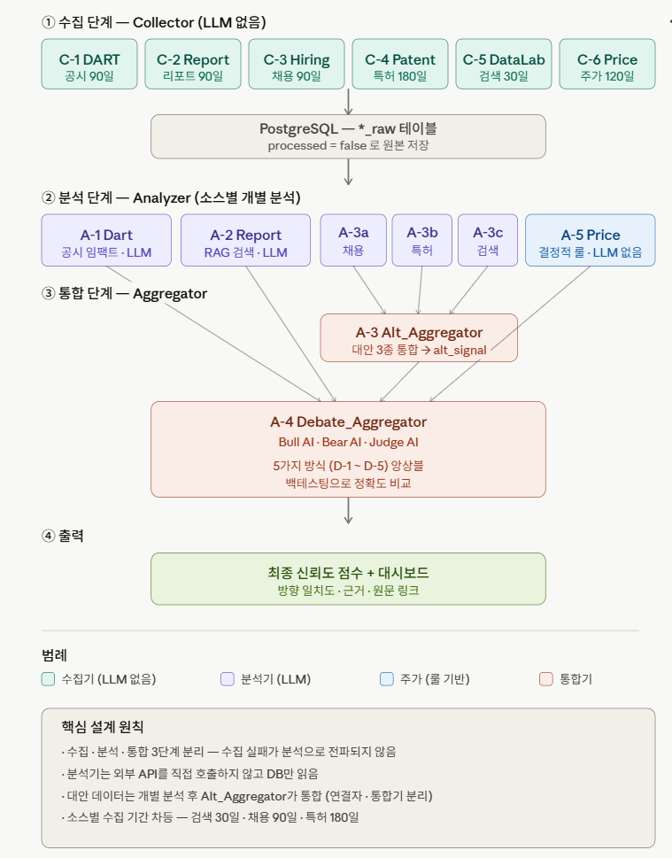

# Signal α 프로젝트 기획서 (메인)

> **팀 LENS** — Link · Evidence · Navigate · Signal
> 흩어진 데이터를 **연결(Link)**하고, **근거(Evidence)**를 만들고, **방향(Navigate)**을 제시해, 의미 있는 **신호(Signal)**로 전달한다.

---

## 문서 구조 안내

이 문서는 메인 기획서다. 상세 스펙은 아래 하위 문서로 분리해 관리한다.

| 번호 | 하위 문서 | 내용 |
| --- | --- | --- |
| 04 | [04_수집단계_Collector.md](04_수집단계_Collector.md) | 6개 수집기 명세, 소스별 수집 기간 |
| 05 | [05_분석단계_Analyzer.md](05_분석단계_Analyzer.md) | 공식·대안·주가 분석기 상세 |
| 06 | [06_통합단계_Aggregator.md](06_통합단계_Aggregator.md) | Debate 5방식, 토론 구조, 실패 정책 |
| 07 | [07_화면시각화설계.md](07_화면시각화설계.md) | 대시보드, 차트, 백테스팅 탭 |
| 08 | [08_모델선정.md](08_모델선정.md) | LLM·임베딩 후보 비교, 단가 |
| 09 | [09_DB설계.md](09_DB설계.md) | DB 설계 — 마이그레이션 베이스라인 기준 |

---

## 0. 한눈에 요약

| 항목 | 내용 |
| --- | --- |
| 서비스 | 공시·리포트·대안 데이터의 투자 신호를 수집·분석해 방향 일치도와 근거를 제공하는 멀티에이전트 AI 서비스 |
| 핵심 원칙 | 매수·매도 추천 없음. 데이터 방향 일치도와 근거만 제공 |
| 대상 사용자 | 공시를 열람하지만 해석이 어려운 성장형 액티브 투자자 |
| 구조 | 수집(Collector) → 분석(Analyzer) → 통합(Aggregator) → 종합 판단 → 대시보드 |
| 모듈 구성 | 수집기 6개 + 분석기 6개 + 통합기 2개 = 총 14개 모듈 |
| 팀 | 5명 (성진 · 은진 · 광현 · 이슬 · 규태) |

---

## 1. 프로젝트 개요

### 1.1 기획 의도

개인 투자자는 매일 수백 건의 공시·리포트·채용공고·특허 속에서 의미 있는 신호를 스스로 찾아야 한다. 기관 투자자와 달리 개인에게는 이를 실시간 처리할 인력도 시스템도 없다.

Signal α는 공시·증권사 리포트·대안 데이터의 투자 신호를 수집·분석하고 서로 교차검증하는 멀티에이전트 AI 서비스다. 투자 판단 자체를 대신하는 것이 아니라, 판단에 활용되는 정보의 질을 높여 더 나은 결정을 지원한다.

### 1.2 서비스 정의

> 여러 출처의 투자 신호를 한 화면에 모아 **방향 일치도**와 **근거**를 제시하는, 매수·매도를 권하지 않는 투자 정보 서비스.

### 1.3 네이밍

| 키워드 | 의미 |
| --- | --- |
| Alpha (α) | 초과수익 · 선행 신호 · 정보 우위 |
| Signal α | 수많은 신호 중 의미 있는 알파만 정제한 값 |

### 1.4 타겟 사용자

| 구분 | 정의 |
| --- | --- |
| 주 타겟 | 성장형 액티브 투자자. 공시를 직접 열람하지만 해석에 어려움을 느끼며, 스스로 종목을 분석하고 투자 판단을 내리는 사용자 |
| 부 타겟 | 정보 과부하를 경험하는 투자 입문자. 데이터는 많으나 무엇을 기준으로 판단해야 할지 모르는 사용자 |

> 주 타겟에 나이 정보는 넣지 않는다 (발표자료 방향과 통일 — `docs/project-context.md` 원칙).

---

## 2. 시장 환경과 차별화

### 2.1 경쟁 환경

AI 기반 투자 정보 서비스는 이미 다수 존재한다. 증권사(토스·한국투자·우리투자 등)는 MTS에 AI 종목 분석·뉴스 요약을 탑재했고, 핀테크 앱(알파스퀘어·씽크풀 등)도 AI 종목 추천을 제공한다.

다만 이들 서비스는 두 가지 공통점을 가진다. 첫째, 대부분 **매수·매도 신호 제공**에 집중한다. 둘째, **공식 데이터(공시·뉴스·리포트)** 중심이다.

### 2.2 Signal α의 차별점

| 차별점 | 내용 |
| --- | --- |
| 매매 추천 대신 방향 일치도 | "사라/팔아라"가 아니라 "여러 소스가 같은 방향을 가리킨다"만 제시. 규제 안전 + 판단 주권 존중 |
| 대안 데이터의 선행 결합 | 채용·특허·검색 트렌드를 선행 지표로 묶어 공식 데이터와 교차검증. 경쟁 서비스 대부분이 다루지 않는 영역 |
| 리포트 밸류에이션 재해석 | 목표주가만 비교하지 않고 EPS, 적용 배수, 피어 그룹, 카테고리 변화 같은 산정 가정을 구조화해 근거로 사용 |
| 선행성 가중 종합 | 선행성이 강한 데이터에 높은 가중치 부여. "변화는 먼저 나타나는 곳에서 시작된다"는 가설을 로직에 직접 반영 |
| 토론 방식 종합 | 긍정 AI·주의 AI가 근거를 제시하고 심판 AI가 방향 일치도를 정량화 |
| 근거 추적성 | 모든 신호에 원문 링크·핵심 근거 연결. AI 판단의 블랙박스를 제거 |
| Signal Journal | 사용자의 투자 판단 기록을 축적해 패턴 복기 지원 |

> **발표 대응**: "경쟁사가 없다"가 아니라 "경쟁사는 많지만 접근이 다르다"로 포지셔닝한다. 경쟁사는 매매를 추천하고 공식 데이터만 쓰지만, Signal α는 매매를 추천하지 않고 대안 데이터를 선행 지표로 결합하며 근거를 추적 가능하게 한다.

---

## 3. 서비스 구조

### 3.1 단계 분리 원칙

| 단계 | 역할 | LLM |
| --- | --- | --- |
| 수집 (Collector) | 외부 소스에서 데이터를 수집하여 원본 그대로 저장 | 없음 |
| 분석 (Analyzer) | 저장된 원본을 소스별로 분석하여 개별 신호 산출 | 있음 (주가 분석 제외) |
| 통합 (Aggregator) | 분석 신호를 묶어 종합 판단 | 있음 |

수집·분석·통합을 분리함으로써 AI 호출 비용을 절감하고, 수집 실패가 분석으로 전파되는 구조적 문제를 방지한다. 분석기는 외부 API를 직접 호출하지 않고 DB만 읽는다.

구현 구조: 모노레포에 독립 배포 가능한 서비스를 둔다 — `services/main-server`(사용자 API 경계) + `services/agent-worker`(수집·분석·오케스트레이션) + `web`(Next.js). 상세는 [`docs/architecture.md`](../architecture.md).

### 3.2 전체 흐름

기본 처리 주기는 1일 1회 배치이며, 장중 고임팩트 공시 감지 시 해당 항목만 즉시 분석하여 종합 점수를 재산출한다. (주가는 예외 — 장중 실시간 폴링 데몬이 별도 동작, 04 문서 참조)

### 3.3 대상 종목

파일럿 단계에서 대형주 소수로 시작하며, 구조는 종목 추가가 가능하도록 파라미터화한다. 구현은 `stocks.is_target` 스위치로 수집 대상을 결정한다 (코드 하드코딩 금지 — `docs/architecture.md` 원칙).

---

## 4. 수집 단계 (Collector)

6개 소스에서 원본 데이터를 수집하여 저장하는 단계다. LLM을 호출하지 않으며, 소스별로 수집 기간을 다르게 설계한다.

> **상세 스펙** → [04_수집단계_Collector.md](04_수집단계_Collector.md)

핵심 요약:

| 수집기 | 소스 | 수집 기간 | 담당 | 구현 |
| --- | --- | --- | --- | --- |
| C-1 DART | 공시 | 90일 + 즉시 | 성진 | 구현 |
| C-2 Report | 증권사 리포트 | 90일 | 은진 | 구현 |
| C-3 Hiring | 채용공고 | 90일 | 광현 | 구현 |
| C-4 Patent | 특허 | 180일 | 이슬 | 부분 (클라이언트·별칭 매핑) |
| C-5 DataLab | 검색 트렌드 | 30일 | 이슬 | 부분 (클라이언트·카테고리) |
| C-6 Price | 주가·수급 | 실시간 폴링 + 120일 백필 `[계획]` | 규태 | 구현 (백필 후속) |

---

## 5. 분석 단계 (Analyzer)

저장된 원본을 소스별로 분석해 개별 신호를 산출하는 단계다. 대안 데이터(채용·특허·검색)는 각각 독립 분석한 뒤 통합기가 묶는다.

> **상세 스펙** → [05_분석단계_Analyzer.md](05_분석단계_Analyzer.md)

핵심 요약:

| 분석기 | 입력 | LLM | 담당 | 구현 |
| --- | --- | --- | --- | --- |
| A-1 Dart_Analyzer | 공시 | 있음 | 성진 | 구현 |
| A-2 Report_Analyzer | 리포트 | 있음 | 은진 | 구현 |
| A-3a Hiring_Analyzer | 채용 | 있음 | 광현 | `[계획]` |
| A-3b Patent_Analyzer | 특허 | 있음 | 이슬 | `[계획]` |
| A-3c DataLab_Analyzer | 검색 | 있음 | 이슬 | `[계획]` |
| A-5 Price_Analyzer | 주가 | 없음 (룰) | 규태 | 구현 |

---

## 6. 통합 단계 (Aggregator) `[계획]`

분석 신호를 묶어 종합 판단을 내리는 단계다. 대안 통합기(Alt_Aggregator)와 종합 판단기(Debate_Aggregator)로 구성된다. 팀원 5명이 각기 다른 방식으로 종합 로직을 구현하고 백테스팅으로 비교한다. **D-1 룰베이스 통합은 `AGGREGATE_SIGNAL`로 구현되어 있으며, D-2~D-5 토론/투표 방식은 계획 상태다.**

> **상세 스펙** → [06_통합단계_Aggregator.md](06_통합단계_Aggregator.md)

핵심 요약:

| 통합기 | 역할 | 담당 |
| --- | --- | --- |
| A-3 Alt_Aggregator | 대안 3종 통합 → alt_signal | 이슬 |
| A-4 Debate_Aggregator | 전체 소스 종합 판단 (D-1~5) | 전체 |

---

## 7. 화면·시각화 설계 `[계획]`

3단계 드릴다운 구조(요약 → 소스별 → 근거)로 대시보드를 구성한다. 별도 백테스팅 탭에서 방식별 정확도를 비교한다. **현재 `web/`은 Next.js 골격(단일 페이지)만 존재.**

> **상세 스펙** → [07_화면시각화설계.md](07_화면시각화설계.md)

---

## 8. 모델 선정

LLM은 멀티 프로바이더(Google·OpenAI·Anthropic·오픈소스) 비교 후 워크로드별로 선택한다. 임베딩은 BGE-M3를 채택한다. 구현은 프로바이더·모델을 환경 변수로 주입한다 (`DART_LLM_PROVIDER`/`DART_LLM_MODEL` 등).

> **상세 스펙** → [08_모델선정.md](08_모델선정.md)

핵심 요약:

| 워크로드 | 채택 모델 |
| --- | --- |
| 분석·요약·토론 | Gemini 3 Flash |
| 단순 분류 | Gemini 2.5 Flash-Lite |
| 리포트 검색 | BGE-M3 |
| 리포트 밸류에이션 분류/패러프레이즈 | Gemini 계열. 목표가, EPS, 배수 같은 수치는 코드가 계산 |
| 멀티 AI 투표 `[계획]` | Gemini + GPT + Claude + DeepSeek 혼합 |

---

## 9. 기술 스택

| 영역 | 스택 | 비고 |
| --- | --- | --- |
| AI / 에이전트 | Gemini 3 Flash 계열 (멀티 프로바이더, env 주입) · 자체 큐 기반 오케스트레이터(`processing_queue`) | LangGraph 도입은 `[계획]` (현재 미사용, LangChain은 청킹 유틸만 사용) |
| 임베딩 / 벡터 DB | BGE-M3 (1024차원) · PostgreSQL · pgvector | `report_chunks.embedding VECTOR(1024)` |
| 백엔드 | FastAPI (Python) — main-server + agent-worker 2서비스 | Spring Boot 없음 (FastAPI 단일 확정) |
| 프론트엔드 | Next.js · Zustand · Tailwind CSS · Recharts | 대시보드는 `[계획]` |
| 인프라 / 배포 | AWS EC2 · Docker Compose · Vercel · GitHub Actions | |

---

## 10. 규제 대응

| 이슈 | 대응 |
| --- | --- |
| 투자자문업 | 매수·매도 추천 없음. 방향 일치도·근거만 제공. `final_signals.disclaimer` 기본값으로 면책 문구 강제 |
| 리포트 저작권 | PDF 원문 미노출. 사용자-facing 응답은 구조화 fact, 패러프레이즈된 thesis, 원문 링크 중심. 긴 verbatim 청크 재배포 금지 |
| 크롤링 IP 차단 | 배치 처리 + 요청 간격 조절 + User-Agent 설정 (Known Issue) |
| 검색 API 정책 변경 | 공식 API 사용으로 리스크 최소화. 변경 시 대체 소스 전환 |
| 주가 데이터 정합성 | 결측·정렬 보장. 7일 초과 시 stale 표시 |

---

## 11. 팀 구성·역할

| 팀원 | 수집 | 분석 | 통합/토론 | 기타 |
| --- | --- | --- | --- | --- |
| 성진 | C-1 Dart | A-1 Dart_Analyzer | D-1 룰베이스 | — |
| 은진 | C-2 Report | A-2 Report_Analyzer | D-4 선행성 가중 | 백테스팅 주관 |
| 광현 | C-3 Hiring | A-3a Hiring_Analyzer | D-3 멀티 페르소나 | 오케스트레이터 |
| 이슬 | C-4 Patent · C-5 DataLab | A-3b Patent_Analyzer · A-3c DataLab_Analyzer + Alt_Aggregator | D-5 멀티 AI 투표 | 대안 통합 책임 |
| 규태 | C-6 Price | A-5 Price_Analyzer | D-2 단일 AI 판단 | price_raw 정합성 관리 |

---

## 12. 6주 로드맵

| 주차 | 목표 | 핵심 작업 |
| --- | --- | --- |
| 1주차 | API 연동 검증 | 데이터 소스 실제 호출 확인, 모듈 간 JSON 규격 확정, 접근 불가 시 즉시 대체 |
| 2주차 | 인프라 셋업 | PostgreSQL·pgvector 셋업, 공통 레이아웃·컨벤션, 백엔드 기본 서버 배포 |
| 3주차 | 수집·분석 개발 | Collector 6종 + Analyzer 5종 + Alt_Aggregator, 담당별 프론트 컴포넌트 |
| 4주차 | 통합 개발 | Debate 5방식 + 오케스트레이터 합산 + 프롬프트 튜닝 |
| 5주차 | 테스트·백테스팅 | 시나리오 테스트, 5방식 정확도 비교, 수치 검증 |
| 6주차 | 발표 준비 | 데모 점검, 백테스팅 시각화, 발표 스크립트 |

---

## 13. 모듈 전체 요약

| 단계 | ID | 코드명 | 저장 | LLM | 담당 | 구현 현황 (main) |
| --- | --- | --- | --- | --- | --- | --- |
| 수집 | C-1 | Dart_Collector | dart_raw_details | — | 성진 | 구현 (`app/collectors/dart/`) |
| 수집 | C-2 | Report_Collector | report_raw_details | — | 은진 | 구현 (`app/collectors/report/`) |
| 수집 | C-3 | Hiring_Collector | hiring_raw_details | — | 광현 | 구현 (`app/collectors/hiring/`, 멀티소스) |
| 수집 | C-4 | Patent_Collector | patent_raw_details | — | 이슬 | 부분 (`kipris_client` + 별칭 매핑) |
| 수집 | C-5 | DataLab_Collector | datalab_raw_details | — | 이슬 | 부분 (`naver_datalab_client` + 카테고리) |
| 수집 | C-6 | Price_Collector | price_snapshots·ohlcv_data | — | 규태 | 구현 (`app/collectors/price/`, 키움 REST 폴링) |
| 분석 | A-1 | Dart_Analyzer | signal_events·analysis_results | O | 성진 | 구현 (`app/analyzers/dart/`) |
| 분석 | A-2 | Report_Analyzer | signal_events·analysis_results · report_valuation_facts | O | 은진 | 구현 (`app/analyzers/report/`), 밸류에이션 fact 추출·LLM 패러프레이즈·배수 요약 MVP 구현 |
| 분석 | A-3a | Hiring_Analyzer | signal_events | O | 광현 | `[계획]` |
| 분석 | A-3b | Patent_Analyzer | signal_events | O | 이슬 | `[계획]` |
| 분석 | A-3c | DataLab_Analyzer | signal_events | O | 이슬 | `[계획]` |
| 통합 | A-3 | Alt_Aggregator | agent_results | O | 이슬 | `[계획]` |
| 분석 | A-5 | Price_Analyzer | analysis_results | — | 규태 | 구현 (`app/analyzers/price/`) |
| 통합 | A-4 | Debate_Aggregator | agent_results·final_signals | O | 전체 | `[계획]` (스키마·큐 작업만 준비) |

**수집기 6개 + 분석기 6개 + 통합기 2개 = 총 14개 모듈**

> 저장 테이블명은 실제 마이그레이션 베이스라인 기준이다 (기획 초기의 `*_raw`/`*_signal` 단순 표기 → `raw_documents` + `*_raw_details` + `signal_events` 구조로 구체화, 09 문서 참조).

---

## 14. DB 설계

실제 마이그레이션 베이스라인(`database/migrations/001~013`) 기준으로 정리했다.

> **상세** → [09_DB설계.md](09_DB설계.md)

---

*팀 LENS — Link · Evidence · Navigate · Signal*
