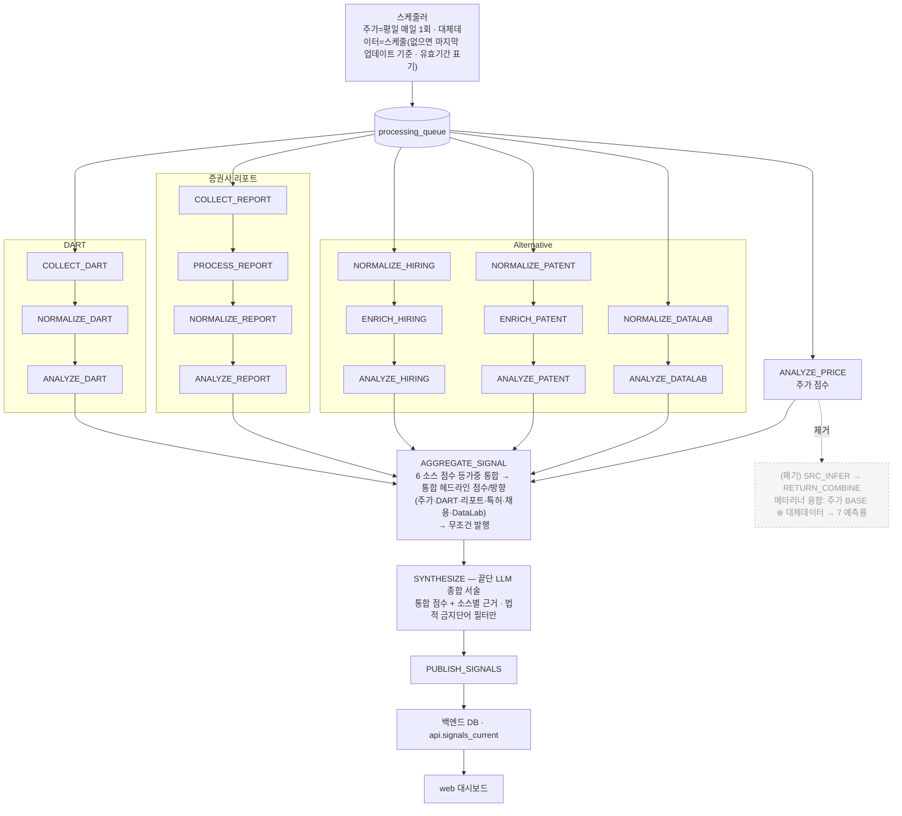
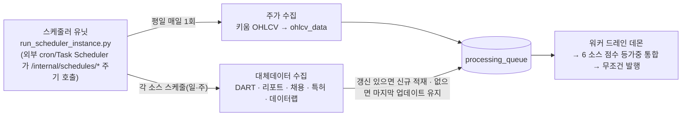
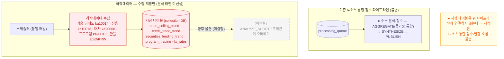

# 워커 드레인 파이프라인 (전체 흐름 설계도)

> `services/agent-worker` 큐 드레인 파이프라인의 **전체 흐름 + 구현 상태**다. 끝단 LLM 서술(법적 금지단어만
> 필터)·`RISK_VETO`/`run_recommend`/근거 이벤트 게이트 폐기·무조건 발행은 이미 구현·머지돼 라이브다.
> 토폴로지·DB 경계는 [architecture-diagram.md](../architecture-diagram.md). 최종 갱신: **2026-07-08**.
>
> **🔄 방향 전환(2026-07-08): 메타러너 융합 폐기 → aggregator 6-소스 통합 점수.** 종전 설계는 "주가 예측률 BASE
> ⊕ 대체데이터 가산 → 7 예측률"(메타러너 학습형 융합)이었으나, return 채널 학습 산출물(`meta_learner_return.json`)이
> **부재해 SRC 융합 라인은 dormant**였다(실측: 005930=중립50). 학습형 융합은 걷어내되, **헤드라인 점수 = 주가·DART·
> 리포트·특허·채용·DataLab 6개 소스가 각자 분석·점수화된 뒤 `AGGREGATE_SIGNAL` 이 등가중으로 통합한 하나의 점수**로
> 산출한다(주가도 점수 산입 소스). 즉 "메타러너를 안 쓰되 주가만이 아니라 **모든 소스가 통합 점수에 들어가는**"
> 결정론 집계다. 새 목표 설계·전환 계획은 아래 "[통합 점수 산출]"·"[전환 계획]" 절.

## 전체 흐름 (목표: 6-소스 통합 점수)

> 설계 핵심: **6개 소스(주가·DART·리포트·특허·채용·DataLab)를 각자 분석·점수화**하고, **`AGGREGATE_SIGNAL` 이
> 소스별 점수를 등가중으로 통합**해 하나의 헤드라인 점수를 낸다. 메타러너 학습형 융합(SRC_INFER·RETURN_COMBINE·주가
> BASE ⊕ 대체데이터·7 예측률)은 **폐기**. 주가는 평일 매일 갱신돼 발행 하한선을 만들고(무조건 발행), 대체데이터는
> 그날 갱신이 없으면 last-known 재사용. 방향 신호 없는 소스(no_signal)는 통합 평균에서 빠지되 근거·커버리지로 표시.
> 끝단 LLM 은 통합 점수 + 소스별 근거를 **서술**하고 **법적 금지단어**(투자·매수·매도·적극매수·적극매도)만 필터한다.

`DRAIN_ORDER` 는 드레인 효율용 정렬이고, 끝단 도달 정확성은 `drain_until_idle` 의 progressed 루프가 보장한다.

## 스케줄러·수집 주기 (설계)

> 주가는 **평일 매일 1회** 수집되어 `ANALYZE_PRICE` 가 매일 돌고, 그래서 종목마다 통합 헤드라인이 **매일 무조건
> 발행**된다(주가가 발행 하한선). 대체데이터는 각 스케줄로 수집하되 **그날 갱신이 없으면 마지막 업데이트 자료를
> 그대로 사용**한다(유효기간 표기 + LLM 서술에 "최종 업데이트 N일 전" 설명 추가).

- **주가 = 매일 보장**: 평일에는 `ANALYZE_PRICE` 가 항상 실행되므로 발행이 비지 않는다(발행의 하한선).
- **대체데이터 = best-effort + last-known**: 신규 수집이 없으면 직전 분석 결과를 유효기간 내 재사용한다(폐기 X).

## 단계별 동작

- **수집 → 정규화 → 분석 (소스별)**: DART(`COLLECT→NORMALIZE→ANALYZE`), 리포트(`COLLECT→PROCESS→
  NORMALIZE→ANALYZE`), Alternative(hiring `NORMALIZE→ENRICH→ANALYZE_HIRING`, patent
  `NORMALIZE→ENRICH→ANALYZE_PATENT`, datalab `NORMALIZE→ANALYZE_DATALAB`), 주가(`ANALYZE_PRICE`). 대체데이터가
  그날 갱신이 없으면 **마지막 업데이트 기준**으로 제공하고(유효기간 표기, 예: 6/28 자료 → 7/7), 끝단 LLM 서술에
  그 사실을 덧붙인다.

- **소스별 분석·점수 (6 소스)**: 주가(`ANALYZE_PRICE`, 규칙 기반 기술분석, `app/orchestrator/price/tasks.py`)·
  DART·리포트·특허·채용·DataLab 이 **각자 분석해 방향/점수(signed score)를 산출**한다(소스별 `analysis_result`+
  `agent_result`, run_key=소스). 주가는 평일 매일 갱신되므로 발행 하한선을 만든다.

- **통합 점수 산출·발행 (`AGGREGATE_SIGNAL`)**: fan-in 으로 (stock, date) 의 모든 소스 결과를 모아 **점수 산입
  소스(주가 포함 6개)의 signed score 를 등가중 평균**해 하나의 통합 헤드라인 점수/방향을 낸다. 방향 신호가 없는
  소스(no_signal)·실패 소스는 **평균에서 제외**하되(0 으로 끌어내리지 않음) 근거·커버리지로는 표시한다.
  **무조건 발행**한다 — 주가가 매일 갱신되므로 발행이 막힐 일이 없다(발행 판정 게이트·근거 이벤트 조건 **없음**).

- **종합 (`SYNTHESIZE`, `synthesis/tasks.py`)**: 끝단 LLM 이 통합 점수 + 소스별 근거를 사용자에게 **서술**한다.
  유일한 가드는 **법적 금지단어 필터**(투자·매수·매도·적극매수·적극매도 등) — 위반 표현만 막고, 그 외 보류/veto 는
  없다. LLM 미설정 시 결정론 폴백 서술.

- **발행 (`PUBLISH_SIGNALS`)**: `final_signals` 등을 백엔드 DB 로 앱레벨 발행(`signal_publisher`) →
  `api.signals_current`/`signal_detail` → web.

- **폐기됨**: `RISK_VETO`(치명 키워드 발행 보류)·`run_recommend`→`recommendations`(추천 랭킹)·발행의 **근거 이벤트
  게이팅**·변동성 vol 채널(#585)은 이미 제거. **🔄 신규 폐기: 메타러너 학습형 융합 라인**(`SRC_INFER`·
  `RETURN_COMBINE`·주가 BASE ⊕ 대체데이터·7 예측률) — 통합 점수를 **결정론 등가중 집계**로 되돌리며 융합 경로를
  걷어낸다(아래 계획). 소스별 분석·점수는 전부 살아 통합 점수에 산입된다.

## 통합 점수 산출 (목표 — 메타러너 폐기, 전 소스 결정론 집계)

> **의도**: 헤드라인 점수를 **6개 소스(주가·DART·리포트·특허·채용·DataLab)가 각자 분석·점수화된 뒤
> `AGGREGATE_SIGNAL` 이 등가중으로 통합한 하나의 점수**로 확정한다. 메타러너 학습형 융합(주가 BASE ⊕ 대체데이터,
> 7 예측률)은 **폐기**한다. "메타러너는 안 쓰되, 주가만이 아니라 **모든 소스가 통합 점수에 들어간다**"가 핵심.

**왜 이 구조인가 (근거)**
- **메타러너 학습형 융합은 지금 실익이 없다.** return 채널 학습 산출물(`meta_learner_return.json`)이 부재해
  `combine_return` 은 균등폴백만 돌고, 대체소스 base 모델(`src_datalab` 등)도 미학습이라 예측 None → 융합이 dormant.
  대체데이터 방향성 알파도 전 소스 null(BH-FDR 생존 0)이라 학습형 융합을 되살릴 근거가 약하다. → 학습형 stacker
  대신 **투명한 등가중 결정론 집계**가 맞다(예측결합 퍼즐·1/N — 소표본에선 등가중이 강건).
- **모든 소스가 점수에 기여해야 한다.** 주가만이 아니라 DART·리포트·특허·채용·DataLab 각 분석 결과가 통합 점수에
  들어가야 사용자가 "여러 데이터가 종합된 하나의 점수"를 본다(제품 의도). 주가는 매일 갱신돼 발행 하한선을 만든다.
- **방향 없는 소스는 희석하지 않는다.** no_signal/실패 소스는 통합 평균에서 빠지되(0 으로 끌어내리지 않음) 근거·
  커버리지로는 표시한다(현 `_aggregate` 규칙 유지). 그래서 데이터가 붙는 소스가 늘수록 통합 점수가 풍부해진다.

**목표 흐름**
1. **소스별 분석** — 주가(`ANALYZE_PRICE`)·DART·리포트·특허·채용·DataLab 이 각자 `analysis_result`+`agent_result`
   (run_key=소스)로 방향/점수를 낸다.
2. **`AGGREGATE_SIGNAL`** (`app/orchestrator/aggregation/tasks.py`): fan-in → `_aggregate` 가 점수 산입 소스
   (`SCORING_SOURCES`, **주가 포함 6개**)의 signed score 를 **등가중 평균**해 통합 점수·방향을 산출한다. `_headline`
   은 메타러너 `src_meta` 폴백 없이 이 **결정론 통합 블렌드**를 헤드라인으로 확정한다(scoring 소스가 0 일 때만 중립 50).
3. **`SYNTHESIZE` → `PUBLISH_SIGNALS`**: LLM 이 통합 점수 + 소스별 근거를 서술(법적 금지단어만 필터) → 발행.

**폐기 대상 (메타러너 융합 경로)**
- `SRC_INFER`(`app/ml/source_inference.py`) · `RETURN_COMBINE`(`app/ml/return_combine.py`) 큐 스테이지.
- `RETURN_COMBINE` 의 `final_signals.source_predictions`(7 예측률) 오버레이.
- `AGGREGATE_SIGNAL._headline` 의 `src_meta` 폴백 단계(meta_signals run_key=`SRC` 조회) — 결정론 통합만 남긴다.
- 리포트 API `prediction_rates`(주가1 + 공공데이터5) — **표시 계약 정리**(main-server·web, 아래 계획 D단계).

**보존**
- **6개 소스 분석 스테이지 전부** — 이제 전부 **통합 점수의 산입 소스**다(주가 포함).
- `_aggregate` 등가중 평균·`_resolve_signal` mixed 판정 등 기존 다중 소스 통합 로직은 그대로 재사용한다.
- 오케스트레이터 되묻기(REQUERY)·에피소드 메모리·outcome 리코더는 불변(숫자 불변, 근거/학습 루프).
- vol 채널(run_key=`ML`, `combined_vol`)은 이미 제거됨 — 건드리지 않는다.

## 통합 점수 전환 계획

> 스코프: `services/agent-worker`(대체데이터+aggregator, 우리 영역). 표시 계약(D단계)의 `main-server`·`web`
> 은 **팀원/프론트 영역이라 조율 항목**으로만 둔다. PR-only(직접 머지 금지). 대부분 **기존 결정론 집계 로직 재사용**
> 이라 변경 폭이 작다.

**A. 헤드라인을 6-소스 통합 점수로** (`app/orchestrator/aggregation/tasks.py`)
- `SCORING_SOURCES`(L34)에 **`PRICE` 추가** → `{"PRICE","DART","REPORT","HIRING","PATENT","DATALAB"}`. 현재 주가는
  근거 전용으로 빠져 있어(주석 L33–34) 통합 점수에 안 들어간다 — 주가를 산입 소스로 편입하는 게 이 수정의 핵심.
- `_headline`(약 L912–937): 3단 폴백에서 **`src_meta` 단계 제거** → 항상 **결정론 통합 블렌드**
  (`aggregate["signal"]`/`["final_score"]`)를 헤드라인으로. scoring 소스가 0 일 때만 중립(50). (이미 있는
  `deterministic_blend` 경로를 유일 경로로 승격 — 로직 신설 없음.)
- `src_row = meta_repository.latest_for_stock(run_key="SRC")` 조회(L189)·`_scoring_method`(src_meta 관련) 라벨 정리.
- `contributes_to_score`(L641)는 `SCORING_SOURCES` 기반이라 주가 편입 시 자동으로 주가도 True. no_signal 소스는
  기존대로 평균에서 제외(희석 방지) — `_aggregate`(L513–525)·`_resolve_signal`(L594) **그대로 재사용**.

**B. 메타러너 융합 스테이지 언와이어** (배선 제거, 파일은 dormant 보존)
- `app/orchestrator/price/tasks.py`(L109–116): `SRC_INFER` 인큐 제거(`AGGREGATE_SIGNAL` 인큐는 유지).
- `app/orchestrator/queue/handlers.py`(L117·L119): `SRC_INFER`/`RETURN_COMBINE` 핸들러 등록 제거.
- `app/orchestrator/queue/drain_daemon.py`(DRAIN_ORDER L74–75) + `queue/tasks.py`(DEFAULT_CYCLE_PLAN
  L128–129): `src_infer`/`return_combine` 항목 제거.
- `app/ml/source_inference.py`·`return_combine.py`·`meta_learner.py` 는 **삭제 대신 dormant 보존**(연구 재사용·
  되돌리기 여지). 후속 PR 에서 정리 결정.

**C. `source_predictions` 오버레이 중단**
- `RETURN_COMBINE` 이 유일 생산자이므로 B 로 자동 중단됨. `final_signals.source_predictions` 는 빈/NULL 로 발행.
- `publish/signal_publisher.py`·`api.signals_current` 는 `SELECT *` 전파라 스키마 변경 불필요(컬럼은 NULL 로 존속).

**D. 표시 계약 정리 (조율 항목 — main-server·web, 우리가 직접 편집 X)**
- `services/main-server/app/api/routes/reports.py`(L41–49·L462–475): `prediction_rates`(per-source 6 예측률)가 빈
  값이 됨 → **통합 점수 + 소스별 점수/근거 카드**로 대체. **F/프론트가 이미 "근거 중심 재구성 + ML UI 제거" 진행 중**.
- `web` 리포트 페이지: "AI 예측률" 섹션 → 통합 점수 헤드라인 + 소스별 근거 카드. 팀/프론트 담당과 싱크.

**E. 테스트·문서**
- 영향 테스트: `tests/ml/test_return_combine.py`·`tests/ml/test_source_inference.py`·`tests/ml/test_meta_learner_return.py`
  (스테이지 폐기로 obsolete/skip), `tests/test_final_signal_aggregator.py`·`tests/test_price_aggregate_enqueue.py`
  (주가 포함 통합 블렌드 기대값으로 갱신), `tests/synthesis/*`·`tests/test_signal_publisher.py`(source_predictions 부재 허용).
- 문서: 이 파일 + `docs/architecture-diagram.md`·`docs/spec/worker-design-and-handoff.md`·
  `docs/spec/final-signal-aggregator-spec.md`·`AGENTS.md` 의 "7 예측률/메타러너" 서술을 통합 점수로 갱신.

**옵션 (미결정)**
- **가중치**: 기본안 = **등가중(1/N)** — 투명하고 소표본에 강건(예측결합 퍼즐). 소스별 신뢰가중은 방향 신호가
  확정될 때 별도 검토(현재는 등가중이 안전, 트리 메타러너 비권장).
- **주가 라인의 실체**: 기본안은 **규칙 기반 `PriceAnalyzer`**(ML 아티팩트 불요·매일 보장). 향후 옵션으로
  **주가 전용 ML 모델**(`src_price` 단독, `train_price_model.py`)을 산입 점수로 승격 가능(현 PoC 신뢰도로는 규칙 기반 우선).

## 발행 정책

- **발행 산출물 = 6-소스 통합 헤드라인 점수** + 소스별 **근거/점수**(score_breakdown·positive/caution evidence).
  헤드라인은 0-100 점수(`final_score`) + 방향(`signal`), 산입 소스의 등가중 평균.
- **사용자 노출**: 통합 헤드라인 + 소스별 점수/근거 카드. 종전 per-source 예측률(주가1+공공데이터5) 노출은 D단계로 정리.
- **무조건 발행**: 주가는 평일 매일 갱신되므로 종목마다 항상 발행(발행 판정·근거 게이트 없음).
- 끝단 LLM 서술이 통합 점수에 소스별 근거 설명을 덧붙인다(법적 금지단어만 필터).

## 현재 구현·학습 상태 (2026-07-08)

| 항목 | 상태 |
|---|---|
| 파이프라인 코드(수집~발행) | 구현·머지·라이브 |
| 무조건 발행 · RISK_VETO/run_recommend/근거게이트 폐기 (구 #602·#604·#606·#608·#610·#612·#614) | **머지·라이브** |
| 결정론 다중 소스 집계(`_aggregate` 등가중) | **구현·라이브** — 단 현재 `SCORING_SOURCES` 에 **주가 미포함** |
| 메타러너 SRC 라인(`SRC_INFER`/`RETURN_COMBINE`) 배선 | 배선돼 있으나 **dormant** — return 학습 아티팩트 부재 → 균등폴백/예측 None |
| `src_datalab`/`src_hiring`/`src_dart`/`src_patent` base 모델 | **미학습** — 예측 None(graceful) |
| **6-소스 통합 점수 전환**(이 문서 계획 A–E) | **미착수(계획 확정)** |

- 실측 함의: 현재 `_headline` 은 SRC(메타러너) → 결정론 블렌드 순으로 폴백하는데, 메타러너가 dormant 이고 **주가가
  SCORING_SOURCES 에서 빠져** 있어 DART 등 대체데이터가 대부분 no_signal 이면 **중립 50** 으로 발행된다(005930 실측).
  → **주가를 산입 소스로 편입(계획 A)** 하는 것이 핵심 수정. 로직은 대부분 기존 결정론 집계 재사용이라 변경 폭이 작다.

## 한계·주의

- **통합 점수는 등가중 결정론 집계**(학습 가중 아님) — 소스별 신뢰가중은 추후 신호 확정 시 검토. 트리 메타러너 비권장.
- 방향 근거는 주가 기술지표 비중이 크다(대체데이터가 대체로 no_signal) → **상방 편향** 경향은 대체/하락데이터 근거로 보완.
- **결정론 헤드라인 점수·RISK_VETO·run_recommend 폐기 완료.** 메타러너 학습형 융합·7 예측률은 **폐기 예정**(위 계획).
- 융합 코드(`source_inference.py`/`return_combine.py`/`meta_learner.py`)는 **dormant 보존** — 배선만 끊는다.

## 부록: 하락데이터 수집·저장 (라인 미신설)

> 하락데이터(공매도·신용·대차·프로그램 + 환율)는 **수집·저장만** 한다. 집계·발행
> **파이프라인 라인은 신설하지 않는다** — 위 6-소스 통합 점수 흐름은 그대로 유지된다. 저장된 데이터는 향후
> ad-hoc 조회·분석·모델 실험용 원천으로만 둔다.
>
> 배경: 현 파이프라인은 방향 근거가 사실상 주가 기술지표뿐이라 **상방 편향**이다. 하락을 대칭적으로 볼
> 원천 데이터를 **먼저 확보(저장)** 해 두고, 실제 분석/편입 여부는 이후 별도 검증·결정한다.

### 수집·저장 범위 (구현·적재 완료)

- **수집:** 키움 조회 TR — 공매도추이 `ka10014` · 신용매매동향 `ka10013` · 대차거래추이 `ka20068` ·
  프로그램매매 `ka90013` (+ 환율 USD/KRW: 별도 소스).
- **저장:** `short_selling_trend` · `credit_trade_trend` · `securities_lending_trend`(신규, #716 머지) +
  `program_trading` · `fx_rates`(기존 재사용). collection DB, Neon 적재 완료(35종목).
- **파이프라인 미연결:** `AGGREGATE_SIGNAL`/`SYNTHESIZE` 어디에도 연결하지 않는다. **6-소스 통합 점수 발행
  흐름 불변**(하락데이터를 통합 점수 산입 소스로 넣지 않는다).

### 향후 (옵션 · 미결정)

저장된 하락데이터를 파이프라인에 편입할지는 **별도 검증 후 결정**한다(예: `ANALYZE_SHORT` 신설, `caution_evidence`
오버레이로 하방 근거 보강 — 주가 상방 편향 균형용). 현 단계는 **저장까지만**.

