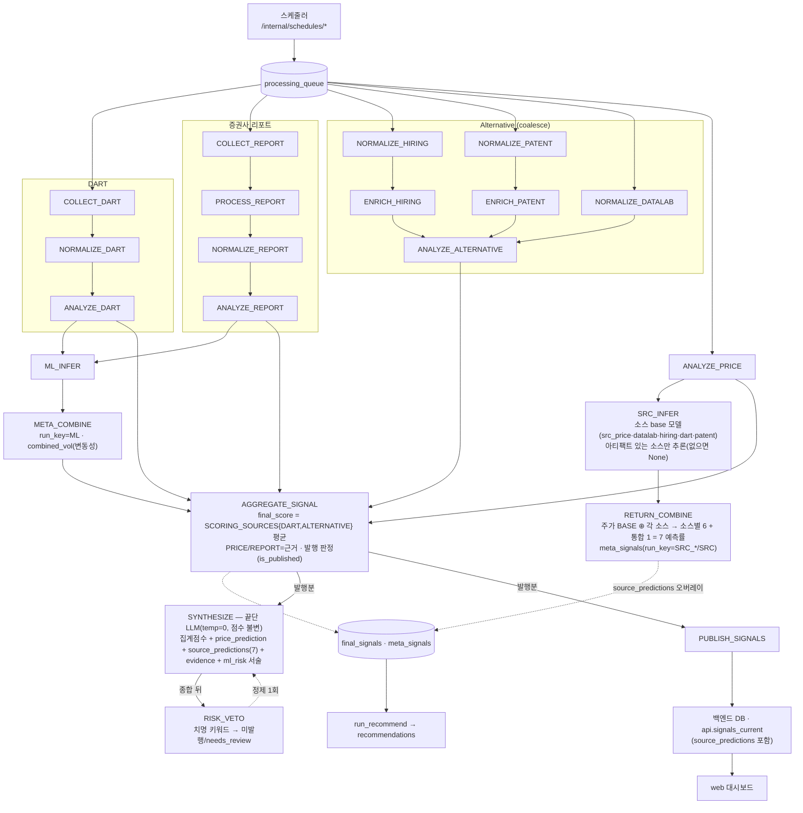

# 워커 드레인 파이프라인 (현재 동작 기준)

> `services/agent-worker` 큐 드레인 파이프라인의 **실제 현재 동작**을 코드 기준으로 정리한 문서다.
> 동작 기준은 항상 코드/테스트. 출처: `app/orchestrator/queue/drain_daemon.py`(`DRAIN_ORDER`),
> 각 핸들러의 `enqueue(...)`, `app/ml/*`, `app/synthesis/tasks.py`.
> 토폴로지·DB 경계는 [architecture-diagram.md](../architecture-diagram.md). 최종 갱신: 2026-06-28.

## 전체 흐름

`DRAIN_ORDER` 는 드레인 효율용 정렬이고, 끝단 도달 정확성은 `drain_until_idle` 의 progressed 루프가 보장한다.

## 단계별 동작

- **수집 → 정규화 → 분석 (소스별)**: DART(`COLLECT→NORMALIZE→ANALYZE`), 리포트(`COLLECT→PROCESS→
  NORMALIZE→ANALYZE`), Alternative(hiring/patent `NORMALIZE→ENRICH`, datalab `NORMALIZE` → `ANALYZE_ALTERNATIVE`
  로 coalesce — 다수 소스가 DART 를 3:1 로 압도하지 않게), 주가(`ANALYZE_PRICE`). 각 분석기는
  `agent_results.method_detail` 계약(`{source, source_score(-1~1), direction, data_status, summary, risk_flags}`)을
  낸다. 검증기 `app/orchestrator/aggregation/source_contract.py`.

- **변동성 채널 (run_key=ML)**: `ANALYZE_DART`/`ANALYZE_REPORT` 가 `ML_INFER` 인큐(`dart/tasks.py`,
  `report/tasks.py`). `ML_INFER`(`ml/inference.py`)는 OHLCV 로 vol 모델(ewma/har_rv/garch/tcn) 예측 →
  `META_COMBINE`(`ml/meta_combine.py`) stacking 결합 → `meta_signals.combined_vol`(run_key=ML). 이 채널은
  **변동성/리스크 크기**만 산출한다(방향 예측 아님).

- **메타러너 예측 라인 (run_key=SRC)** — 아래 별도 절.

- **집계 (`AGGREGATE_SIGNAL`, `aggregation/tasks.py`)**: `final_score` = `SCORING_SOURCES={DART, ALTERNATIVE}`
  평균(점수를 뒤집지 않음). PRICE/REPORT 는 점수에 산입하지 않고 **근거**로만 수집. 이 단계가 발행 판정
  (`is_published`/`warning_level`/`needs_review`) 게이트이며, 발행분만 `SYNTHESIZE` 와 `PUBLISH_SIGNALS` 를 인큐한다.

- **종합 (`SYNTHESIZE`, `synthesis/tasks.py`)**: 끝단 LLM(temperature=0). **점수·방향·발행은 불변**, 설명
  내러티브만 생성한다. 입력: 집계 점수 + `price_prediction`(주가 단독, score_breakdown.PRICE) +
  `source_predictions`(7 예측률) + `report_valuation` + evidence + `ml_risk`(변동성). LLM 미설정 시 결정론 폴백.
  종합 **뒤** `RISK_VETO`(`gates/risk_veto.py`)가 치명 키워드를 검사하고, 필요 시 LLM 정제 1회(RISK_VETO→
  SYNTHESIZE 재인큐) 후에도 치명이면 미발행.

- **발행 (`PUBLISH_SIGNALS`)**: `final_signals` 등을 백엔드 DB 로 앱레벨 발행(`signal_publisher`, `SELECT *`
  동적 복사) → `api.signals_current`/`signal_detail`(읽기 계약 view, `source_predictions` 포함) → web.

- **추천 (`run_recommend.py`)**: `final_signals`/`meta_signals` → `recommendations`(rank, 변동성 역가중).

## 메타러너 예측 라인 — 주가 BASE 앵커 + 대체데이터 가산

설계 의도: **주가 예측률을 BASE(앵커)로 두고 각 대체데이터를 가산/참조**해 소스별 예측률을 만든다
(주가는 데이터가 풍부해 BASE 로 적합, 대체데이터는 1~3년치·비실시간이라 보조).

흐름(트리거됨):
1. **`ANALYZE_PRICE` 가 `SRC_INFER` 를 인큐**(per-stock 1회, `orchestrator/price/tasks.py`).
2. **`SRC_INFER`**(`ml/source_inference.py`): 소스별 정형 피처 → base 모델(`src_price`·`src_datalab`·
   `src_hiring`·`src_dart`·`src_patent`, LightGBM) → forward-return 예측을 `ml_inferences`(run_key=SRC) 적재.
   학습 아티팩트(`app/ml/artifacts/source_models/*.txt`)가 있는 소스만 예측, 없으면 None(graceful).
3. **`RETURN_COMBINE`**(`ml/return_combine.py`): 각 소스 = `combine_return({src_price, src_<source>})` 로
   **주가 BASE 를 앵커로 포함**해 융합. 소스별 6개(`SRC_PRICE`/`SRC_DATALAB`/`SRC_HIRING`/`SRC_DART`/
   `SRC_PATENT`/`SRC_REPORT`) + 통합 1개(`SRC`) = **총 7개** 를 `meta_signals`(per-source run_key)에 적재하고,
   현재 발행 신호의 `final_signals.source_predictions`(JSONB) + `ml_*` 컬럼에 오버레이한다.
4. 발행 경로(`PUBLISH_SIGNALS` → `api.signals_current.source_predictions`)와 `SYNTHESIZE`(LLM 서술,
   수치 불변)로 사용자에게 노출.

숫자 예측률은 메타러너/융합이 확정하고 LLM 은 서술만 한다. 변동성 채널(run_key=ML)과는 자연키로
분리되어 `combined_vol` 을 오염시키지 않는다(SRC 행의 combined_vol 은 NULL).

## 점수·발행 정책

- **발행 헤드라인 점수 = 결정론 집계(`final_score`, SCORING_SOURCES)**. 7개 예측률(`source_predictions`)은
  이와 **병행 노출**되며 헤드라인을 대체하지 않는다(통합 예측률로의 헤드라인 교체는 학습·검증 후 과제).
- 주가 단독 예측(`price_prediction`)과 메타러너 7예측률(`source_predictions`)은 별개 필드로 함께 노출된다.

## 현재 구현·학습 상태 (2026-06-28)

| 항목 | 상태 |
|---|---|
| 파이프라인 코드(수집~발행, 메타러너 라인 포함) | 구현·머지됨 |
| `SRC_INFER` 라이브 트리거(ANALYZE_PRICE) | 배선됨 |
| `src_price`(주가 BASE) 모델 | **학습됨** — Neon 3년·20종목, OOF 방향적중 ≈0.59, 소표본·중첩 라벨의 **PoC** 수준 |
| `src_datalab`/`src_hiring`/`src_dart`/`src_patent` | **미학습** — 원천 데이터 미적재(실적재 단계 필요) → 예측 None(graceful) |
| 발행 헤드라인 | 결정론 집계 유지(7예측률 병행 노출) |

- 학습 하니스: 주가 = `app/ml/train_price_model.py`(OHLCV 밀집 패널), 이벤트형 소스 =
  `app/ml/train_source_models.py`(event_study_panel forward-return 라벨).
- 아티팩트(`*.txt`)는 환경·데이터별 산출물이라 미커밋(.gitignore) — 배포 시 학습으로 생성.
- E2E(로컬 PG + 학습된 src_price)로 `ANALYZE_PRICE → SRC_INFER → RETURN_COMBINE → final_signals.
  source_predictions → SYNTHESIZE` 노출까지 검증됨.

## 한계·주의

- 대체 4모델은 데이터가 적재·학습돼야 예측에 기여한다(현재는 `src_price` 만 실값).
- 메타러너 예측 정확도는 데이터량에 비례하며 현 단계는 PoC — 발행 신뢰도 자료로 단정하지 말 것.
- 점수 산식(SCORING_SOURCES)은 메타러너 라인과 무관하게 불변.
