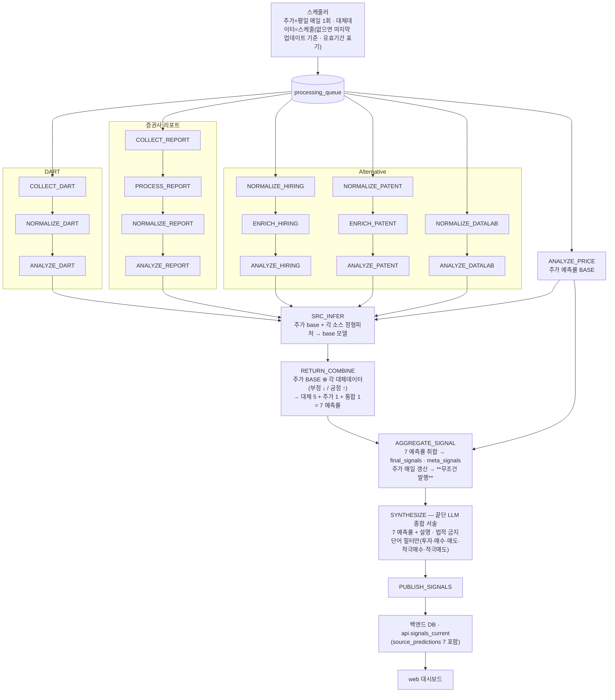
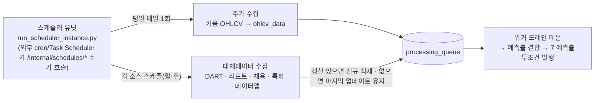

# 워커 드레인 파이프라인 (목표 설계)

> `services/agent-worker` 큐 드레인 파이프라인의 **목표 설계**다 — 주가 예측률 BASE ⊕ 대체데이터 →
> **7 예측률 무조건 발행**, 끝단 LLM 서술(법적 금지단어만 필터). 결정론 집계 헤드라인·근거 이벤트 게이트·
> `RISK_VETO`·`run_recommend` 는 **폐기**한다. 이 설계 확정 후 코드를 재작성한다(아래 "구현 상태"에 현재 코드와의 차이).
> 토폴로지·DB 경계는 [architecture-diagram.md](../architecture-diagram.md). 최종 갱신: 2026-06-28.

## 전체 흐름

> 설계 핵심: **주가 예측률을 BASE 로, 각 대체데이터 분석을 그 위에 가/감산**해 소스별 예측률을 만든다.
> 대체 5 + 주가 1 + 통합 1 = **7 예측률을 무조건 발행**한다(주가는 평일 매일 갱신되므로 막힐 일이 없다).
> 발행 판정·근거 이벤트 게이트·RISK_VETO 치명키워드 보류·run_recommend 는 **없다**(제거됨). 끝단 LLM 은
> 7 예측률을 서술하고 **법적 금지단어**(투자·매수·매도·적극매수·적극매도)만 필터한다.

`DRAIN_ORDER` 는 드레인 효율용 정렬이고, 끝단 도달 정확성은 `drain_until_idle` 의 progressed 루프가 보장한다.

## 스케줄러·수집 주기 (설계)

> 주가는 **평일 매일 1회** 수집되어 `ANALYZE_PRICE` 가 매일 돌고, 그래서 종목마다 7 예측률이 **매일 무조건
> 발행**된다. 대체데이터는 각 스케줄로 수집하되 **그날 갱신이 없으면 마지막 업데이트 자료를 그대로 사용**한다
> (유효기간 표기 + LLM 서술에 "최종 업데이트 N일 전" 설명 추가).

- **주가 = 매일 보장**: 평일에는 `ANALYZE_PRICE` 가 항상 실행되므로 발행이 비지 않는다(발행의 하한선).
- **대체데이터 = best-effort + last-known**: 신규 수집이 없으면 직전 분석 결과를 유효기간 내 재사용한다(폐기 X).

## 단계별 동작 (목표 설계 — 코드 재작성 대상)

> ⚠️ 이 절은 **목표 설계**다. 현재 코드는 결정론 집계 점수·근거 이벤트 게이트·RISK_VETO·run_recommend 를
> 갖고 있으나, 아래 설계로 **재작성** 예정(설계 확정 → 코드). 제거 대상은 맨 아래 "제거" 항목 참조.

- **수집 → 정규화 → 분석 (소스별)**: DART(`COLLECT→NORMALIZE→ANALYZE`), 리포트(`COLLECT→PROCESS→
  NORMALIZE→ANALYZE`), Alternative(hiring `NORMALIZE→ENRICH→ANALYZE_HIRING`, patent
  `NORMALIZE→ENRICH→ANALYZE_PATENT`, datalab `NORMALIZE→ANALYZE_DATALAB`), 주가(`ANALYZE_PRICE`). 대체데이터가
  그날 갱신이 없으면 **마지막 업데이트 기준**으로 제공하고(유효기간 표기, 예: 6/28 자료 → 7/7), 끝단 LLM 서술에
  그 사실을 덧붙인다.

- **예측률 결합 (`SRC_INFER` → `RETURN_COMBINE`)**: **주가 예측률을 BASE** 로 두고, 각 대체데이터(report·hiring·
  patent·dart·datalab) 분석을 그 위에 **가/감산**한다(부정적 → 숫자 ↓, 긍정적 → 숫자 ↑). 결과는 **대체 5 + 주가 1
  + 통합 1 = 7 예측률**(`source_predictions`/`meta_signals`).

- **집계·발행 (`AGGREGATE_SIGNAL`)**: 7 예측률을 `final_signals`·`meta_signals` 로 취합한다. **무조건 발행**한다 —
  주가는 평일 매일 갱신되므로 발행이 막힐 일이 없다. (발행 판정 게이트·근거 이벤트 조건·`is_published` 보류 **없음**.)

- **종합 (`SYNTHESIZE`, `synthesis/tasks.py`)**: 끝단 LLM 이 7 예측률을 사용자에게 **서술**한다(예측률만으론 설명이
  부족하므로 필수). 유일한 가드는 **법적 금지단어 필터**(투자·매수·매도·적극매수·적극매도 등) — 위반 표현만 막고,
  그 외 보류/veto 는 없다. LLM 미설정 시 결정론 폴백 서술.

- **발행 (`PUBLISH_SIGNALS`)**: `final_signals` 등을 백엔드 DB 로 앱레벨 발행(`signal_publisher`) →
  `api.signals_current`/`signal_detail`(`source_predictions` 7 포함) → web.

- **제거 (싹 다)**: `RISK_VETO`(치명 키워드 발행 보류), `run_recommend`→`recommendations`(추천 랭킹), 발행의
  **근거 이벤트 게이팅**, 변동성 vol 채널(이미 #585 제거). 금융 법적 금지단어 필터만 남긴다.

## 메타러너 예측 라인 — 주가 BASE 앵커 + 대체데이터 가산

설계 의도: **주가 예측률을 BASE(앵커)로 두고 각 대체데이터를 가산/참조**해 소스별 예측률을 만든다
(주가는 데이터가 풍부해 BASE 로 적합, 대체데이터는 1~3년치·비실시간이라 보조).

흐름(트리거됨):
1. **`ANALYZE_PRICE` 가 `SRC_INFER` 를 인큐**(per-stock 1회, `orchestrator/price/tasks.py`).
2. **`SRC_INFER`**(`ml/source_inference.py`): 소스별 정형 피처 → base 모델(`src_price`·`src_datalab`·
   `src_hiring`·`src_dart`·`src_patent`, LightGBM) → forward-return 예측을 `ml_inferences`(run_key=SRC) 적재.
   학습 아티팩트(`app/ml/artifacts/source_models/*.txt`)가 있는 소스만 예측, 없으면 None(graceful).
3. **`RETURN_COMBINE`**(`ml/return_combine.py`): 각 소스 = `combine_return({src_price, src_<source>})` 로
   **주가 BASE 를 앵커로 포함**해 융합. 소스별 6개(`SRC_PRICE`/`SRC_DATALAB`/`SRC_HIRING`/`SRC_DART`/
   `SRC_PATENT`/`SRC_REPORT`) + 통합 1개(`SRC`) = **총 7개** 를 `meta_signals`(per-source run_key)에 적재하고,
   현재 발행 신호의 `final_signals.source_predictions`(JSONB) + `ml_*` 컬럼에 오버레이한다.
4. 발행 경로(`PUBLISH_SIGNALS` → `api.signals_current.source_predictions`)와 `SYNTHESIZE`(LLM 서술,
   수치 불변)로 사용자에게 노출.

숫자 예측률은 메타러너/융합이 확정하고 LLM 은 서술만 한다. 메타러너 return 행은 `run_key=SRC` 로
분리 적재된다(제거된 vol 채널의 `run_key=ML` 과 무관 — `combined_vol` 은 항상 NULL).

## 발행 정책 (목표 설계)

- **발행 산출물 = 7 예측률**(`source_predictions`): 대체 5 + 주가 1 + 통합 1. 주가가 BASE, 대체데이터는 가/감산.
- **무조건 발행**: 주가는 평일 매일 갱신되므로 종목마다 항상 7 예측률을 발행한다(발행 판정·근거 게이트 없음).
- 끝단 LLM 서술이 7 예측률에 설명을 덧붙인다(법적 금지단어만 필터). 결정론 헤드라인 점수·추천 랭킹은 폐기.

## 현재 구현·학습 상태 (2026-06-28)

| 항목 | 상태 |
|---|---|
| 파이프라인 코드(수집~발행, 메타러너 라인 포함) | 구현·머지됨 |
| `SRC_INFER` 라이브 트리거(ANALYZE_PRICE) | 배선됨 |
| `src_price`(주가 BASE) 모델 | **학습됨** — Neon 3년·20종목, OOF 방향적중 ≈0.59, 소표본·중첩 라벨의 **PoC** 수준 |
| `src_datalab`/`src_hiring`/`src_dart`/`src_patent` | **미학습** — 원천 데이터 미적재(실적재 단계 필요) → 예측 None(graceful) |
| 발행 헤드라인 | **현재** 결정론 집계(7예측률 병행) → **목표** 7예측률 무조건 발행으로 재작성(이 문서 설계) |

- 학습 하니스: 주가 = `app/ml/train_price_model.py`(OHLCV 밀집 패널), 이벤트형 소스 =
  `app/ml/train_source_models.py`(event_study_panel forward-return 라벨).
- 아티팩트(`*.txt`)는 환경·데이터별 산출물이라 미커밋(.gitignore) — 배포 시 학습으로 생성.
- E2E(로컬 PG + 학습된 src_price)로 `ANALYZE_PRICE → SRC_INFER → RETURN_COMBINE → final_signals.
  source_predictions → SYNTHESIZE` 노출까지 검증됨.

## 한계·주의

- 대체 4모델은 데이터가 적재·학습돼야 예측에 기여한다(현재는 `src_price` 만 실값).
- 메타러너 예측 정확도는 데이터량에 비례하며 현 단계는 PoC — 발행 신뢰도 자료로 단정하지 말 것.
- **목표 설계에서 결정론 헤드라인 점수·RISK_VETO·run_recommend 는 폐기**하고 7 예측률 무조건 발행으로 재작성한다(코드 재작성 대기).
