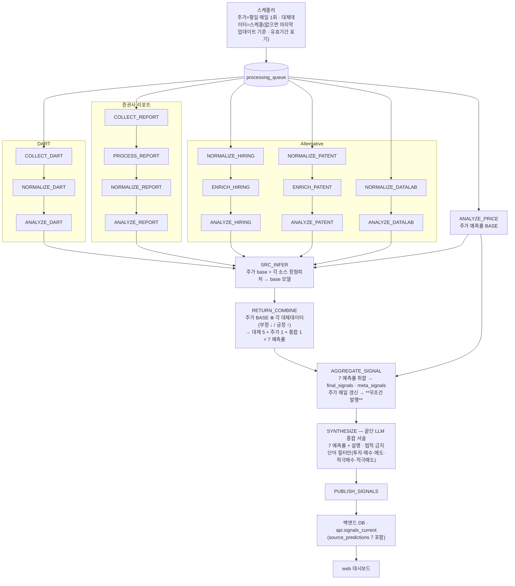
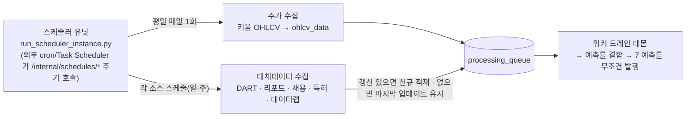
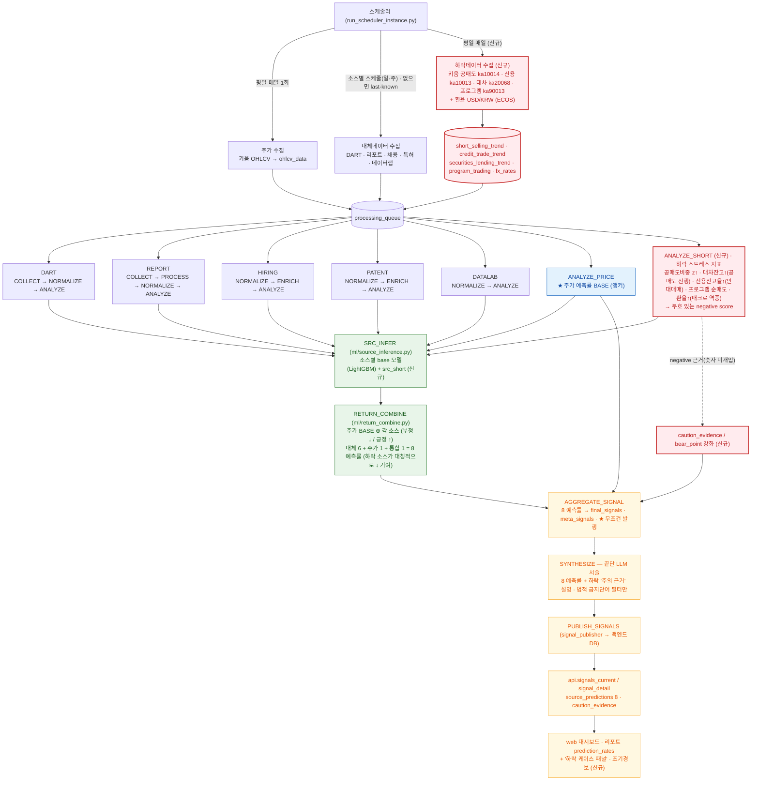

# 워커 드레인 파이프라인 (목표 설계)

> `services/agent-worker` 큐 드레인 파이프라인의 **목표 설계 + 구현 상태**다 — 주가 예측률 BASE ⊕ 대체데이터 →
> **7 예측률 무조건 발행**, 끝단 LLM 서술(법적 금지단어만 필터). 결정론 집계 헤드라인·근거 이벤트 게이트·
> `RISK_VETO`·`run_recommend` 는 **폐기**한다. **이 설계는 PR 스택(#602→#608→#610→#612→#614, 독립 #604·#606)
> 으로 구현 완료돼 머지 대기 중**이다(아래 "구현 상태" 표 참고).
> 토폴로지·DB 경계는 [architecture-diagram.md](../architecture-diagram.md). 최종 갱신: 2026-06-29.

## 전체 흐름

> 설계 핵심: **주가 예측률을 BASE 로, 각 대체데이터 분석을 그 위에 가/감산**해 소스별 예측률을 만든다.
> 대체 5 + 주가 1 + 통합 1 = **7 예측률을 무조건 발행**한다(주가는 평일 매일 갱신되므로 막힐 일이 없다).
> 발행 판정·근거 이벤트 게이트·RISK_VETO 치명키워드 보류·run_recommend 는 **없다**(제거됨). 끝단 LLM 은
> 7 예측률을 서술하고 **법적 금지단어**(투자·매수·매도·적극매수·적극매도)만 필터한다.

`DRAIN_ORDER` 는 드레인 효율용 정렬이고, 끝단 도달 정확성은 `drain_until_idle` 의 progressed 루프가 보장한다.

## 스케줄러·수집 주기 (설계)

> 주가는 **평일 매일 1회** 수집되어 `ANALYZE_PRICE` 가 매일 돌고, 그래서 종목마다 7 예측률이 **매일 무조건
> 발행**된다. 대체데이터는 각 스케줄로 수집하되 **그날 갱신이 없으면 마지막 업데이트 자료를 그대로 사용**한다
> (유효기간 표기 + LLM 서술에 "최종 업데이트 N일 전" 설명 추가).

- **주가 = 매일 보장**: 평일에는 `ANALYZE_PRICE` 가 항상 실행되므로 발행이 비지 않는다(발행의 하한선).
- **대체데이터 = best-effort + last-known**: 신규 수집이 없으면 직전 분석 결과를 유효기간 내 재사용한다(폐기 X).

## 단계별 동작 (목표 설계 — 코드 재작성 대상)

> ⚠️ 이 절은 **목표 설계**다. 현재 코드는 결정론 집계 점수·근거 이벤트 게이트·RISK_VETO·run_recommend 를
> 갖고 있으나, 아래 설계로 **재작성** 예정(설계 확정 → 코드). 제거 대상은 맨 아래 "제거" 항목 참조.

- **수집 → 정규화 → 분석 (소스별)**: DART(`COLLECT→NORMALIZE→ANALYZE`), 리포트(`COLLECT→PROCESS→
  NORMALIZE→ANALYZE`), Alternative(hiring `NORMALIZE→ENRICH→ANALYZE_HIRING`, patent
  `NORMALIZE→ENRICH→ANALYZE_PATENT`, datalab `NORMALIZE→ANALYZE_DATALAB`), 주가(`ANALYZE_PRICE`). 대체데이터가
  그날 갱신이 없으면 **마지막 업데이트 기준**으로 제공하고(유효기간 표기, 예: 6/28 자료 → 7/7), 끝단 LLM 서술에
  그 사실을 덧붙인다.

- **예측률 결합 (`SRC_INFER` → `RETURN_COMBINE`)**: **주가 예측률을 BASE** 로 두고, 각 대체데이터(report·hiring·
  patent·dart·datalab) 분석을 그 위에 **가/감산**한다(부정적 → 숫자 ↓, 긍정적 → 숫자 ↑). 결과는 **대체 5 + 주가 1
  + 통합 1 = 7 예측률**(`source_predictions`/`meta_signals`).

- **집계·발행 (`AGGREGATE_SIGNAL`)**: 7 예측률을 `final_signals`·`meta_signals` 로 취합한다. **무조건 발행**한다 —
  주가는 평일 매일 갱신되므로 발행이 막힐 일이 없다. (발행 판정 게이트·근거 이벤트 조건·`is_published` 보류 **없음**.)

- **종합 (`SYNTHESIZE`, `synthesis/tasks.py`)**: 끝단 LLM 이 7 예측률을 사용자에게 **서술**한다(예측률만으론 설명이
  부족하므로 필수). 유일한 가드는 **법적 금지단어 필터**(투자·매수·매도·적극매수·적극매도 등) — 위반 표현만 막고,
  그 외 보류/veto 는 없다. LLM 미설정 시 결정론 폴백 서술.

- **발행 (`PUBLISH_SIGNALS`)**: `final_signals` 등을 백엔드 DB 로 앱레벨 발행(`signal_publisher`) →
  `api.signals_current`/`signal_detail`(`source_predictions` 7 포함) → web.

- **제거 (싹 다)**: `RISK_VETO`(치명 키워드 발행 보류), `run_recommend`→`recommendations`(추천 랭킹), 발행의
  **근거 이벤트 게이팅**, 변동성 vol 채널(이미 #585 제거). 금융 법적 금지단어 필터만 남긴다.

## 메타러너 예측 라인 — 주가 BASE 앵커 + 대체데이터 가산

설계 의도: **주가 예측률을 BASE(앵커)로 두고 각 대체데이터를 가산/참조**해 소스별 예측률을 만든다
(주가는 데이터가 풍부해 BASE 로 적합, 대체데이터는 1~3년치·비실시간이라 보조).

흐름(트리거됨):
1. **`ANALYZE_PRICE` 가 `SRC_INFER` 를 인큐**(per-stock 1회, `orchestrator/price/tasks.py`).
2. **`SRC_INFER`**(`ml/source_inference.py`): 소스별 정형 피처 → base 모델(`src_price`·`src_datalab`·
   `src_hiring`·`src_dart`·`src_patent`, LightGBM) → forward-return 예측을 `ml_inferences`(run_key=SRC) 적재.
   학습 아티팩트(`app/ml/artifacts/source_models/*.txt`)가 있는 소스만 예측, 없으면 None(graceful).
3. **`RETURN_COMBINE`**(`ml/return_combine.py`): 각 소스 = `combine_return({src_price, src_<source>})` 로
   **주가 BASE 를 앵커로 포함**해 융합. 소스별 6개(`SRC_PRICE`/`SRC_DATALAB`/`SRC_HIRING`/`SRC_DART`/
   `SRC_PATENT`/`SRC_REPORT`) + 통합 1개(`SRC`) = **총 7개** 를 `meta_signals`(per-source run_key)에 적재하고,
   현재 발행 신호의 `final_signals.source_predictions`(JSONB) + `ml_*` 컬럼에 오버레이한다. 각 예측률 엔트리는
   예측 수익률(`final_score`)과 함께 **0-100 'AI 예측 점수'(`score_100`, tanh 변환 — `meta_learner.return_to_score_100`,
   헤드라인과 동일)** 를 동반 적재해 사용자 노출에 그대로 쓴다.
4. 발행 경로(`PUBLISH_SIGNALS` → `api.signals_current.source_predictions`)와 `SYNTHESIZE`(LLM 서술,
   수치 불변)로 사용자에게 노출. 리포트 API(`/api/reports/{ticker}` → `prediction_rates`, `reports.py`)는
   **주가 1 + 공공데이터 5(DART·증권사리포트·채용·특허·네이버데이터랩) = per-source 6개 예측률을 0-100 으로 따로
   노출**한다(통합 `SRC` 는 헤드라인 `score`/`direction` 으로 이미 노출). 비회원은 공개 소스(DART·데이터랩)만.

숫자 예측률은 메타러너/융합이 확정하고 LLM 은 서술만 한다. 메타러너 return 행은 `run_key=SRC` 로
분리 적재된다(제거된 vol 채널의 `run_key=ML` 과 무관 — `combined_vol` 은 항상 NULL).

## 발행 정책 (구현됨 — PR 스택 머지 대기)

- **발행 산출물 = 7 예측률**(`source_predictions`): 대체 5 + 주가 1 + 통합 1. 주가가 BASE, 대체데이터는 가/감산.
  각 예측률은 0-100 `score_100` 동반(헤드라인과 동일 tanh 변환).
- **사용자 노출**: 통합(`SRC`)은 발행 **헤드라인**(`score`/`direction`). per-source 6개(주가 1 + **공공데이터
  예측률 5개** = 주가 ⊕ 각 공공데이터)는 리포트 `prediction_rates` 로 **따로** 보여준다(공공데이터 5개가 핵심 노출).
- **무조건 발행**: 주가는 평일 매일 갱신되므로 종목마다 항상 7 예측률을 발행한다(발행 판정·근거 게이트 없음).
- 끝단 LLM 서술이 7 예측률에 설명을 덧붙인다(법적 금지단어만 필터). 결정론 헤드라인 점수·추천 랭킹은 폐기.

## 현재 구현·학습 상태 (2026-06-29)

| 항목 | 상태 |
|---|---|
| 파이프라인 코드(수집~발행, 메타러너 라인 포함) | 구현·머지됨 |
| `SRC_INFER` 라이브 트리거(ANALYZE_PRICE) | 배선됨 |
| `src_price`(주가 BASE) 모델 | **학습됨** — Neon 3년·20종목, OOF 방향적중 ≈0.59, 소표본·중첩 라벨의 **PoC** 수준 |
| `src_datalab`/`src_hiring`/`src_dart`/`src_patent` | **미학습** — 원천 데이터 미적재(실적재 단계 필요) → 예측 None(graceful) |
| 목표 설계 재작성(이 문서) | **구현 완료(PR 스택 OPEN, 머지 대기)** — 아래 표 |

### 목표 설계 구현 PR 스택 (2026-06-29, 머지 대기)

| PR | base | 내용 |
|---|---|---|
| #602 | main | RISK_VETO 완전 제거 · 발행 무조건화(`is_published=True`, 항상 SYNTHESIZE) · SYNTHESIZE→PUBLISH 직결(법적필터만) |
| #604 | main | `run_recommend`/`RecommendationRepository` 제거(테이블 스키마는 보존) |
| #606 | main | `ANALYZE_PRICE` 가 `AGGREGATE_SIGNAL` 무조건 인큐(단독 주가 종목도 발행) |
| #608 | #602 | 발행 헤드라인 = 통합 SRC 예측(meta_signals SRC → 0-100 tanh 변환), 결정론 블렌드는 표시·경보 메타로 강등 |
| #610 | #608 | 대체데이터 last-known 재사용(소스별 윈도 DART/PATENT/REPORT=30일·HIRING/DATALAB/PRICE=7일) + "최종 업데이트 N일 전" |
| #612 | #610 | `source_predictions` 각 엔트리 `score_100`(0-100) 동반 + 리포트 API `prediction_rates`(주가1+공공데이터5) 노출 |
| #614 | #612 | 프론트(web) 리포트 "AI 예측률" 섹션 렌더 |

> 머지 순서: 독립=#604·#606. 체인=**#602→#608→#610→#612→#614**(선행 머지 시 GitHub 자동 main 재타겟).

- 학습 하니스: 주가 = `app/ml/train_price_model.py`(OHLCV 밀집 패널), 이벤트형 소스 =
  `app/ml/train_source_models.py`(event_study_panel forward-return 라벨).
- 아티팩트(`*.txt`)는 환경·데이터별 산출물이라 미커밋(.gitignore) — 배포 시 학습으로 생성.
- E2E(로컬 PG + 학습된 src_price)로 `ANALYZE_PRICE → SRC_INFER → RETURN_COMBINE → final_signals.
  source_predictions → SYNTHESIZE` 노출까지 검증됨.

## 한계·주의

- 대체 4모델은 데이터가 적재·학습돼야 예측에 기여한다(현재는 `src_price` 만 실값).
- 메타러너 예측 정확도는 데이터량에 비례하며 현 단계는 PoC — 발행 신뢰도 자료로 단정하지 말 것.
- **결정론 헤드라인 점수·RISK_VETO·run_recommend 는 폐기 완료**(7 예측률 무조건 발행으로 재작성됨 — 위 PR 스택, 머지 대기).

## 부록: 하락데이터 확장 설계 (제안 — 미구현)

> ⚠️ **제안 단계다.** 하락데이터(공매도·신용·대차·프로그램 + 환율)는 현재 **수집·적재만 완료**(키움 조회 TR →
> 신규 테이블, Neon 적재)돼 있고, 아래 파이프라인 편입(분석·예측률·발행)은 **미구현 후속**이다.
>
> 배경: 현 파이프라인은 방향 근거가 사실상 주가 기술지표뿐이고 대체데이터가 성장/수요 감지라 **상방 편향**이다.
> 하락을 대칭적으로 잡기 위해 **포지셔닝/레버리지 스트레스** 데이터를 신규 소스로 편입한다.

### 편입 방식

- **수집(신규):** 키움 공매도(`ka10014`)·신용(`ka10013`)·대차(`ka20068`)·프로그램(`ka90013`) + 환율 USD/KRW(ECOS)
  → `short_selling_trend`·`credit_trade_trend`·`securities_lending_trend`·`program_trading`·`fx_rates`.
- **분석(신규 `ANALYZE_SHORT`):** 하락 스트레스 지표 산출 — 공매도비중 z↑ · 대차잔고↑(공매도 선행) ·
  신용잔고율↑(반대매매 취약) · 프로그램 순매도 · 환율↑(매크로 역풍) → **부호 있는 negative score**.
- **① 예측률 편입:** `SRC_INFER`에 신규 base 모델 `src_short` → `RETURN_COMBINE`에서
  **대체 6 + 주가 1 + 통합 1 = 8 예측률**(하락 소스가 대칭적으로 ↓ 기여). 기존 7 예측률의 상방 편향을 균형.
- **② 주의 근거 오버레이:** `AGGREGATE_SIGNAL`의 `caution_evidence`/`bear_point`를 다중 소스 하락 근거로 강화
  → 끝단 LLM이 "하락 주의 근거"로 서술(숫자 미개입).
- **노출(신규):** `source_predictions` 8 + 리포트 '하락 케이스 패널'·조기경보.

### 불변식 (그대로 유지)

- 숫자(방향/점수)는 **결정론/메타러너 소유**, LLM은 서술만.
- 하락은 "매도" 조언이 아니라 **주의 근거** — 법적 금지단어 필터 유지.

### 후속 작업

- `task_type` 신규 `COLLECT_SHORT`/`NORMALIZE_SHORT`/`ANALYZE_SHORT` + `drain_daemon` 배선.
- `ANALYZE_SHORT` 규칙(하락 지표 → negative score) + `src_short` 학습 하니스.
- `RETURN_COMBINE` 8-소스 확장 + `caution_evidence` 집계 + 프론트 하락 패널.
- 환율 최신화 소스(ECOS) 배선(현재 `fx_rates` 는 2026-06-19 까지 적재, 이후 스테일).

