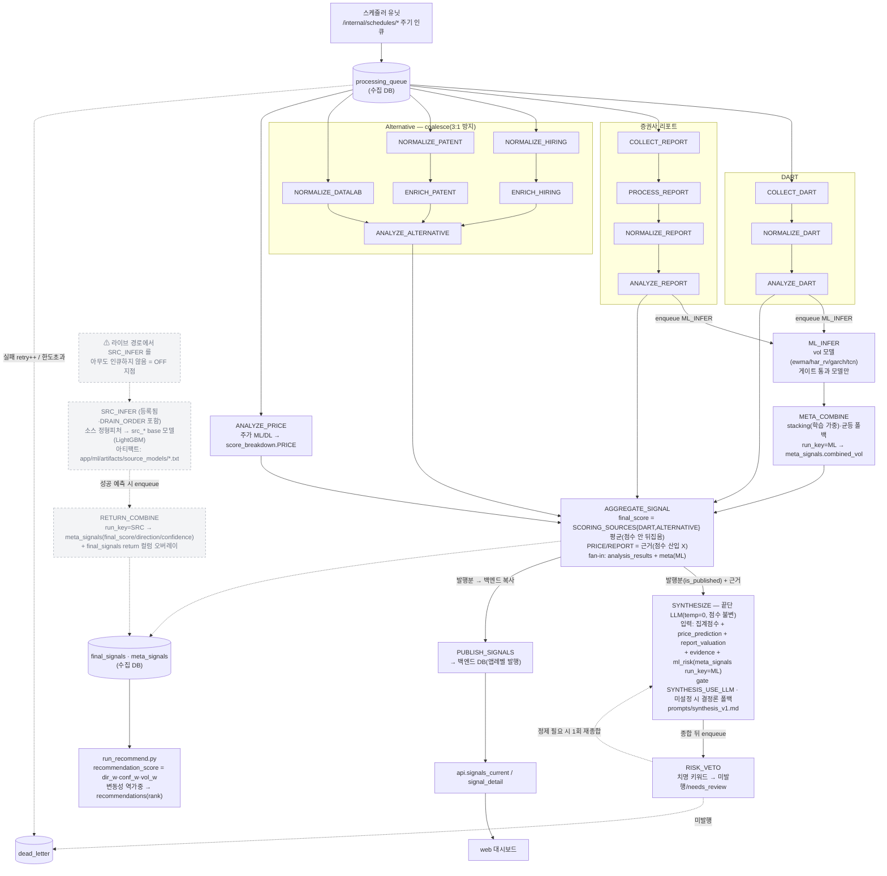
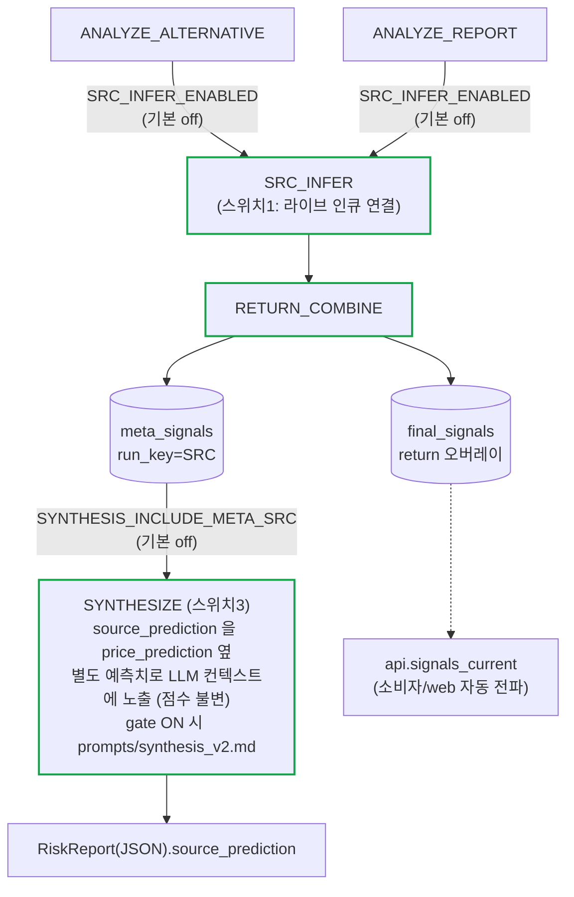
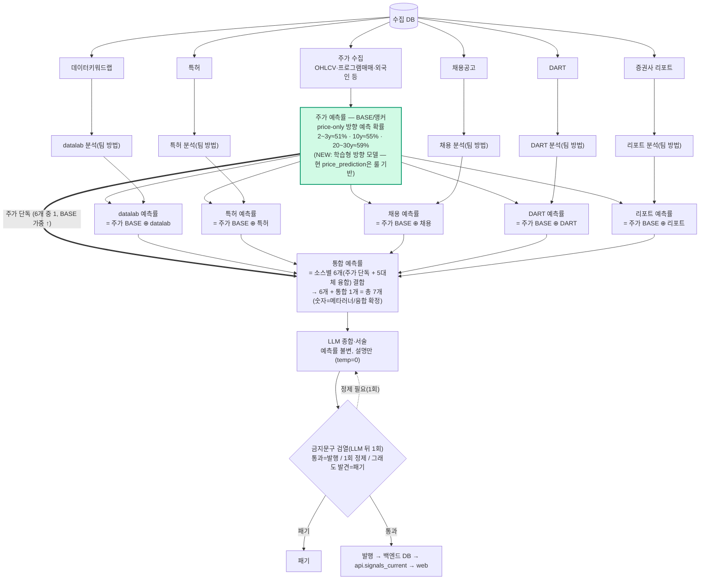

# 워커 드레인 파이프라인 — 상세 설계도 (코드 수준)

> `services/agent-worker` 큐 드레인 파이프라인을 **코드 수준으로 상세히** 그린 설계도다.
> 개요(토폴로지·DB 경계)는 [architecture-diagram.md](../architecture-diagram.md), 팀 핸드오프와 plug-in
> 절차는 [spec/worker-design-and-handoff.md](./worker-design-and-handoff.md) 참고. 동작 기준은 항상 코드/테스트.
> 출처: `app/orchestrator/queue/drain_daemon.py`(`DRAIN_ORDER`), 각 핸들러의 `enqueue(...)`.
> 최종 갱신: 2026-06-28.

이 문서는 두 장의 다이어그램을 담는다.
- **A. 현 상태** — origin/main 기준 실제 드레인 파이프라인. 메타러너 **return(SRC) 채널은 코드만 있고
  라이브 생산자가 없어 OFF**(점선).
- **B. ① 이후** — §5 핸드오프의 OFF plug-in 스위치 2개를 **env gate 기본-OFF로 배선**했을 때의 델타.

---

## A. 현 상태 — 큐 드레인 파이프라인

`DRAIN_ORDER`(드레인 효율용 정렬, 정확성은 `drain_until_idle` 의 progressed 루프가 보장):
수집 → 정규화 → 분석(소스별) → ML/DL(2 채널) → 집계 → 게이트 → 종합 → 발행.

**핵심 사실(코드 대조용)**
- **vol 채널(run_key=ML)**: `ANALYZE_DART`/`ANALYZE_REPORT` 가 `ML_INFER` 인큐
  (`dart/tasks.py`, `report/tasks.py`). `ML_INFER`(`ml/inference.py`)는 OHLCV 를 읽어 변동성 예측 →
  `META_COMBINE`(`ml/meta_combine.py`)가 stacking 결합 → `meta_signals.combined_vol`(run_key=ML).
- **소스 return 채널(run_key=SRC)**: `SRC_INFER`(`ml/source_inference.py`)·`RETURN_COMBINE`
  (`ml/return_combine.py`) 핸들러는 등록·DRAIN_ORDER 포함이지만 **라이브 경로에서 `SRC_INFER` 를
  인큐하는 코드가 없다**(= OFF). 켜지면 `meta_signals`(run_key=SRC)의 return 컬럼과 `final_signals`
  return 오버레이를 채운다. vol 채널과 자연키로 분리되어 `combined_vol` 을 오염시키지 않는다(D4).
- **집계**: `aggregation/tasks.py` — `final_score` 는 `SCORING_SOURCES={DART, ALTERNATIVE}` 평균만으로
  산출(점수를 뒤집지 않음). PRICE/REPORT 는 근거로만 수집. ALT 다수 소스는 coalesce 로 1 peer 화.
- **종합**: `synthesis/tasks.py` — LLM 은 **점수 불변**, "이유만" 서술. `price_prediction` 은
  `score_breakdown.PRICE` 에서 분리한 **별도 정량 신호**. `ml_risk` 는 `meta_signals`(run_key=**ML**)만 읽음.
- **게이트/발행 순서**: `AGGREGATE_SIGNAL` 이 게이트2(신호·모델 품질, `is_published`) 역할을 하며,
  **발행분만** `SYNTHESIZE`(run_key=ML)와 `PUBLISH_SIGNALS`(백엔드 DB 설정 시)를 각각 인큐한다
  (`aggregation/tasks.py`). `RISK_VETO` 는 종합 **뒤**에 동작한다(`SYNTHESIZE` 가 `RISK_VETO` 인큐):
  치명 키워드 시 LLM 정제 루프(RISK_VETO→SYNTHESIZE 재인큐 1회), 이후에도 치명이면 미발행/needs_review.
  `PUBLISH_SIGNALS` 가 백엔드 DB 로 앱레벨 발행 → `api.signals_current` → web.

---

## B. ① 이후 — 메타러너 return(SRC) 채널 연결 (env gate 기본-OFF)

①은 **새 로직을 추가하지 않는다.** 이미 머지된 SRC 채널(#525/#546)을 §5 핸드오프의 OFF 스위치
2개로 **연결**할 뿐이며, 두 스위치 모두 **기본 OFF** 라 끄면 A 와 동작이 byte-for-byte 동일하다.

**두 OFF 스위치 (켜는 지점)**

| 스위치 | env gate (기본 off) | 연결부 | OFF일 때 |
|---|---|---|---|
| 1. SRC_INFER 라이브 인큐 | `SRC_INFER_ENABLED` | `ANALYZE_ALTERNATIVE`/`ANALYZE_REPORT` 핸들러 끝 | 인큐 0건, SRC 채널 dormant |
| 3. SYNTHESIZE→LLM 노출 | `SYNTHESIS_INCLUDE_META_SRC` | `SYNTHESIZE` 가 `meta_signals(run_key=SRC)` read → `source_prediction` | LLM 컨텍스트·RiskReport JSON·프롬프트 모두 A 와 동일 |

(스위치 2 = base 모델 아티팩트 학습은 `train_source_models.py`. 아티팩트가 없으면 `SRC_INFER` 예측=None →
`RETURN_COMBINE` 미인큐로 **안전 no-op**.)

**OFF-safe 보장**
- 두 gate 는 `_env_bool(..., default=False)` 로 정의(미설정=OFF).
- 스위치3 은 `source_prediction` 이 있을 때만 `_llm_context`/`RiskReport.to_dict`/결정론 내러티브에 키를
  추가하고, 프롬프트도 gate ON 시에만 v2 를 선택 → OFF 출력은 현행과 동일.
- **주의(독립성)**: 스위치1만 켜도 `RETURN_COMBINE` 이 `final_signals` return 컬럼을 오버레이하므로
  소비자 노출이 바뀐다(스위치3 와 독립). 집계 점수 산식(SCORING_SOURCES)은 어느 경우든 불변.

> 권장 순서(핸드오프 §5): 데이터/라벨이 쌓이기 전엔 OFF 가 정상. 결정론/LLM 라인으로 먼저 운영하고,
> 데이터가 쌓이면 컨센서스 상관이 높은 REPORT 부터 학습 채널을 켠다.

---

## C. 제안 설계 (재구성) — 주가 기반 BASE + 대체데이터 가산

> 팀 설계 의도(2026-06-28): **주가 예측률을 BASE(앵커)로 두고, 대체데이터를 "가산/참조"로 얹어
> 소스별 예측률을 만든다.** 근거: 주가 데이터는 풍부해 price-only 방향 예측이 데이터 길이에 따라
> ≈51%(2~3년)/55%(10년)/59%(20~30년)로 비교적 안정적이지만, 대체데이터는 1~3년치·비실시간이라
> 단독 예측력이 약함 → 주가를 중심으로 두고 대체데이터로 보정하는 게 합리적.

**핵심 원칙**
- **주가 = BASE 앵커**: 모든 소스 예측률은 주가 예측률을 토대로 시작하고, 대체데이터는 가산/참조로
  보정. (대체데이터 희소·비실시간 → 융합 시 주가에 큰 가중, 대체는 보조.)
- **숫자 예측률은 메타러너/융합이 확정**, LLM 은 서술만(점수 불변). 검열은 **LLM 뒤 1회**(앞단 없음 —
  예측률만 흐르는 앞단은 검열 대상이 아님).
- **산출물 7개**: 소스별 6개(주가 + datalab/특허/채용/DART/리포트) + 통합 1개.
- **통합 구성**: 통합 예측률 = **소스별 6개 모두를 결합**(주가 단독 포함). 주가 단독이 통합의 한
  구성요소로 직접 들어가야 함(주가=BASE 앵커 → 큰 가중). 빼면 주가 신호가 융합분에 희석돼서만 반영됨.

**현 코드와의 차이 / 새로 필요한 것**
1. **주가 예측률(BASE) 모델 = NEW**. 현 `analyzers/price/rules.py` 는 룰 기반 방향, ML 채널
   (`ML_INFER→META_COMBINE`)은 **변동성**(combined_vol)이라 둘 다 "학습형 방향 예측률"이 아님.
   → price-only 방향 학습 모델(OHLCV+프로그램매매+외국인 피처)을 신설/학습해야 함.
2. **소스별 융합(주가 ⊕ 소스)** = 기존 SRC 채널 확장. 현 `return_combine.py` 는 소스 base + 리포트
   피처를 **하나의** `meta_signals(run_key=SRC)` 로 결합 → **주가 BASE 융합 + 소스별 분해(6개)** 로 확장 필요.
3. **소스별 예측률 적재/노출** = 현재 통합 1행만 → 소스별 6 + 통합 1 저장·API 노출 스키마 확장.

**남은 결정 1개 (검토 요청)** — 사용자에게 **발행 헤드라인 점수**를 무엇으로 보여줄지:
- (a) **통합 예측률을 헤드라인**으로(설계 의도에 가장 부합). 단 정확도는 modest 라고 명시 권장.
- (b) **당분간 결정론 집계(DART·ALT)를 헤드라인** 유지 + 7개 예측률 병행 노출 → 검증 후 (a)로 교체.

주가 BASE 가 데이터 풍부로 비교적 안정적이라 §5 의 "데이터 부족" 우려는 일부 완화됨 → (a)도 가능.
다만 대체데이터 가산분의 신뢰도가 낮으므로, **초기엔 (b)로 안전하게 노출하고 검증 후 (a) 교체**를 권장.
