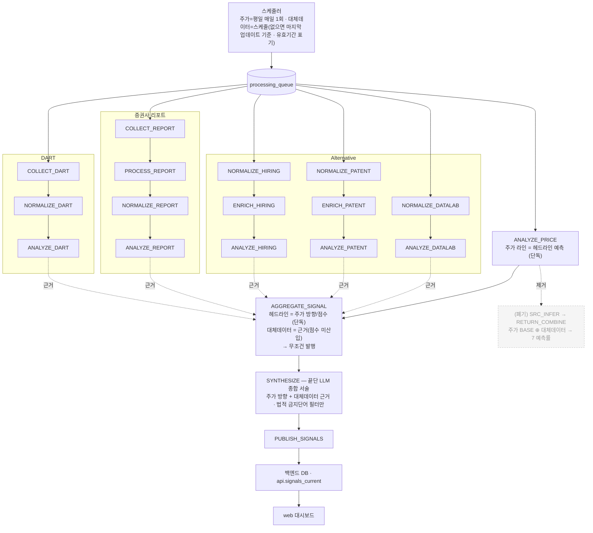
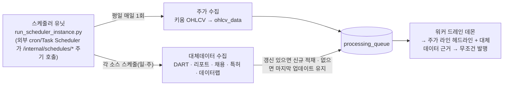
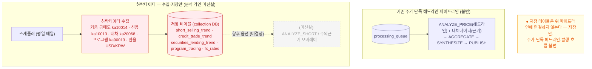

# 워커 드레인 파이프라인 (전체 흐름 설계도)

> `services/agent-worker` 큐 드레인 파이프라인의 **전체 흐름 + 구현 상태**다. 끝단 LLM 서술(법적 금지단어만
> 필터)·`RISK_VETO`/`run_recommend`/근거 이벤트 게이트 폐기·무조건 발행은 이미 구현·머지돼 라이브다.
> 토폴로지·DB 경계는 [architecture-diagram.md](../architecture-diagram.md). 최종 갱신: **2026-07-08**.
>
> **🔄 방향 전환(2026-07-08): 메타러너 예측 라인 폐기 → 주가 단독 예측 라인.** 종전 설계는 "주가 예측률 BASE
> ⊕ 대체데이터 가산 → 7 예측률"이었으나, 대체데이터는 **방향성 알파가 전 소스 null**(연구 종결, 아래 근거)이라
> 융합이 헤드라인에 노이즈만 더한다. 게다가 메타러너 학습 산출물(`meta_learner_return.json`)이 **부재해 SRC 라인은
> dormant**, 헤드라인은 사실상 결정론 블렌드/중립(50) 폴백으로 발행돼 왔다(실측: 005930=중립50). 그래서
> **헤드라인 예측 = 주가 라인 단독**으로 단순화하고, 대체데이터는 **점수에서 빼고 근거(evidence)로만** 노출한다.
> 새 목표 설계·전환 계획은 아래 "[주가 단독 예측 라인]"·"[전환 계획]" 절.

## 전체 흐름 (목표: 주가 단독 예측 라인)

> 설계 핵심: **헤드라인 예측 = 주가 라인(ANALYZE_PRICE) 단독**. 주가는 평일 매일 갱신되므로 종목마다 **무조건
> 발행**된다(발행 하한선). 대체데이터(DART·리포트·채용·특허·데이터랩)는 여전히 수집·정규화·분석하되 **헤드라인
> 점수에는 산입하지 않고 근거 카드(positive/caution evidence·score_breakdown)로만** 보여준다. 메타러너 융합
> (SRC_INFER·RETURN_COMBINE·7 예측률)은 **폐기**. 끝단 LLM 은 주가 방향 + 대체데이터 근거를 **서술**하고
> **법적 금지단어**(투자·매수·매도·적극매수·적극매도)만 필터한다.

`DRAIN_ORDER` 는 드레인 효율용 정렬이고, 끝단 도달 정확성은 `drain_until_idle` 의 progressed 루프가 보장한다.

## 스케줄러·수집 주기 (설계)

> 주가는 **평일 매일 1회** 수집되어 `ANALYZE_PRICE` 가 매일 돌고, 그래서 종목마다 주가 헤드라인이 **매일 무조건
> 발행**된다. 대체데이터는 각 스케줄로 수집하되 **그날 갱신이 없으면 마지막 업데이트 자료를 그대로 사용**한다
> (유효기간 표기 + LLM 서술에 "최종 업데이트 N일 전" 설명 추가).

- **주가 = 매일 보장**: 평일에는 `ANALYZE_PRICE` 가 항상 실행되므로 발행이 비지 않는다(발행의 하한선).
- **대체데이터 = best-effort + last-known**: 신규 수집이 없으면 직전 분석 결과를 유효기간 내 재사용한다(폐기 X).

## 단계별 동작

- **수집 → 정규화 → 분석 (소스별)**: DART(`COLLECT→NORMALIZE→ANALYZE`), 리포트(`COLLECT→PROCESS→
  NORMALIZE→ANALYZE`), Alternative(hiring `NORMALIZE→ENRICH→ANALYZE_HIRING`, patent
  `NORMALIZE→ENRICH→ANALYZE_PATENT`, datalab `NORMALIZE→ANALYZE_DATALAB`), 주가(`ANALYZE_PRICE`). 대체데이터가
  그날 갱신이 없으면 **마지막 업데이트 기준**으로 제공하고(유효기간 표기, 예: 6/28 자료 → 7/7), 끝단 LLM 서술에
  그 사실을 덧붙인다.

- **주가 라인 = 헤드라인 예측 (`ANALYZE_PRICE`)**: `ohlcv_data` 를 `PriceAnalyzer`(규칙 기반 기술분석,
  `app/orchestrator/price/tasks.py`)로 분석해 방향/점수를 낸다. 이 **주가 라인이 곧 발행 헤드라인**이다(융합 없음).
  주가는 평일 매일 갱신되므로 종목마다 항상 헤드라인이 존재한다(발행 하한선).

- **집계·발행 (`AGGREGATE_SIGNAL`)**: fan-in 으로 (stock, date) 의 모든 소스 결과를 모은다. **헤드라인 = 주가
  라인의 방향/점수 단독**. 대체데이터(DART·리포트·채용·특허·데이터랩)는 `score_breakdown`·근거 카드
  (positive/caution evidence)로 **함께 보여주되 헤드라인 점수에는 산입하지 않는다**(`contributes_to_score=False`).
  **무조건 발행**한다 — 주가가 매일 갱신되므로 발행이 막힐 일이 없다(발행 판정 게이트·근거 이벤트 조건 **없음**).

- **종합 (`SYNTHESIZE`, `synthesis/tasks.py`)**: 끝단 LLM 이 주가 방향 + 대체데이터 근거를 사용자에게 **서술**한다.
  유일한 가드는 **법적 금지단어 필터**(투자·매수·매도·적극매수·적극매도 등) — 위반 표현만 막고, 그 외 보류/veto 는
  없다. LLM 미설정 시 결정론 폴백 서술.

- **발행 (`PUBLISH_SIGNALS`)**: `final_signals` 등을 백엔드 DB 로 앱레벨 발행(`signal_publisher`) →
  `api.signals_current`/`signal_detail` → web.

- **폐기됨**: `RISK_VETO`(치명 키워드 발행 보류)·`run_recommend`→`recommendations`(추천 랭킹)·발행의 **근거 이벤트
  게이팅**·변동성 vol 채널(#585)은 이미 제거. **🔄 신규 폐기: 메타러너 예측 라인**(`SRC_INFER`·`RETURN_COMBINE`·
  주가 BASE ⊕ 대체데이터 융합·7 예측률) — 헤드라인을 주가 라인 단독으로 바꾸면서 융합 경로를 걷어낸다(아래 계획).

## 주가 단독 예측 라인 (목표 — 메타러너 베이스라인 폐기)

> **의도**: 헤드라인 예측을 **주가 라인 하나로 확정**한다. 종전의 "주가 BASE 앵커 ⊕ 대체데이터 가산 → 7 예측률"
> 메타러너 융합은 **폐기**한다.

**왜 주가 단독인가 (근거)**
- **대체데이터 방향성 알파 = 전 소스 null.** 채용·특허·데이터랩·뉴스감성 단독 방향 신호는 BH-FDR 생존 0,
  DART 톤은 폐기, 리포트는 매수 편향(11종목). 융합(선형·상호작용·PEAD) 3경로도 무신호로 종결됐다. 대체데이터의
  검증된 가치는 **매그니튜드/나우캐스트(차기 매출)**이지 **방향**이 아니다. → 방향 헤드라인에 섞으면 노이즈만 는다.
- **메타러너는 사실상 dormant.** return 채널 학습 산출물(`meta_learner_return.json`)이 부재해 `combine_return`
  은 균등평균 폴백으로만 돌고, 대체소스 base 모델(`src_datalab` 등)도 미학습이라 예측 None → 융합에서 자연 제외.
  실전 헤드라인은 이미 결정론 블렌드/중립(50) 폴백으로 발행돼 왔다(실측: 005930 = 중립 50).
- **주가는 유일하게 매일 갱신되는 방향 라인.** 평일 매일 `ANALYZE_PRICE` 가 돌아 발행 하한선을 만든다.
  대체데이터는 근거(evidence)로 붙여 **왜 그런 주가 흐름인지**를 설명한다(제품 철학 = 흔적/근거 중심).

**목표 흐름**
1. **`ANALYZE_PRICE`** (`app/orchestrator/price/tasks.py`): `ohlcv_data` → `PriceAnalyzer`(규칙 기반 기술분석)
   → `analysis_result`(run_key=`PRICE`) + `agent_result`. 이 방향/점수가 **곧 헤드라인**.
2. **`AGGREGATE_SIGNAL`** (`app/orchestrator/aggregation/tasks.py`): fan-in 으로 전 소스를 모으되 **헤드라인 =
   주가 라인 단독**. 대체데이터(DART·리포트·채용·특허·데이터랩)는 `score_breakdown`·positive/caution evidence 로
   **함께 노출하되 헤드라인 점수 미산입**(`contributes_to_score=False`). 무조건 발행.
3. **`SYNTHESIZE` → `PUBLISH_SIGNALS`**: LLM 이 주가 방향 + 대체데이터 근거를 서술(법적 금지단어만 필터) → 발행.

**폐기 대상 (융합 경로)**
- `SRC_INFER`(`app/ml/source_inference.py`) · `RETURN_COMBINE`(`app/ml/return_combine.py`) 큐 스테이지.
- `RETURN_COMBINE` 의 `final_signals.source_predictions`(7 예측률) 오버레이.
- `AGGREGATE_SIGNAL._headline` 의 `src_meta` 폴백 단계(meta_signals run_key=`SRC` 조회).
- 리포트 API `prediction_rates`(주가1 + 공공데이터5) — **표시 계약 정리**(main-server·web, 아래 계획 D단계).

**보존**
- 대체데이터 수집·정규화·분석 스테이지(ANALYZE_DART/REPORT/HIRING/PATENT/DATALAB)는 그대로 — 근거로 계속 쓴다.
- 오케스트레이터 되묻기(REQUERY)·에피소드 메모리·outcome 리코더는 불변(숫자 불변, 근거/학습 루프).
- vol 채널(run_key=`ML`, `combined_vol`)은 이미 제거됨 — 건드리지 않는다.

## 주가 단독 라인 전환 계획

> 스코프: `services/agent-worker`(대체데이터+aggregator, 우리 영역). 표시 계약(D단계)의 `main-server`·`web`
> 은 **팀원/프론트 영역이라 조율 항목**으로만 둔다. PR-only(직접 머지 금지). 배선은 남기고 **로직만** 바꾸므로
> 되돌리기 쉽다.

**A. 헤드라인을 주가 라인 단독으로** (`app/orchestrator/aggregation/tasks.py`)
- `_headline`(약 L912–937): 3단 폴백에서 **`src_meta` 단계 제거** → 헤드라인을 **주가 라인 결과**로 확정.
  구현안: `SCORING_SOURCES`(L34)를 `{"PRICE"}` 로 바꿔 결정론 블렌드가 주가만 반영하게 하거나, `_headline`
  에서 PRICE `NormalizedSourceResult` 를 직접 헤드라인으로 채택. **주가 결측 시에만** 중립(50) 폴백.
- ⚠️ `_resolve_signal`(L594)은 `available` 전체로 mixed 를 판정한다 — 대체데이터 방향이 헤드라인을 mixed 로
  뒤집지 않도록, **헤드라인 방향은 주가 소스 방향에서만** 뽑도록 가드. 대체데이터 mixed 는 `needs_review`/근거로만.
- `src_row = meta_repository.latest_for_stock(run_key="SRC")` 조회(L189) 및 관련 `_scoring_method` 라벨 정리.
- `contributes_to_score`(L641)는 이미 소스별로 계산 — 대체데이터가 자연히 False 가 되도록 `SCORING_SOURCES` 조정.

**B. 융합 스테이지 언와이어** (배선 제거, 파일은 dormant 보존)
- `app/orchestrator/price/tasks.py`(L109–116): `SRC_INFER` 인큐 제거(`AGGREGATE_SIGNAL` 인큐는 유지).
- `app/orchestrator/queue/handlers.py`(L117·L119): `SRC_INFER`/`RETURN_COMBINE` 핸들러 등록 제거.
- `app/orchestrator/queue/drain_daemon.py`(DRAIN_ORDER L74–75) + `queue/tasks.py`(DEFAULT_CYCLE_PLAN
  L128–129): `src_infer`/`return_combine` 항목 제거.
- `app/ml/source_inference.py`·`return_combine.py`·`meta_learner.py` 는 **삭제 대신 dormant 보존**(연구 재사용·
  되돌리기 여지). 후속 PR 에서 정리 결정.

**C. `source_predictions` 오버레이 중단**
- `RETURN_COMBINE` 이 유일 생산자이므로 B 로 자동 중단됨. `final_signals.source_predictions` 는 빈/NULL 로 발행.
- `publish/signal_publisher.py`·`api.signals_current` 는 `SELECT *` 전파라 스키마 변경 불필요(컬럼은 NULL 로 존속).

**D. 표시 계약 정리 (조율 항목 — main-server·web, 우리가 직접 편집 X)**
- `services/main-server/app/api/routes/reports.py`(L41–49·L462–475): `prediction_rates` 6소스가 빈 값이 됨 →
  섹션을 제거하거나 "근거 카드"로 대체. **F/프론트가 이미 "근거 중심 재구성 + ML UI 제거" 진행 중**이라 방향 일치.
- `web` 리포트 페이지: "AI 예측률" 섹션 → 주가 라인 1 + 대체데이터 근거 카드. 팀/프론트 담당과 싱크.

**E. 테스트·문서**
- 영향 테스트: `tests/ml/test_return_combine.py`·`tests/ml/test_source_inference.py`·`tests/ml/test_meta_learner_return.py`
  (스테이지 폐기로 obsolete/skip), `tests/test_price_aggregate_enqueue.py`·aggregation 헤드라인 테스트(주가 단독
  기대값으로 갱신), `tests/synthesis/*`·`tests/test_signal_publisher.py`(source_predictions 부재 허용).
- 문서: 이 파일 + `docs/architecture-diagram.md`·`docs/spec/worker-design-and-handoff.md`·`AGENTS.md` 의
  "7 예측률/메타러너" 서술을 주가 단독으로 갱신.

**옵션 (미결정)**
- **주가 라인의 실체**: 기본안은 **규칙 기반 `PriceAnalyzer`**(ML 아티팩트 불요·매일 보장). 향후 옵션으로
  **주가 전용 ML 모델**(`src_price` 단독, `train_price_model.py`)을 헤드라인으로 승격 가능하나, 현 PoC(20종목·
  중첩 라벨) 신뢰도로는 규칙 기반이 안전. → v1 = 규칙 기반, ML 은 신호 확정 시 별도 검토.
- **대체데이터 유지 범위**: 기본안은 **근거로 존속**(제품 철학). 전면 제거는 권장하지 않음(설명력 상실).

## 발행 정책

- **발행 산출물 = 주가 단독 헤드라인** + 대체데이터 **근거**(score_breakdown·positive/caution evidence). 헤드라인은
  0-100 점수(`final_score`) + 방향(`signal`).
- **사용자 노출**: 헤드라인(주가 방향/점수) + 근거 카드. 종전 per-source 예측률(주가1+공공데이터5) 노출은 D단계로 정리.
- **무조건 발행**: 주가는 평일 매일 갱신되므로 종목마다 항상 발행(발행 판정·근거 게이트 없음).
- 끝단 LLM 서술이 주가 방향에 대체데이터 근거 설명을 덧붙인다(법적 금지단어만 필터).

## 현재 구현·학습 상태 (2026-07-08)

| 항목 | 상태 |
|---|---|
| 파이프라인 코드(수집~발행) | 구현·머지·라이브 |
| 무조건 발행 · RISK_VETO/run_recommend/근거게이트 폐기 (구 #602·#604·#606·#608·#610·#612·#614) | **머지·라이브** |
| 메타러너 SRC 라인(`SRC_INFER`/`RETURN_COMBINE`) 배선 | 배선돼 있으나 **dormant** — return 학습 아티팩트 부재 → 균등폴백/예측 None |
| `src_price`(주가 base 모델) | PoC 수준(Neon 3년·20종목, 미배포 아티팩트) |
| `src_datalab`/`src_hiring`/`src_dart`/`src_patent` | **미학습** — 예측 None(graceful) |
| **주가 단독 라인 전환**(이 문서 계획 A–E) | **미착수(계획 확정)** |

- 실측 함의: 대체소스 아티팩트가 없어 융합에서 자연 제외되므로 **라이브는 이미 사실상 주가 단독에 근접**했다.
  전환은 코드보다 **헤드라인/표시 계약 정리**가 주 작업이다(계획 A·D).

## 한계·주의

- **주가 라인은 기술분석이라 상방 편향**이 있다(부록 "하락데이터" 참조) — 대체데이터/하락데이터를 근거로 균형을 보완한다.
- 규칙 기반 주가 라인은 예측이 아니라 **기술 신호**다 — 발행 신뢰도 자료로 단정하지 말 것.
- **결정론 헤드라인 점수·RISK_VETO·run_recommend 폐기 완료.** 메타러너 융합·7 예측률은 **폐기 예정**(위 계획).
- 융합 코드(`source_inference.py`/`return_combine.py`/`meta_learner.py`)는 **dormant 보존** — 배선만 끊는다.

## 부록: 하락데이터 수집·저장 (라인 미신설)

> 하락데이터(공매도·신용·대차·프로그램 + 환율)는 **수집·저장만** 한다. 집계·발행
> **파이프라인 라인은 신설하지 않는다** — 위 주가 단독 헤드라인 흐름은 그대로 유지된다. 저장된 데이터는 향후
> ad-hoc 조회·분석·모델 실험용 원천으로만 둔다.
>
> 배경: 현 파이프라인은 방향 근거가 사실상 주가 기술지표뿐이라 **상방 편향**이다. 하락을 대칭적으로 볼
> 원천 데이터를 **먼저 확보(저장)** 해 두고, 실제 분석/편입 여부는 이후 별도 검증·결정한다.

### 수집·저장 범위 (구현·적재 완료)

- **수집:** 키움 조회 TR — 공매도추이 `ka10014` · 신용매매동향 `ka10013` · 대차거래추이 `ka20068` ·
  프로그램매매 `ka90013` (+ 환율 USD/KRW: 별도 소스).
- **저장:** `short_selling_trend` · `credit_trade_trend` · `securities_lending_trend`(신규, #716 머지) +
  `program_trading` · `fx_rates`(기존 재사용). collection DB, Neon 적재 완료(35종목).
- **파이프라인 미연결:** `AGGREGATE_SIGNAL`/`SYNTHESIZE` 어디에도 연결하지 않는다. **주가 단독 헤드라인 +
  근거 발행 흐름 불변**(하락데이터를 헤드라인 점수에 편입하지 않는다).

### 향후 (옵션 · 미결정)

저장된 하락데이터를 파이프라인에 편입할지는 **별도 검증 후 결정**한다(예: `ANALYZE_SHORT` 신설, `caution_evidence`
오버레이로 하방 근거 보강 — 주가 상방 편향 균형용). 현 단계는 **저장까지만**.

